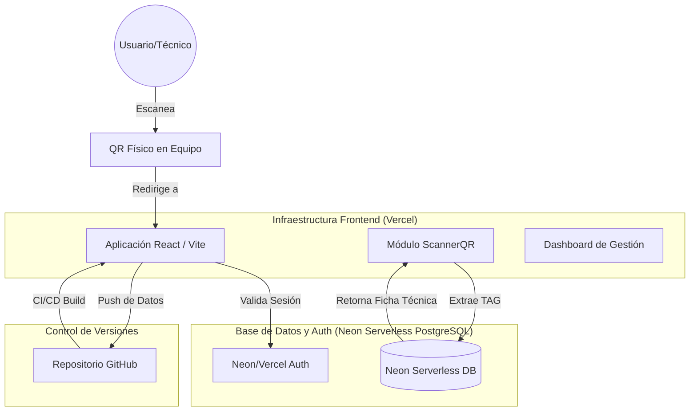

# Arquitectura del Sistema: CMMS HVAC PRO

Este documento describe la interacción entre los distintos componentes de la infraestructura y el flujo de datos del sistema.

## 1. Diagrama de Interacción (Workflow)

## 2. Componentes de la Solución

### A. Motor de Aplicación (Vercel)
* **Frontend**: React 18 + Vite + Tailwind CSS.
* **Dominio**: La aplicación se sirve dinámicamente. El código usa `window.location.origin` para que los códigos QR generados apunten siempre al entorno correcto (Desarrollo vs Producción).

### B. Base de Datos (Neon PostgreSQL)
* **Neon**: Repositorio Relacional Serverless PostgreSQL para la persistencia de activos, mantenimientos y usuarios.

### C. Despliegue Continuo (GitHub)
* Los cambios realizados en este entorno de AI Studio se envían al repositorio de GitHub.
* Vercel detecta automáticamente los nuevos "commits" y despliega la versión actualizada en segundos.

## 3. Pasos para Producción

1. **Configuración de Vercel**:
   - Conectar el repositorio de GitHub.
   - Configurar variables de entorno (`DATABASE_URL`, API Keys de Gemini).
2. **Activación de Neon (Database)**:
   - Crear el proyecto en Console de Vercel o en `console.neon.tech`.
   - Copiar la cadena de conexión de PostgreSQL a `DATABASE_URL`.
3. **Generación de QR**:
   - Las etiquetas generadas ahora incluyen la URL de Vercel de forma automática.
