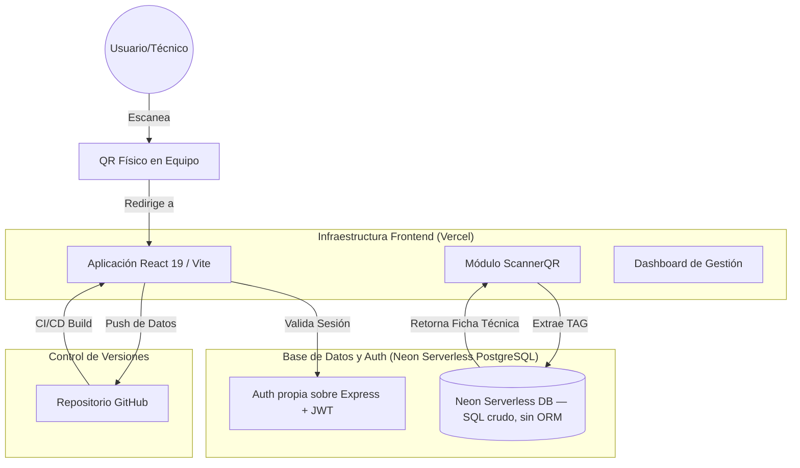
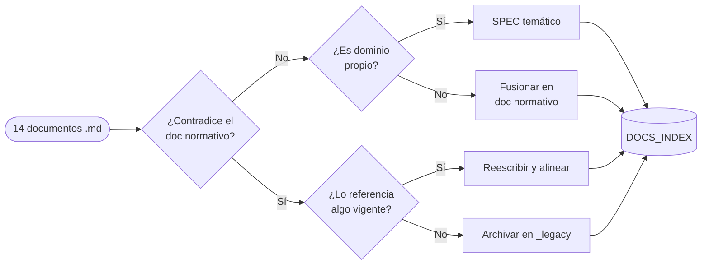
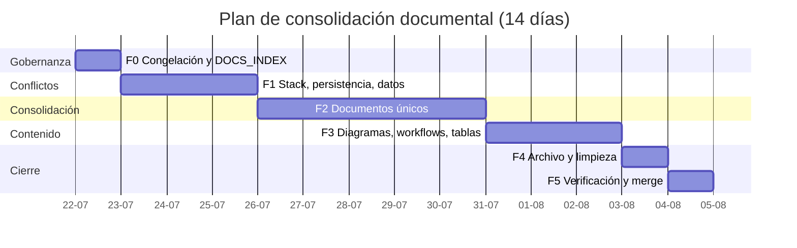

# CMMS HVAC PRO — Especificación Técnica (Documento Normativo Único)

**Versión:** 1.0
**Fecha:** 2026-07-21

> Documento normativo técnico único. Ver `DOCS_INDEX.md` para la matriz de precedencia. Fusiona contenido técnico de `ARCHITECTURE.md`, `FE-INFRA-01_DEXIE_V16_SCHEMA.md`, `FASE_1_ARQUITECTURA_Y_DISEÑO.md` y partes técnicas de `FASE_2_PLAN_IMPLEMENTACION_FRONTEND.md`. Llena el hueco de un documento técnico único previamente referenciado pero inexistente.

---

## § Stack y decisiones selladas

Estos hechos fueron verificados directamente en el código del repositorio (no son una propuesta ni una opinión de los documentos fuente) y son la referencia que prevalece sobre cualquier mención contradictoria en otros documentos, incluidos los que este documento fusiona:

- **Frontend:** React **19** (`"react": "^19.0.0"`, `"react-dom": "^19.0.0"` en `package.json`) + Vite + Tailwind CSS + Wouter (router) + Zustand (estado global). Cualquier referencia a "React 18" en documentación (como la que tenía `ARCHITECTURE.md` antes de esta consolidación) es un error corregido en este documento.
- **Persistencia cliente:** Dexie `^4.4.2` sobre IndexedDB, offline-first. Confirmado por uso extensivo en `src/db/database.ts`, `src/repositories/BaseRepository.ts`, hooks y páginas.
- **Persistencia servidor:** SQL crudo contra PostgreSQL serverless (Neon) vía `@neondatabase/serverless` (`import { neon } from "@neondatabase/serverless"` en `server.ts`), usando template tags `` sql`...` ``. **No existe Drizzle ORM en este proyecto**: no está declarado en `package.json`, no hay imports de `drizzle-orm` en `server/`, `src/` ni `api/`. Cualquier documento fuente que mencione Drizzle queda corregido por este hallazgo.
- **Backend HTTP:** Express `^4.21.2`, corriendo en `server.ts`.
- **Identidad de producto:** CMMS HVAC PRO es una plataforma **white-label multi-tenant genérica** — una plataforma universal de gestión de activos, con HVAC como vertical principal. Ninguna marca real (ni EECOL ni NBYB / Ingeniería y Servicios Bravo Spa) es la identidad del producto: son ejemplos ilustrativos de tenant/cliente que pueden aparecer en datos de ejemplo o seeds. Ver `§ Riesgos y deuda técnica conocida` para el gap conocido entre esta identidad y strings hardcodeados actuales en la UI.
- **Modelo de datos:** en migración activa y **no resuelta**. Coexisten hoy en producción dos familias de tablas (legacy `cmms_*` y canónica `uuid_sync`). Ver `§ Modelo de Datos — Equivalencias Legacy` para el detalle completo; no debe asumirse que `cmms_*` ya fue retirado.

---

## 1. Arquitectura General

### 1.1 Diagrama de Interacción (Workflow de Infraestructura)



### 1.2 Componentes de la Solución

**A. Motor de Aplicación (Vercel)**
- Frontend: React 19 + Vite + Tailwind CSS + Wouter + Zustand.
- Persistencia local: Dexie (IndexedDB), offline-first.
- Dominio: la aplicación se sirve dinámicamente. El código usa `window.location.origin` para que los códigos QR generados apunten siempre al entorno correcto (Desarrollo vs Producción).

**B. Base de Datos (Neon PostgreSQL)**
- Neon: repositorio relacional serverless PostgreSQL para la persistencia de activos, mantenimientos y usuarios.
- Acceso vía SQL crudo con `@neondatabase/serverless`, sin capa ORM.

**C. Backend HTTP (Express)**
- `server.ts` expone endpoints REST (`/api/*`, `/api/v1/*`, `/api/sync`, `/api/cmms/:resource`) consumidos por el frontend.

**D. Despliegue Continuo (GitHub → Vercel)**
- Los cambios se envían al repositorio de GitHub. Vercel detecta automáticamente los nuevos commits y despliega la versión actualizada.

### 1.3 Pasos para Producción

1. **Configuración de Vercel:** conectar el repositorio de GitHub; configurar variables de entorno (`DATABASE_URL`, API Keys de Gemini, `VITE_API_URL`).
2. **Activación de Neon (Database):** crear el proyecto en Console de Vercel o en `console.neon.tech`; copiar la cadena de conexión de PostgreSQL a `DATABASE_URL`.
3. **Generación de QR:** las etiquetas generadas incluyen la URL de Vercel de forma automática.

---

## 2. Control de Acceso — Matriz de Permisos por Rol

### 2.1 Roles del Sistema

| Rol | Descripción | Alcance |
|---|---|---|
| **Administrador** | Rol global. Crea clientes, cambia de contexto y puede operar en vista global sin cliente preseleccionado. | Global, todos los clientes |
| **Supervisor** | Supervisa técnicos, crea OT, edita reportes, cierra tickets. | Por cliente |
| **Técnico** | Emite OT, checklist, cierra tickets. | Equipos asignados |
| **Cliente** | Crea tickets, mantenimientos, lee informes, descarga datos. | Su cliente |
| **Proveedor** | Accede a tickets asignados, actualiza estado. | Tickets asignados |

El Administrador global utiliza el selector para entrar a vista global o a un cliente. Supervisor y Técnico eligen al iniciar uno de sus clientes asignados y mantienen ese contexto durante la sesión, con opción de cambiarlo desde el encabezado. Cliente y Proveedor ingresan directamente con su cliente predeterminado. La sucursal nunca se solicita al iniciar sesión y se selecciona únicamente como filtro dentro de los módulos que corresponda.

### 2.2 Matriz Detallada de Permisos

| **Permiso / Acción** | **Sistema** | **Admin** | **Supervisor** | **Técnico** | **Cliente** | **Proveedor** |
|---|---|---|---|---|---|---|
| **ADMINISTRACIÓN & CONFIGURACIÓN** | | | | | | |
| Crear Cliente | ❌ | ✅ | ❌ | ❌ | ❌ | ❌ |
| Editar Cliente | ❌ | ✅ | ❌ | ❌ | ❌ | ❌ |
| Crear Sucursal | ❌ | ✅ | ❌ | ❌ | ❌ | ❌ |
| Editar Sucursal | ❌ | ✅ | ❌ | ❌ | ❌ | ❌ |
| **USUARIOS & PERFILES** | | | | | | |
| Crear Usuario | ❌ | ✅ | ❌ | ❌ | ❌ | ❌ |
| Editar Perfil (propio) | ✅ | ✅ | ✅ | ✅ | ✅ | ✅ |
| Editar Perfil (otros) | ✅ | ✅ (su cliente) | ✅ (técnicos) | ❌ | ❌ | ❌ |
| Ver Logs de Eventos | ✅ | ✅ | ❌ | ❌ | ❌ | ❌ |
| **MI COMPAÑÍA — DATOS CORPORATIVOS** | | | | | | |
| Editar Logo & Razón Social | ✅ | ✅ | ❌ | ❌ | ✅ | ❌ |
| Editar Carta de Presentación | ✅ | ✅ | ❌ | ❌ | ✅ | ❌ |
| Gestionar Documentación | ✅ | ✅ | ✅ | ❌ | ✅ | ❌ |
| **TIPO DE EQUIPO & VARIABLES** | | | | | | |
| Crear Tipo de Equipo | ✅ | ✅ | ❌ | ❌ | ❌ | ❌ |
| Editar Tipo de Equipo | ✅ | ✅ | ❌ | ❌ | ❌ | ❌ |
| Crear Variables Personalizadas | ✅ | ✅ | ❌ | ❌ | ❌ | ❌ |
| **ACTIVOS & EQUIPOS** | | | | | | |
| Crear Equipo | ✅ | ✅ | ✅ | ✅ | ❌ | ❌ |
| Editar Equipo | ✅ | ✅ | ✅ | ✅ | ❌ | ❌ |
| Retirar/Archivar Equipo | ✅ | ✅ | ✅ | ❌ | ❌ | ❌ |
| Ver Hoja de Vida | ✅ | ✅ | ✅ | ✅ | ✅ | ✅ |
| Ver Historial de Cambios | ✅ | ✅ | ✅ | ✅ | ✅ | ❌ |
| Leer QR | ✅ | ✅ | ✅ | ✅ | ✅ | ✅ |
| **PLANTILLAS & CONFIGURACIÓN** | | | | | | |
| Crear/Editar form_templates | ✅ | ✅ | ❌ | ❌ | ❌ | ❌ |
| Crear/Editar Categorías Formularios | ✅ | ✅ | ❌ | ❌ | ❌ | ❌ |
| Publicar Template | ✅ | ✅ | ❌ | ❌ | ❌ | ❌ |
| **ÓRDENES DE TRABAJO** | | | | | | |
| Crear OT | ✅ | ✅ | ✅ | ✅ | ✅ | ❌ |
| Editar OT (propio) | ✅ | ✅ | ✅ | ✅ | ✅ | ❌ |
| Emitir Checklist | ✅ | ✅ | ✅ | ✅ | ❌ | ❌ |
| Firmar Informe | ✅ | ✅ | ✅ | ✅ | ❌ | ❌ |
| Editar Informe Técnico | ✅ | ✅ | ✅ | ❌ | ❌ | ❌ |
| Ver OT | ✅ | ✅ | ✅ | ✅ | ✅ | ✅ |
| Descargar Informe (PDF) | ✅ | ✅ | ✅ | ✅ | ✅ | ✅ |
| **MANTENIMIENTO PREVENTIVO** | | | | | | |
| Crear MP | ✅ | ✅ | ✅ | ❌ | ✅ | ❌ |
| Editar MP | ✅ | ✅ | ✅ | ❌ | ✅ | ❌ |
| Planificar MP | ✅ | ✅ | ✅ | ❌ | ❌ | ❌ |
| **TICKETS & INCIDENCIAS** | | | | | | |
| Crear Ticket | ✅ | ✅ | ✅ | ❌ | ✅ | ❌ |
| Editar Ticket | ✅ | ✅ | ✅ | ❌ | ✅ | ✅ |
| Cerrar Ticket | ✅ | ✅ | ✅ | ✅ | ✅ | ✅ |
| Asignar Responsable | ✅ | ✅ | ✅ | ❌ | ✅ | ❌ |
| Asignar Proveedor | ✅ | ✅ | ✅ | ❌ | ✅ | ❌ |
| Ver Tickets Asignados | ✅ | ✅ | ✅ | ❌ | ✅ | ✅ |
| **INVENTARIO** | | | | | | |
| Crear Artículo | ✅ | ✅ | ❌ | ❌ | ❌ | ❌ |
| Editar Artículo | ✅ | ✅ | ❌ | ❌ | ❌ | ❌ |
| Ajustar Stock | ✅ | ✅ | ✅ | ✅ | ❌ | ❌ |
| Ver Stock | ✅ | ✅ | ✅ | ✅ | ✅ | ❌ |
| Ver Historial Stock | ✅ | ✅ | ✅ | ❌ | ❌ | ❌ |
| **PROVEEDORES** | | | | | | |
| Crear Proveedor | ✅ | ✅ | ❌ | ❌ | ✅ | ❌ |
| Editar Proveedor | ✅ | ✅ | ❌ | ❌ | ✅ | ❌ |
| Ver Datos Proveedor | ✅ | ✅ | ✅ | ❌ | ✅ | ✅ |
| **REPORTES & ANALYTICS** | | | | | | |
| Generar Reportes OT | ✅ | ✅ | ✅ | ❌ | ✅ | ❌ |
| Generar Reportes MP | ✅ | ✅ | ✅ | ❌ | ✅ | ❌ |
| Ver Indicadores (MTBF, MTBM, etc.) | ✅ | ✅ | ✅ | ❌ | ✅ | ❌ |
| Exportar Reportes (Excel/PDF) | ✅ | ✅ | ✅ | ✅ | ✅ | ❌ |
| Ver Dashboards Avanzados | ✅ | ✅ | ✅ | ❌ | ✅ | ❌ |
| **CONFIGURACIÓN DE ALERTAS** | | | | | | |
| Crear Reglas Notificación | ✅ | ✅ | ❌ | ❌ | ❌ | ❌ |
| Editar Reglas Notificación | ✅ | ✅ | ❌ | ❌ | ❌ | ❌ |
| **SINCRONIZACIÓN & OFFLINE** | | | | | | |
| Ver Cola de Pendientes | ✅ | ✅ | ✅ | ✅ | ❌ | ❌ |
| Resolver Conflictos Sync | ✅ | ✅ | ❌ | ❌ | ❌ | ❌ |
| **ELIMINACIÓN & ARCHIVADO** | | | | | | |
| Eliminar Registro | ✅ | ✅ | ❌ | ❌ | ❌ | ❌ |
| Archivar Registro | ✅ | ✅ | ✅ | ❌ | ❌ | ❌ |

---

## 3. Estructura de Datos — Jerarquía de Tenant

```
Cliente (cliente_id)
├── Sucursal (sucursal_id, cliente_id)
│   ├── Activo / Equipo (tag_id, sucursal_id, cliente_id)
│   │   ├── Historial de Cambios
│   │   ├── Ficha Técnica (personalizable por tipo_de_equipo_id)
│   │   └── Hoja de Vida (OT, MP, Tickets)
│   ├── Orden de Trabajo (OT) (cliente_id, sucursal_id)
│   │   └── N Instancias de Formulario (form_instances) [1 por tag]
│   ├── Mantenimiento Preventivo (MP) (cliente_id, sucursal_id)
│   ├── Ticket (cliente_id, sucursal_id)
│   └── Inventario (cliente_id, sucursal_id)
│
├── Mi Compañía (Logo, Razón Social, Documentación)
├── Proveedores (cliente_id)
└── Usuarios & Roles (cliente_id, roles)
```

Toda entidad sincronizable incluye además `uuid_sync` técnico e inmutable y `id` funcional. Los usuarios se relacionan con uno o más clientes mediante `user_clientes`; el administrador global puede operar sin cliente activo.

---

## 4. Módulos Principales

### 4.1 Entorno Gráfico Front

**Plataforma:** PWA (Progressive Web App)
**Responsivo:** Mobile-first, optimizado para técnicos en terreno
**Temas:** 3 skins disponibles — Light, Dark, Cyberpunk (oscuro con neón fosforescente)

**Características UI:**
- Botones grandes (mínimo 44x44px) para touch
- Listas desplegables expandidas
- Teclado numérico automático para campos de número
- Menú lateral personalizable (drag-to-reorder, left/right toggle)
- Menú de módulos diferenciado: PC vs PWA
- Sincronización visual (offline/online badge)
- QR scanner integrado

### 4.2 Módulos y Componentes

- **Dashboard Principal:** vista rápida de OT activas, MP programadas, tickets pendientes; indicadores KPI (MTBF, MTBM, disponibilidad, costo mantenimiento); gráficos de tendencias; notificaciones in-app.
- **Cliente & Sucursales:** CRUD Cliente y Sucursal (solo Administrador global). El formulario de alta y edición exige nombre, RUT válido, dirección, región y una sucursal obligatoria de tipo Casa Matriz. Datos corporativos (logo, razón social, contacto), carta de presentación y documentación.
- **Mi Compañía:** perfil corporativo, perfiles de usuario (Administrador, Supervisor, Técnico, Cliente, Proveedor), datos de proveedor, documentación corporativa.
- **Activos & Equipos:** CRUD Tipo de Equipo con variables personalizables (Capacidad BTU, Voltaje, Frecuencia, Marca, Modelo, etc. para HVAC); CRUD Equipo (tag_id, código serial, ubicación); Ficha Técnica personalizable por `tipo_de_equipo_id`; Hoja de Vida (OT, MP, tickets, cambios de estado); QR Reader → redirecciona a Hoja de Vida.
- **Formularios Dinámicos:** `form_templates` (plantillas versionadas por tipo de equipo), `form_instances` (instancias de informe por tag dentro de una OT), FieldRenderer dinámico (texto, número, lista, checkbox, firma digital, foto), validación cliente-side offline y server-side online.
- **Órdenes de Trabajo (OT):** creación por Supervisor/Técnico/Cliente (sucursal, N tags, técnico responsable, tipo de OT: preventivo, correctivo, atencion_falla, puesta_en_marcha, inspeccion_tecnica, instalacion_montaje); dashboard de progreso por tag; emisión de checklist (form_instance por tag); firma de informe; folio automático (`INF-{cod_sucursal}.{cod_tipo}-{tag_correlativo}-{folio_secuencial}` — offline asigna folio temporal, backend retorna folio único al sincronizar).
- **Mantenimiento Preventivo (MP):** creación (equipos, frecuencia semanal/mensual/trimestral/anual, plantilla checklist); planificador que agrupa tags por (cliente, sucursal, frecuencia) y genera 1 OT + N work_order_assets automáticamente; calendario visual por sucursal.
- **Calendario & Planificación:** calendario visual de OT y MP programadas, alimentado por fechas de OT, informes/checklist completados y MP programadas; filtros por cliente/sucursal/tipo/estado; exportación a iCal/Google Calendar.
- **Mapa:** geolocalización de sucursales y equipos, filtros, popup con información rápida, fallback a lista si no hay GPS.
- **Ticket & Incidencias:** creación (descripción, prioridad, tipo, asignación de responsable/proveedor); workflow de estados Abierto → En Progreso → Resuelto → Cerrado; seguimiento (comentarios, cambios de estado, auditoría); resolución e historial.
- **Inventario:** gestión de repuestos y materiales (código, descripción, marca, cantidad, stock mínimo, costo); movimientos de entrada/salida/ajuste; alertas de stock bajo/caducidad.
- **Reportes & Analytics:** reportes de OT, MP y tickets; indicadores KPI (MTBF, MTBM, MTBR, disponibilidad, costo de mantenimiento); exportación a Excel/PDF/CSV; gráficos de líneas, barras y pie charts.

---

## 5. Schema de Persistencia Cliente (Dexie / IndexedDB)

Esta sección consolida la especificación de `FE-INFRA-01_DEXIE_V16_SCHEMA.md`. El número "v16" del archivo original es histórico: la implementación real parte de `src/db/database.ts` y avanza mediante la siguiente versión incremental disponible del schema Dexie — **no se crea una base paralela**.

### 5.1 Convención Base

```typescript
export interface BaseEntity {
  uuid_sync: string;  // UUID técnico, inmutable y usado por sync
  id: string;         // Identificador funcional/humano
}
// Toda entidad persistida debe extender BaseEntity.
```

### 5.2 Tipos TypeScript por Tabla

**Maestros (configuración global):**

```typescript
export interface Cliente extends BaseEntity {
  cliente_id: string;  // UUID
  nombre: string;
  rut: string;         // XX.XXX.XXX-X (único)
  razon_social: string;
  direccion_sede: string;
  telefono: string;
  email: string;
  sitio_web?: string;
  moneda: 'CLP' | 'USD';
  logo_url?: string;   // PNG/SVG blob URL
  estado: 'activo' | 'suspendido' | 'cerrado';
  created_at: Date;
  updated_at: Date;
  updated_by_user_id?: string;
}

export interface Sucursal extends BaseEntity {
  sucursal_id: string;  // UUID
  cliente_id: string;   // FK
  nombre: string;
  codigo: string;       // Ej: "21-STK" (usado en TAG)
  direccion: string;
  ciudad: string;
  region: string;
  telefono?: string;
  email?: string;
  latitud?: number;
  longitud?: number;
  codigo_num: number;   // Correlativo (1, 2, 3...)
  estado: 'activo' | 'cerrado';
  created_at: Date;
  updated_at: Date;
}

export interface CatalogAssetType extends BaseEntity {
  tipo_de_equipo_id: string;  // UUID
  cliente_id: string;          // FK
  nombre: string;              // "Split", "Chiller", "VRF"
  descripcion?: string;
  codigo_num: number;          // Correlativo para TAG
  campos_dinamicos: Record<string, any>;  // JSON de campos por tipo
  categoria: string;           // "HVAC", "Eléctrico", etc.
  es_predefinido: boolean;
  estado: 'activo' | 'archivado';
  created_at: Date;
  updated_at: Date;
}

export interface RefrigeranteCatalogo extends BaseEntity {
  refrigerante_id: string;  // UUID
  nombre: string;           // "R-410A" (único)
  presion_sat_psi: number;
  temp_sat_celsius: number;
  peligro_nivel: 'bajo' | 'medio' | 'alto';
  disponible_chile: boolean;
  creado_en: Date;
}

export interface User extends BaseEntity {
  user_id: string;                    // UUID
  email: string;
  nombre: string;
  rol: 'administrador' | 'supervisor' | 'tecnico' | 'cliente' | 'proveedor';
  estado: 'activo' | 'inactivo' | 'bloqueado';
  jwt_token_hash?: string;            // Hash del JWT actual
  push_subscription?: Record<string, any>;  // Suscripción VAPID
  created_at: Date;
  updated_at: Date;
  last_login?: Date;
}

export interface UserCliente extends BaseEntity {
  user_id: string;
  cliente_id: string;
}
// El administrador es global y puede operar sin cliente activo.
// El PIN y su hash nunca se persisten en Dexie.
```

**Datos operacionales:**

```typescript
export interface Equipo extends BaseEntity {
  tag: string;                  // {sucursal_codigo}.{tipo_codigo}.{seq}
  cliente_id: string;           // FK
  sucursal_id: string;          // FK
  tipo_de_equipo_id: string;    // FK

  // Identificación
  nombre: string;
  marca?: string;
  modelo?: string;
  serie?: string;               // Único por equipo

  // Especificaciones técnicas
  refrigerante_id?: string;     // FK
  capacidad_valor?: number;
  capacidad_unidad: 'BTU' | 'kW' | 'TR';
  voltaje?: string;             // "220V", "380/400V 3x"
  corriente_nominal?: number;   // Amperios
  potencia_kw?: number;

  // Campos dinámicos (según tipo_de_equipo_id)
  variables_dinamicas: Record<string, any>;  // JSON

  // Ciclo de vida
  fecha_instalacion?: Date;
  vida_util_anos?: number;
  frecuencia_mantenimiento: 'unico' | 'mensual' | 'bimestral' | 'trimestral' | 'semestral' | 'anual';

  // Estado & Criticidad
  criticidad: 'redundante' | 'no_critico' | 'critico';
  estado: 'operativo' | 'en_observacion' | 'en_falla' | 'mantenimiento' | 'retirado';

  // Ubicación
  ubicacion?: string;
  area?: string;
  region?: string;
  responsable_interno?: string;

  // Personalizables por cliente
  costo_compra?: number;
  proveedor?: string;
  garantia_anos?: number;

  // Imagen placa
  imagen_placa_url?: string;
  tiene_placa: boolean;

  // Auditoría
  created_at: Date;
  updated_at: Date;
  created_by_user_id?: string;
}

export interface WorkOrder extends BaseEntity {
  work_order_id: string;    // UUID
  cliente_id: string;       // FK
  sucursal_id: string;      // FK

  // Identificación
  folio?: string;           // INF-{cod_sucursal}.{cod_tipo}-{tag_corr}-{seq}
  folio_temporal?: string;  // Offline: OT-{uuid-corto}

  // Tipo & Estado
  tipo: 'preventivo' | 'correctivo' | 'atencion_falla' | 'puesta_en_marcha' | 'inspeccion_tecnica' | 'instalacion_montaje' | 'predictivo';
  estado: 'abierto' | 'en_progreso' | 'completado' | 'firmado' | 'cerrado';

  // Contenido
  descripcion?: string;
  tecnico_asignado_user_id?: string;  // FK
  supervisor_user_id?: string;        // FK

  // Narrativos (se auto-pueblan vía binding)
  hallazgo?: string;
  diagnostico?: string;
  recomendaciones?: string;
  conclusiones?: string;

  // Consumo energético
  consumo_kwh?: number;
  consumo_editado_manually: boolean;
  horas_operacion?: number;

  // Control
  version: number;
  created_at: Date;
  updated_at: Date;
  created_by_user_id?: string;
  closed_at?: Date;
}

export interface WorkOrderAsset extends BaseEntity {
  work_order_asset_id: string;  // UUID
  work_order_id: string;         // FK
  cliente_id: string;            // FK
  tag: string;                   // FK (composite)
  estado: 'pendiente' | 'en_progreso' | 'completado';
  form_instance_id?: string;  // FK
  orden: number;
  created_at: Date;
  updated_at: Date;
}

export interface FormInstance extends BaseEntity {
  form_instance_id: string;     // UUID
  work_order_id: string;        // FK
  work_order_asset_id?: string; // FK
  cliente_id: string;           // FK
  tag?: string;                 // Referencia equipo
  form_template_id?: string;
  datos: Record<string, any>;   // JSON con respuestas
  estado: 'borrador' | 'completado' | 'firmado';
  firma_digital?: string;       // PNG data URL (canvas)
  fecha_firma?: Date;
  usuario_firma_user_id?: string;
  created_at: Date;
  updated_at: Date;
}

export interface Ticket extends BaseEntity {
  ticket_id: string;            // UUID
  cliente_id: string;           // FK
  sucursal_id: string;          // FK
  numero_correlativo: number;   // Secuencial por cliente
  titulo: string;
  descripcion: string;
  tipo: 'correctivo' | 'preventivo' | 'consulta';
  prioridad: 'baja' | 'media' | 'alta' | 'critica';
  tag?: string;                 // FK equipos (opcional)
  responsable_tecnico_user_id?: string;
  proveedor_asignado_user_id?: string;
  estado: 'abierto' | 'en_progreso' | 'observado' | 'resuelto' | 'cerrado';
  creador_user_id: string;
  created_at: Date;
  updated_at: Date;
  closed_at?: Date;
}

export interface TicketComment extends BaseEntity {
  ticket_comment_id: string;    // UUID
  ticket_id: string;            // FK
  estado_anterior?: 'abierto' | 'en_progreso' | 'observado' | 'resuelto' | 'cerrado';
  estado_nuevo?: 'abierto' | 'en_progreso' | 'observado' | 'resuelto' | 'cerrado';
  texto?: string;               // Mín 20 caracteres si presente
  foto_url?: string;            // Blob URL
  creador_user_id: string;
  created_at: Date;
}
```

**Sincronización:**

```typescript
export interface SyncQueueItem extends BaseEntity {
  sync_queue_id: string;                      // UUID
  tabla: string;                              // 'work_orders', 'form_instances', etc.
  record_id: string;
  data: Record<string, any>;                  // Copia de datos a subir
  status: 'pending' | 'syncing' | 'synced' | 'error' | 'conflicted';
  retry_count: number;
  next_retry?: Date;
  last_error?: string;
  created_at: Date;
}

export interface AttachmentMetadata extends BaseEntity {
  attachment_id: string;        // UUID
  tabla: string;                // 'work_orders', 'form_instances'
  record_id: string;
  tipo: 'foto' | 'firma';
  filename: string;
  blob?: Blob;                  // Almacenado en IndexedDB
  tamaño_bytes: number;
  created_at: Date;
  synced: boolean;
}

export interface SyncHistory extends BaseEntity {
  sync_history_id: string;      // UUID
  status: 'success' | 'error' | 'partial';
  items_uploaded: number;
  items_downloaded: number;
  timestamp: Date;
  last_error?: string;
}
```

**Caché & preferencias:**

```typescript
export interface KPICache extends BaseEntity {
  kpi_cache_id: string;         // UUID
  cliente_id: string;           // FK
  periodo: string;              // "2026-06", "2026-Q2", etc.
  mtbf_horas?: number;
  mtbm_horas?: number;
  mtbr_horas?: number;
  disponibilidad_pct?: number;
  consumo_kwh_total?: number;
  cached_at: Date;
  expires_at: Date;
}

export interface UserPreferences extends BaseEntity {
  user_preferences_id: string;  // UUID
  user_id: string;              // FK
  theme: 'light' | 'dark' | 'cyberpunk';
  language: 'es' | 'en';
  push_enabled: boolean;
  email_alerts: boolean;
  menu_order: string[];         // Array de module IDs en orden
  menu_position: 'left' | 'right';
  datos: Record<string, any>;   // Extensible
  updated_at: Date;
}
```

### 5.3 Definición del Schema Dexie

```typescript
// src/db/database.ts
import Dexie, { Table } from 'dexie';
import * as T from './types';

export class CMSSHVACDatabase extends Dexie {
  // MAESTROS
  clientes!: Table<T.Cliente>;
  sucursales!: Table<T.Sucursal>;
  catalog_asset_types!: Table<T.CatalogAssetType>;
  refrigerantes_catalogo!: Table<T.RefrigeranteCatalogo>;
  users!: Table<T.User>;

  // DATOS OPERACIONALES
  equipos!: Table<T.Equipo>;
  work_orders!: Table<T.WorkOrder>;
  work_order_assets!: Table<T.WorkOrderAsset>;
  form_instances!: Table<T.FormInstance>;
  tickets!: Table<T.Ticket>;
  ticket_comments!: Table<T.TicketComment>;

  // SINCRONIZACIÓN
  sync_queue!: Table<T.SyncQueueItem>;
  attachment_metadata!: Table<T.AttachmentMetadata>;
  sync_history!: Table<T.SyncHistory>;

  // CACHÉ & PREFERENCIAS
  kpi_cache!: Table<T.KPICache>;
  user_preferences!: Table<T.UserPreferences>;

  constructor() {
    super('cmmsHVACPRO');

    this.version(NEXT_SCHEMA_VERSION).stores({
      // MAESTROS
      clientes: 'uuid_sync, id, cliente_id, estado, updated_at',
      sucursales: 'uuid_sync, id, sucursal_id, [cliente_id+nombre], [cliente_id+codigo], cliente_id, estado',
      catalog_asset_types: 'tipo_de_equipo_id, [cliente_id+nombre], cliente_id, estado',
      refrigerantes_catalogo: 'refrigerante_id, nombre, disponible_chile',
      users: 'uuid_sync, id, user_id, email, rol, estado',
      user_clientes: 'uuid_sync, id, [user_id+cliente_id], user_id, cliente_id',

      // DATOS OPERACIONALES
      equipos: 'tag, [cliente_id+sucursal_id], [cliente_id+estado], criticidad, updated_at',
      work_orders: 'work_order_id, [cliente_id+sucursal_id], [cliente_id+estado], folio, tecnico_asignado_user_id, updated_at',
      work_order_assets: '[work_order_id+tag], estado, work_order_id, tag',
      form_instances: 'form_instance_id, work_order_id, [work_order_id+trabajo_order_asset_id], estado, updated_at',
      tickets: 'ticket_id, [cliente_id+numero_correlativo], [cliente_id+estado], estado, responsable_tecnico_user_id, updated_at',
      ticket_comments: 'ticket_comment_id, ticket_id, created_at',

      // SINCRONIZACIÓN
      sync_queue: '[tabla+record_id], status, next_retry, created_at',
      attachment_metadata: 'attachment_id, record_id, synced, created_at',
      sync_history: 'sync_history_id, timestamp',

      // CACHÉ & PREFERENCIAS
      kpi_cache: '[cliente_id+periodo], expires_at',
      user_preferences: 'user_preferences_id, user_id'
    });

    // Hooks
    this.equipos.hook('updating', (changes, key) => {
      if (changes.tag !== undefined && changes.tag !== key) {
        throw new Error('Campo tag es inmutable');
      }
    });

    this.work_orders.hook('updating', (changes, key) => {
      if (changes.created_at !== undefined) {
        throw new Error('Campo created_at es inmutable');
      }
    });
  }
}

export const db = new CMSSHVACDatabase();
```

> ⚠️ REVISAR: la fuente `FE-INFRA-01_DEXIE_V16_SCHEMA.md` usa `NEXT_SCHEMA_VERSION` como placeholder simbólico (no un número fijo), consistente con su propia advertencia de que "v16" es histórico y la implementación real debe determinarse contra la versión actual de `src/db/database.ts`. Este documento preserva ese placeholder intencionalmente — no se debe fijar un número de versión aquí sin verificar antes el número real vigente en `src/db/database.ts`.

### 5.4 Índices — Documentación y Notas de Performance

```typescript
// src/db/indices.ts
/**
 * REGLAS:
 * - Índice primario (PK): siempre presente
 * - Índice compuesto [A+B]: búsquedas por ambos campos
 * - Índice simple A: búsquedas por este campo
 *
 * PERFORMANCE:
 * - < 100k registros: índices mínimos suficientes
 * - > 100k registros: aumentar índices específicos por query
 */

export const INDICES = {
  clientes: { pk: 'cliente_id', indices: ['estado', 'updated_at'] },
  sucursales: {
    pk: 'sucursal_id',
    indices: ['[cliente_id+nombre]', '[cliente_id+codigo]', 'cliente_id', 'estado']
  },
  equipos: {
    pk: 'tag',  // Compuesto: {sucursal_codigo}.{tipo_codigo}.{seq}
    indices: ['[cliente_id+sucursal_id]', '[cliente_id+estado]', 'criticidad', 'updated_at'],
    performance_notes: `
      - Query común: db.equipos.where('cliente_id').equals(cid).where('estado').equals('operativo')
      - Dexie optimiza con índice [cliente_id+estado]
      - Sin índice: scan full table (lento > 1k registros)
    `
  },
  work_orders: {
    pk: 'work_order_id',
    indices: ['[cliente_id+sucursal_id]', '[cliente_id+estado]', 'folio', 'tecnico_asignado_user_id', 'updated_at'],
    performance_notes: `
      - Query: db.work_orders.where('tecnico_asignado_user_id').equals(uid)
      - Índice necesario si > 100 OT por técnico
    `
  },
  work_order_assets: {
    pk: '[work_order_id+tag]',
    indices: ['estado', 'work_order_id', 'tag']
  },
  form_instances: {
    pk: 'form_instance_id',
    indices: ['work_order_id', '[work_order_id+work_order_asset_id]', 'estado', 'updated_at']
  },
  tickets: {
    pk: 'ticket_id',
    indices: ['[cliente_id+numero_correlativo]', '[cliente_id+estado]', 'estado', 'responsable_tecnico_user_id', 'updated_at']
  },
  sync_queue: {
    pk: '[tabla+record_id]',
    indices: ['status', 'next_retry', 'created_at'],
    performance_notes: `
      - Query: db.sync_queue.where('status').equals('pending').and(item => !item.next_retry || item.next_retry <= NOW())
      - Sin índice: scan completo en cada sync (malo si > 1000 items)
    `
  },
  kpi_cache: { pk: '[cliente_id+periodo]', indices: ['expires_at'] }
};
```

### 5.5 Migraciones Incrementales

El schema Dexie evoluciona mediante migraciones incrementales sobre la base actual — no se asume ni se crea una versión paralela inexistente. El patrón de referencia (ilustrado aquí sobre el salto conceptual v15→v16 documentado en la fuente) es:

```typescript
// src/db/migrations.ts
import { db } from './database';

/**
 * Migración incremental de ejemplo (v15 → v16 en la fuente original)
 * Cambios típicos de este tipo de migración:
 * - Tabla work_orders: eliminar asset_id, agregar campos narrativos
 * - Nueva tabla: work_order_assets (relación N-N OT ↔ Equipos)
 * - Nueva tabla: form_instances
 * - Nuevos campos: consumo_kwh, criticidad en equipos
 * Ejecución automática en primer acceso a la nueva versión de la DB
 */
export async function runMigrations() {
  const currentVersion = localStorage.getItem('db_schema_version') || '15';

  if (currentVersion === '15') {
    try {
      const workOrdersV15 = await db.work_orders.toArray();
      const equiposV15 = await db.equipos.toArray();

      const workOrdersV16 = workOrdersV15.map(wo => ({
        ...wo,
        hallazgo: null, diagnostico: null, recomendaciones: null, conclusiones: null,
        consumo_kwh: null, consumo_editado_manually: false, horas_operacion: null,
        asset_id: undefined  // eliminado; ahora vive en work_order_assets
      }));

      const equiposV16 = equiposV15.map(eq => ({
        ...eq,
        criticidad: 'no_critico',
        consumo_kwh: null,
        variables_dinamicas: eq.variables_dinamicas || {}
      }));

      const workOrderAssets = workOrdersV15
        .filter(wo => wo.asset_id)
        .map((wo, idx) => ({
          work_order_asset_id: generateUUID(),
          work_order_id: wo.work_order_id,
          cliente_id: wo.cliente_id,
          tag: wo.asset_id,
          estado: wo.estado === 'cerrado' ? 'completado' : 'pendiente',
          orden: idx + 1,
          created_at: wo.created_at,
          updated_at: wo.updated_at
        }));

      await db.work_orders.bulkPut(workOrdersV16);
      await db.equipos.bulkPut(equiposV16);
      await db.work_order_assets.bulkAdd(workOrderAssets);

      localStorage.setItem('db_schema_version', '16');
    } catch (error) {
      console.error('✗ Error en migración:', error);
      throw error;
    }
  }
}

export async function initDatabase() {
  await runMigrations();
}
```

### 5.6 Operaciones Comunes de Referencia

```typescript
// src/db/operations.ts
export async function crearEquipo(data) { /* genera tag, aplica defaults, db.equipos.add(equipo) */ }
export async function crearWorkOrder(data) { /* genera folio_temporal OT-{uuid corto}, version: 1 */ }
export async function agregarAssetAWorkOrder(work_order_id, tag, orden) { /* db.work_order_assets.add */ }
export async function obtenerEquipo(tag) { return db.equipos.get(tag); }
export async function listarEquiposPorSucursal(cliente_id, sucursal_id) {
  return db.equipos.where('[cliente_id+sucursal_id]').equals([cliente_id, sucursal_id]).toArray();
}
export async function listarEquiposOperativos(cliente_id) {
  return db.equipos.where('[cliente_id+estado]').equals([cliente_id, 'operativo']).toArray();
}
export async function actualizarEquipoEstado(tag, nuevoEstado) {
  await db.equipos.update(tag, { estado: nuevoEstado, updated_at: new Date() });
}
export async function marcarWorkOrderAssetCompletado(work_order_id, tag) {
  await db.work_order_assets.update([work_order_id, tag], { estado: 'completado', updated_at: new Date() });
}
export async function agregarAQueueSync(tabla, record_id, data) {
  /* status: 'pending', retry_count: 0 → db.sync_queue.add */
}
export async function obtenerItemsParaSincronizar() {
  return db.sync_queue.where('status').equals('pending').toArray();
}
```

---

## 6. Flujo Offline → Online (Vista Conceptual)

```
Offline (PWA - Técnico en terreno)
│
├─ Crear OT → Asigna folio TEMPORAL (OT-CLI-SYS-[uuid])
├─ Emitir Checklist → form_instance local
├─ Firmar Informe → Signature guardada localmente
├─ Foto/Attachment → Blob en IndexedDB
│
└─ Cola de Sincronización (pending queue)

        ↓ Conexión restaurada

Online (Sincronización)
│
├─ Push: OT, form_instances, attachments, signatures
├─ Backend:
│  ├─ Valida en servidor
│  ├─ Genera folio ÚNICO (INF-[cod_sucursal].[cod_tipo]-[tag_corr]-[folio_seq])
│  ├─ Triggers: binding narrativos, ot_completable
│  └─ Retorna folio + UUID final
│
├─ Pull: Registros de otros dispositivos
├─ Dexie: Actualiza local con LWW (Last-Write-Wins)
│
└─ UI: Notificación "Sincronización exitosa"
```

Ver `§ Inventario de Workflows → W-04` y `W-05` para el detalle técnico real (endpoints, payloads, semántica de conflicto) implementado en `server.ts`.

---

## 7. Consideraciones de Diseño

**Mobile-First:** botones ≥44x44px; menú hamburguesa (mobile) vs sidebar (desktop); scroll vertical prioritario; teclado numérico automático en campos de número.

**Offline-First:** IndexedDB mediante Dexie, evolucionando el schema actual con migraciones incrementales y sin asumir una versión paralela inexistente; Service Worker para push + sync; cola automática de pendientes; conflictos resueltos con LWW (última escritura gana) a nivel de tabla `data`/`updated_at`, y con versión optimista (409) a nivel del endpoint granular legacy — ver `§ Inventario de Workflows → W-05`.

**Seguridad & Privacidad:** JWT + PIN para desbloqueo offline (el PIN se valida exclusivamente en servidor, nunca se persiste en Dexie/localStorage); todos los datos con `cliente_id` (tenant isolation); logs de auditoría (quién, qué, cuándo); VAPID para web push (consentimiento del usuario).

**Accesibilidad:** etiquetas ARIA; contraste suficiente (WCAG AA); teclado navegable; lectores de pantalla compatibles.

---

## 8. Infraestructura Frontend — Componentes Técnicos

Esta sección fusiona el contenido técnico (no el checklist de seguimiento de tareas) de `FASE_2_PLAN_IMPLEMENTACION_FRONTEND.md`.

### 8.1 Mapa de Módulos Frontend

```
FRONTEND
│
├── 📦 INFRAESTRUCTURA
│   ├── Schema Dexie incremental
│   ├── IndexedDB Migrations
│   ├── Storage Blobs (Fotos, Firmas)
│   └── Caché Layer (KPI, Usuarios)
│
├── 🔄 SINCRONIZACIÓN
│   ├── Service Worker (offline-first)
│   ├── Sync Queue Manager
│   ├── LWW / Optimistic-Version Conflict Resolution
│   ├── Push Notifications Handler
│   └── Retry Logic (exponencial)
│
├── 📋 FORMULARIOS DINÁMICOS
│   ├── form_templates Viewer
│   ├── FieldRenderer (texto, número, select, firma, foto)
│   ├── form_instances Creator
│   ├── Validación client-side
│   └── Binding engine (auto-narrativos OT)
│
├── 📝 ÓRDENES DE TRABAJO
│   ├── OTForm (crear, editar)
│   ├── TagAssignment (multi-tag workflow)
│   ├── OTProgressDashboard (estado por tag)
│   ├── Informe HVAC Viewer
│   └── Firma Digital & Foto
│
├── 🎨 DASHBOARDS & REPORTES
│   ├── Dashboard Principal (KPI cards)
│   ├── OT Progress Dashboard (gráfico estado)
│   ├── Equipos Ficha Técnica
│   ├── Calendario Planificación
│   ├── Mapa de Sucursales/Equipos
│   └── Indicadores (MTBF, MTBM, Consumo)
│
├── 🔐 CONTROL DE ACCESO
│   ├── AuthContext (sesión online; PIN server-only)
│   ├── Permiso Middleware
│   ├── Role-based UI rendering
│   └── Tenant Isolation
│
├── 🎨 COMPONENTES UI
│   ├── Theme System (light, dark, cyberpunk)
│   ├── Form Controls (input, select, datepicker)
│   ├── Cards & Modals
│   ├── Toast Notifications
│   ├── Mobile Layout Responsive
│   └── Menú Customizable (drag-to-reorder)
│
└── 📱 PWA & OFFLINE
    ├── Service Worker (fetch interception)
    ├── Manifest.json (PWA config)
    ├── Install Prompt
    ├── Offline Badge
    └── Sync Status Indicator
```

### 8.2 Sync Queue Manager

Cola local de pendientes (Dexie `sync_queue`) que agrupa cambios de creación/actualización a subir cuando hay conexión.

```typescript
export class SyncQueueManager {
  async addToQueue(tabla: string, record_id: string, data: any) {
    const item = {
      sync_queue_id: generateUUID(), tabla, record_id, data,
      status: 'pending', retry_count: 0, created_at: new Date()
    };
    await db.sync_queue.put(item);
    await this.scheduleSyncIfOnline();
  }

  async processQueue() {
    const pending = await db.sync_queue.where('status').equals('pending').toArray();
    for (const item of pending) { await this.uploadItem(item); }
  }
}
```

Criterios: los items se agregan a la cola en offline; el estado es visible en UI (badge/ícono); hay reintento automático al restaurar conexión; se advierte al superar 1000 items en cola.

### 8.3 Retry Logic (Exponencial)

```typescript
function scheduleNextRetry(retryCount: number): Date {
  // Exponencial: 1s, 2s, 4s, 8s, 16s, 32s, máx 5 min
  const delay = Math.min(Math.pow(2, retryCount) * 1000, 300000);
  return new Date(Date.now() + delay);
}

// Job cada 30 segundos
cron('*/30 * * * * *', async () => {
  const toRetry = await db.sync_queue
    .where('status').anyOf(['pending', 'error'])
    .and(item => !item.next_retry || item.next_retry <= new Date())
    .toArray();
  for (const item of toRetry) { await uploadItem(item); }
});
```

### 8.4 Binding Engine (Auto-poblamiento de Narrativos)

Cuando se completa un `form_instance`, el binding engine auto-puebla los campos narrativos (`hallazgo`, `recomendaciones`, etc.) de la OT asociada, agregando los textos de todas las `form_instances` de esa OT:

```typescript
export class BindingEngine {
  async updateOTNarratives(work_order_id: string) {
    const forms = await db.form_instances.where('work_order_id').equals(work_order_id).toArray();

    const hallazgos = forms.flatMap(f => f.hallazgos || []).filter(h => h.trim()).join('\n- ');
    const recomendaciones = forms.flatMap(f => f.recomendaciones || []).filter(r => r.trim()).join('\n- ');

    await db.work_orders.update(work_order_id, {
      hallazgo: hallazgos ? `- ${hallazgos}` : '',
      recomendaciones: recomendaciones ? `- ${recomendaciones}` : '',
      updated_at: new Date()
    });
  }
}
```

### 8.5 Autenticación y Aislamiento de Tenant

- **AuthContext / useAuth:** sesión online; JWT válido con expiración y renovación controlada.
- **PIN:** se valida exclusivamente en servidor (Argon2id); nunca se persiste en IndexedDB ni localStorage; el login es exclusivamente online.
- **Permission Middleware:** matriz de roles × acciones (ver `§ 2`) aplicada como wrapper de componentes (`ProtectedComponent`) y función de validación (`checkPermiso`).
- **Tenant Isolation:** todo registro lleva `cliente_id`; el hook `useTenantContext` valida que el usuario solo acceda a su(s) cliente(s) asignado(s); el administrador global puede operar sin cliente activo.

### 8.6 Dependencias Técnicas Entre Componentes

```
Schema Dexie incremental
├── bloqueante para: Blob Storage, Sync Queue Manager, Form Templates Viewer, OTForm, AuthContext

AuthContext
├── bloqueante para: Permission Middleware, OTForm, Form Templates Viewer

Sync Queue Manager
├── bloqueante para: Sync Engine, OTForm

Sync Engine
├── bloqueante para: Conflict Resolution, Retry Logic
├── requiere: Service Worker

FieldRenderer
├── bloqueante para: Form Instance Creator, OTForm

OTForm
├── bloqueante para: OTProgressDashboard
├── requiere: AuthContext, FieldRenderer, Sync Queue Manager

OTProgressDashboard
├── bloqueante para: Dashboard Principal
```

---

## 9. Modelo de Datos — Equivalencias Legacy

El modelo de datos en `server.ts` está hoy en un estado de **migración real, no resuelto**. Coexisten en producción dos familias de tablas, **ambas activas**:

1. **Legacy `cmms_*`:** nomenclatura antigua, servida por rutas de API activas (`POST /api/cmms/:resource`), con `allowedResources` explícito en el servidor.
2. **Canónica `uuid_sync`:** patrón genérico `CREATE TABLE IF NOT EXISTS <nombre> (uuid_sync TEXT PRIMARY KEY, id TEXT, data JSONB NOT NULL, updated_at BIGINT, created_at BIGINT, deleted_at BIGINT)`, servida por el endpoint de sync global (`POST /api/sync`, `GET /api/:table`, `GET /api/v1/:cliente_id/...`).

**Decisión del dueño del producto:** la nomenclatura canónica objetivo hacia adelante es el modelo genérico `uuid_sync` (assets / work_orders / ordenes_servicio / etc.). El modelo `cmms_*` sigue vivo en producción **hoy** y se trata como **deuda técnica documentada**, **sin fecha de eliminación forzada**. No debe asumirse ni redactarse en ningún documento derivado que `cmms_*` ya fue retirado.

### 9.1 Tabla de Equivalencias

| Legacy (`cmms_*`, activo en producción) | Canónico (`uuid_sync`) | Notas |
|---|---|---|
| `cmms_equipos` | `assets` | Mapeo explícito en `server.ts`: `'activos': 'assets'`. El endpoint legacy también acepta `resource === 'equipos'` o `'assets'` y lo enruta a `cmms_equipos`. |
| `cmms_tickets` | `work_orders` | En el endpoint legacy, tanto `work_orders` como `tickets` como *nombre de recurso entrante* se mapean a `cmms_tickets`. En el modelo canónico, `TABLE_ALIAS_MAP` mapea el alias `'tickets'` a la tabla `work_orders` (no a una tabla `tickets` separada) — ver ⚠️ REVISAR más abajo. |
| `cmms_mantenimientos` | `preventive_maintenance` | Mapeo explícito: `resource === 'preventive_maintenance'` → `cmms_mantenimientos`. |
| `cmms_ot_eventos` | `events` (aprox.) | Sin mapeo automático explícito en el código revisado; incluida en `allowedResources` legacy. Tratar como equivalente funcional de `events` hasta confirmación. |
| `cmms_ot_comentarios` | *(sin tabla canónica `uuid_sync` dedicada identificada)* | Incluida en `allowedResources` legacy; no se identificó una tabla canónica 1:1 en el código revisado. |
| `cmms_informes_mantenimiento` | `reports` (aprox.) | Incluida en `allowedResources` legacy; tratar como equivalente funcional de `reports` hasta confirmación. |
| `cmms_users` | `users` | La tabla canónica `users` (con columnas propias `pin_hash`, `uuid_sync`, etc., no el patrón genérico `data JSONB`) es la usada activamente por `/api/auth` y `/api/users`. |
| `cmms_auth_failures` | *(sin equivalente canónico — es infraestructura de seguridad, no dato de negocio)* | Tabla de control de intentos fallidos de login; usada activamente por `/api/auth`. |
| `cmms_idempotency_keys` | *(sin equivalente canónico — es infraestructura de idempotencia)* | Usada por el endpoint legacy `/api/cmms/:resource` para cachear respuestas por `Idempotency-Key`. |

Tablas canónicas adicionales (`uuid_sync`, patrón genérico `data JSONB`) sin contraparte `cmms_*` directa: `catalog_asset_types`, `settings`, `ordenes_servicio`, `inventory`, `calendar`, además de las tablas de identidad/tenant `clientes`, `sucursales`, `user_clientes`, y `assets` (con columnas propias, no genéricas).

> ⚠️ REVISAR: dentro de `server.ts`, el objeto `TABLE_ALIAS_MAP` del modelo canónico mapea el alias en español `'tickets'` hacia la tabla canónica `work_orders` (`'tickets': 'work_orders'`), mientras que el endpoint legacy `/api/cmms/:resource` mapea el recurso `'tickets'` hacia la tabla legacy `cmms_tickets`. Es decir, en ambos modelos existe un concepto llamado "tickets" en la superficie de API, pero apunta a una tabla de Órdenes de Trabajo, no a una entidad de Ticket/Incidencia independiente como la describen `FASE_1_ARQUITECTURA_Y_DISEÑO.md` (sección Tickets & Incidencias) y el schema Dexie (tabla `tickets` con `ticket_id`, `numero_correlativo`, estados de incidencia). No quedó claro en el código revisado si existe una tabla de "Ticket/Incidencia" real y separada en Postgres, o si el módulo de Tickets del frontend persiste hoy exclusivamente en Dexie sin contraparte server-side dedicada. Requiere confirmación del equipo de backend antes de tratar esto como normado.

> ⚠️ REVISAR: el código de `server.ts` incluye, en el arranque, un bloque que **elimina** (`DROP`) explícitamente las tablas `cmms_*` como parte de una "MIGRACIÓN QA SENIOR" (`cmms_usuarios_clientes`, `cmms_informes_mantenimiento`, `cmms_sla_config`, `cmms_pm_planes`, `cmms_pm_plantillas`, `cmms_checklist_plantillas`, `cmms_push_subscriptions`, `cmms_ot_eventos`, `cmms_ot_comentarios`, `cmms_tickets`, `cmms_mantenimientos`, `cmms_equipos`, `cmms_users`, `cmms_clientes`, entre otras), pero el mismo archivo define rutas de API (`POST /api/cmms/:resource`) que dependen de que esas mismas tablas (`cmms_equipos`, `cmms_tickets`, `cmms_mantenimientos`, etc.) existan. No quedó claro en el código revisado si ese bloque de depuración se ejecuta condicionalmente, una sola vez, o si ha quedado inactivo/obsoleto en la ruta de arranque actual. Esto es una contradicción interna del propio código (no solo de la documentación) y debe ser confirmada por el equipo de backend — se documenta aquí como hallazgo, sin resolverla por interpretación.

---

## 10. Riesgos y Deuda Técnica Conocida

- **Coexistencia de dos modelos de datos:** el modelo legacy `cmms_*` y el modelo canónico `uuid_sync` están ambos activos en producción hoy. No hay fecha de eliminación de `cmms_*`. Cualquier feature nueva debe evaluar explícitamente contra cuál modelo se integra, y este documento es la referencia para esa decisión (ver `§ 9`).
- **Identidad white-label incompleta en código:** el producto está definido como una plataforma white-label multi-tenant genérica, pero el código de UI **aún tiene strings de marca hardcodeados** pendientes de generalizar:
  - `src/pages/ScannerQR.tsx` — comentario y etiquetas de UI/QR con el texto "NBYB SPA" (líneas con "branding de NBYB SPA", "OPERACIONES NBYB SPA • CMMS CONTROL 2024", "Configuración Estándar NBYB SPA").
  - `src/components/modals/CreateAssetModal.tsx` — texto "La etiqueta cumple con el estándar de codificación NBYB CMMS."
  Este documento no corrige el código (queda fuera de su alcance); se deja registrado como ítem de deuda técnica/gap conocido para una tarea de generalización posterior.
- **Ambigüedad legacy `cmms_tickets` vs `tickets` (módulo de incidencias):** ver el hallazgo detallado en `§ 9.1` sobre el posible traslape/confusión entre "OT" y "Ticket/Incidencia" a nivel de nomenclatura de API.
- **Contradicción interna en `server.ts` sobre el ciclo de vida de `cmms_*`:** el propio servidor contiene tanto código que elimina las tablas `cmms_*` en arranque como rutas de API que dependen de su existencia (ver hallazgo detallado en `§ 9.1`).
- **Numeración histórica del schema Dexie:** el nombre de archivo original `FE-INFRA-01_DEXIE_V16_SCHEMA.md` fija "v16" como número de versión, pero la propia fuente advierte que ese número es histórico y que la implementación debe usar la siguiente versión incremental real disponible en `src/db/database.ts`. Este documento preserva esa advertencia y no fija un número de versión definitivo (ver `§ 5.3`).
- **Documento hermano técnico roto (resuelto por este documento):** existía una referencia a un documento técnico único que nunca fue creado. Este archivo (`CMMS_HVAC_PRO_Especificacion_Tecnica.md`) resuelve ese hueco.

---

## § Gobernanza Documental





---

## § Inventario de Workflows

| Código | Workflow | Documento dueño | Estado |
|--------|----------|-----------------|--------|
| W-01 | Alta y baja de activo | Reglas de Negocio | ✅ Normado |
| W-02 | Escaneo de QR y deep-link | SPEC-QR-FLOW | ✅ Normado |
| W-03 | Creación de OT offline | Reglas de Negocio | ✅ Normado |
| W-04 | Sincronización offline → online | Especificación Técnica | ✅ Normado |
| W-05 | Resolución de conflictos (409) | Especificación Técnica | 🟡 A consolidar |
| W-06 | Firma y cierre de OT | Reglas de Negocio | ✅ Normado |
| W-07 | Movimiento de inventario (append-only) | Reglas de Negocio | ✅ Normado |
| W-08 | Mantenimiento preventivo programado | Reglas de Negocio | ✅ Normado |
| W-09 | Configuración por cliente (toggles) | SPEC-CONFIG-FLOWS | ✅ Normado |

Regla de unicidad: si un workflow aparece descrito en más de un documento, el documento dueño manda y los demás enlazan a él (no lo reescriben).

Este documento es el dueño de **W-04** y **W-05**; se desarrollan con mayor detalle técnico a continuación, basado en el código real de sincronización encontrado en `server.ts` y en el diseño de sync engine de `FASE_2_PLAN_IMPLEMENTACION_FRONTEND.md`.

### W-04 — Sincronización Offline → Online

**Disparo:** recuperación de conectividad detectada por `useNetworkStatus` / evento `online` del navegador, o ejecución manual de sincronización.

**Motor de sincronización (cliente), `runFullSync`:**

1. **Upload** — sube cambios locales pendientes (`db.sync_queue` con `status = 'pending'`).
2. **Download** — descarga cambios remotos desde el último `last_sync_timestamp`.
3. **Merge** — aplica los cambios remotos sobre Dexie con resolución de conflictos.

```typescript
export async function runFullSync(user_id: string) {
  await uploadPendingChanges();          // PASO 1: local → servidor
  const updates = await downloadRemoteChanges(); // PASO 2: servidor → local
  await mergeChanges(updates);           // PASO 3: merge + resolución de conflictos
}
```

**Upload (cliente → servidor):**

```typescript
async function uploadPendingChanges() {
  const items = await db.sync_queue.where('status').equals('pending').toArray();
  for (const item of items) {
    try {
      const response = await fetch(`/api/sync/upload/${item.tabla}`, {
        method: 'POST',
        headers: { 'Authorization': `Bearer ${token}` },
        body: JSON.stringify(item.data)
      });
      if (response.ok) {
        const result = await response.json();
        await db[item.tabla].update(item.record_id, {
          server_id: result.id, folio: result.folio, synced: true
        });
        await db.sync_queue.update(item.sync_queue_id, { status: 'synced' });
      } else if (response.status === 409) {
        const conflict = await response.json();
        await resolveConflict(item, conflict);   // ver W-05
      }
    } catch (err) {
      item.retry_count++;
      item.next_retry = scheduleNextRetry(item.retry_count);
      await db.sync_queue.update(item.sync_queue_id, item);
    }
  }
}
```

**Endpoint real de sincronización masiva (servidor), `POST /api/sync`** (`server.ts`): recibe `{ inserts: [], updates: [], deletes: [], lastSync }` y procesa cada fase en paralelo (`Promise.all`) por razones de latencia en entorno serverless Neon. Cada item trae `{ table, uuid_sync, data, updated_at }`.

- La tabla destino se resuelve con `resolveTable(name)`, que acepta tanto el nombre canónico (`assets`, `work_orders`, `preventive_maintenance`, `reports`, `events`, `catalog_asset_types`, `settings`, `ordenes_servicio`, `inventory`, `calendar`, `clientes`, `sucursales`, `users`, `audit_logs` — lista `ALLOWED_TABLES`) como alias en español vía `TABLE_ALIAS_MAP` (`activos→assets`, `usuarios→users`, `mantenimientos→preventive_maintenance`, `tickets→work_orders`, `informes→reports`, `eventos→events`, `clients→clientes`, `branches→sucursales`, `inventario→inventory`, `calendario→calendar`).
- Se valida permiso de escritura por tabla con `isSyncWritableTable` (set `SYNC_WRITABLE_TABLES`: `assets`, `preventive_maintenance`, `work_orders`, `reports`, `events`, `catalog_asset_types`, `ordenes_servicio`, `inventory`, `calendar`; `clientes`/`sucursales`/`audit_logs` solo si el usuario es administrador).
- Para la mayoría de tablas (patrón genérico `uuid_sync`/`data JSONB`), el insert usa `INSERT ... ON CONFLICT (uuid_sync) DO UPDATE SET ... WHERE EXCLUDED.updated_at > <tabla>.updated_at OR <tabla>.updated_at IS NULL` — esto es la implementación real de **Last-Write-Wins basado en `updated_at`**: si el registro entrante es más antiguo o igual que el que ya existe en servidor, el `UPDATE` simplemente no se aplica (no genera error ni 409).
- Para `assets` (tabla con columnas propias, no JSONB genérico) aplica el mismo patrón LWW por `updated_at` pero con columnas explícitas, y además resuelve `cliente_id`/`sucursal_id` a valores por defecto si el cliente o sucursal referenciados no existen.
- Si la escritura falla por violación de unicidad, el item se marca `result: 'conflict'`; cualquier otro error se marca `result: 'error'`. La respuesta agrega `{ inserts: [...], updates: [...], deletes: [...] }` con el resultado por item — **este endpoint no responde HTTP 409 a nivel de request**, el conflicto se resuelve item a item dentro de un 200/error genérico.

**Download (servidor → cliente):** `GET /api/:table` (alias `GET /api/sync/:table`), con `?since=<timestamp>&cliente_id=<id>`; retorna filas con `updated_at` mayor al timestamp solicitado (o `updated_at IS NULL`), acotadas al tenant del usuario autenticado (o alcance global si es administrador operando sin cliente).

**Merge (cliente):**

```typescript
async function mergeChanges(updates: any) {
  for (const table in updates) {
    for (const record of updates[table]) {
      const existing = await db[table].get(record.id);
      if (!existing) {
        await db[table].add(record);
      } else if (record.updated_at > existing.updated_at) {
        await db[table].update(record.id, record);   // servidor más nuevo → overwrite
      }
      // si local es más nuevo, se mantiene local (ya está en la cola de sync)
    }
  }
  localStorage.setItem('last_sync_timestamp', new Date().toISOString());
}
```

**Flujo end-to-end de referencia (OT creada offline):** técnico crea OT offline → folio temporal `OT-{uuid corto}` → insert en Dexie (`work_orders` + `work_order_assets`) → item agregado a `sync_queue` (`status='pending'`) → badge "⏳ Pendiente" → al reconectar, Service Worker dispara sync → upload → backend valida y genera folio oficial `INF-{cod_sucursal}.{cod_tipo}-{tag_corr}-{folio_seq}` → respuesta con `folio_oficial`, `server_id`, `status: 'synced'` → cliente actualiza el registro Dexie con el folio oficial y marca el item de cola como `synced` → UI muestra "✓ Sincronizado".

**Retry exponencial** ante fallos de red (no ante conflictos de negocio): `delay = min(2^retryCount * 1000ms, 300000ms)`, evaluado por un job cada 30 segundos sobre items en estado `pending`/`error` cuyo `next_retry` ya venció.

### W-05 — Resolución de Conflictos (409)

El código real implementa **dos mecanismos de conflicto distintos y coexistentes**, según qué endpoint se use — esto es un hallazgo concreto de esta consolidación, no una simplificación:

**Mecanismo 1 — LWW silencioso por `updated_at` (endpoint `POST /api/sync`, modelo canónico `uuid_sync`):**
No emite HTTP 409. La cláusula `WHERE EXCLUDED.updated_at > <tabla>.updated_at OR <tabla>.updated_at IS NULL` en el `INSERT ... ON CONFLICT` (o el `WHERE uuid_sync = ... AND (updated_at < ... OR updated_at IS NULL)` en los `UPDATE`) hace que la escritura entrante se descarte automáticamente si no es más nueva que la almacenada — el "conflicto" se resuelve en la base de datos, no en la aplicación. Solo se reporta `result: 'conflict'` en la respuesta si la violación es de una restricción de unicidad (`unique`), no por timestamp.

**Mecanismo 2 — Bloqueo optimista por número de versión, HTTP 409 explícito (endpoint legacy `POST /api/cmms/:resource`, tablas `cmms_*`):**

```typescript
// server.ts — POST /api/cmms/:resource
const recordId = payload.id || payload.tag || payload.uuid_sync;
const version = payload.version || 1;

// Verifica versión actual en BD
if (targetTable === 'cmms_equipos') {
  existingRecord = await sql`SELECT version FROM cmms_equipos WHERE tag = ${recordId} AND cliente_id = ${clienteId}`;
} else {
  existingRecord = await sql`SELECT version FROM ${sql(targetTable)} WHERE id = ${recordId} AND cliente_id = ${clienteId}`;
}

if (existingRecord.length > 0 && existingRecord[0].version > version) {
  return res.status(409).json({
    success: false,
    error: "Conflict: current version in DB is higher than requested. Update your local state.",
    currentVersion: existingRecord[0].version
  });
}
```

Este endpoint también soporta idempotencia vía header `Idempotency-Key`, cacheando la respuesta en `cmms_idempotency_keys` por 24 horas para evitar reprocesar reintentos duplicados del cliente.

**Consumo del 409 en el cliente (`resolveConflict`, LWW conceptual en el pseudocódigo de `FASE_2_PLAN_IMPLEMENTACION_FRONTEND.md`):** al recibir un 409 en el flujo de upload, el item de la cola se enruta al `conflictResolver` (`FE-SYNC-03`) en lugar de marcarse como `synced`. La estrategia declarada es **Last-Write-Wins**: se compara el timestamp/versión local contra el `currentVersion`/dato retornado por el servidor y se aplica el más reciente; si no es posible decidir automáticamente, la especificación de la fuente contempla un `conflictUI.tsx` (modal de resolución manual) como mecanismo de respaldo, aunque el detalle de esa UI no estaba desarrollado en las fuentes revisadas.

> ⚠️ REVISAR: las fuentes (`FASE_1`, `FASE_2`) describen la resolución de conflictos de forma genérica como "LWW" y "409 → conflictResolver" sin distinguir que el servidor real implementa dos mecanismos distintos según el endpoint (LWW silencioso por `updated_at` en `/api/sync`, versión optimista con 409 explícito en `/api/cmms/:resource`). Este documento dejó ambos mecanismos documentados como observados en el código, pero **no quedó resuelto cuál de los dos endpoints es la vía de sincronización vigente/preferida para el frontend actual** (el pseudocódigo de `FASE_2` referencia `/api/sync/upload/${tabla}` y `response.status === 409`, una ruta que no coincide exactamente con ninguno de los dos endpoints reales encontrados en `server.ts`, que son `POST /api/sync` y `POST /api/cmms/:resource`). Requiere confirmación del equipo de backend/frontend sobre cuál integración está realmente en uso hoy antes de marcar W-05 como "✅ Normado".

---

## Fuentes Fusionadas

| Documento fuente | Contenido incorporado |
|---|---|
| `ARCHITECTURE.md` | Diagrama de interacción general y pasos de despliegue (§1), con corrección de "React 18" → React 19. |
| `FE-INFRA-01_DEXIE_V16_SCHEMA.md` | Schema Dexie completo: tipos TypeScript, definición de base, índices, migraciones, operaciones comunes (§5). |
| `FASE_1_ARQUITECTURA_Y_DISEÑO.md` | Matriz de permisos por rol, jerarquía de tenant, módulos principales, flujo offline→online conceptual, consideraciones de diseño (§2, §3, §4, §6, §7). |
| `FASE_2_PLAN_IMPLEMENTACION_FRONTEND.md` | Partes técnicas únicamente: mapa de módulos, sync queue manager, retry logic, binding engine, auth/tenant isolation, dependencias entre componentes (§8). El checklist de sprints/tareas de desarrollo (progreso, estimados de esfuerzo, DoD) se dejó fuera por no ser normativo. |
| `server.ts` (código real, no un documento .md) | Contratos de API reales de sincronización, nombres de tabla, mapeos legacy↔canónico y los dos mecanismos de conflicto (§9, W-04, W-05) — usado para verificar y corregir lo que los documentos .md describían solo conceptualmente. |
