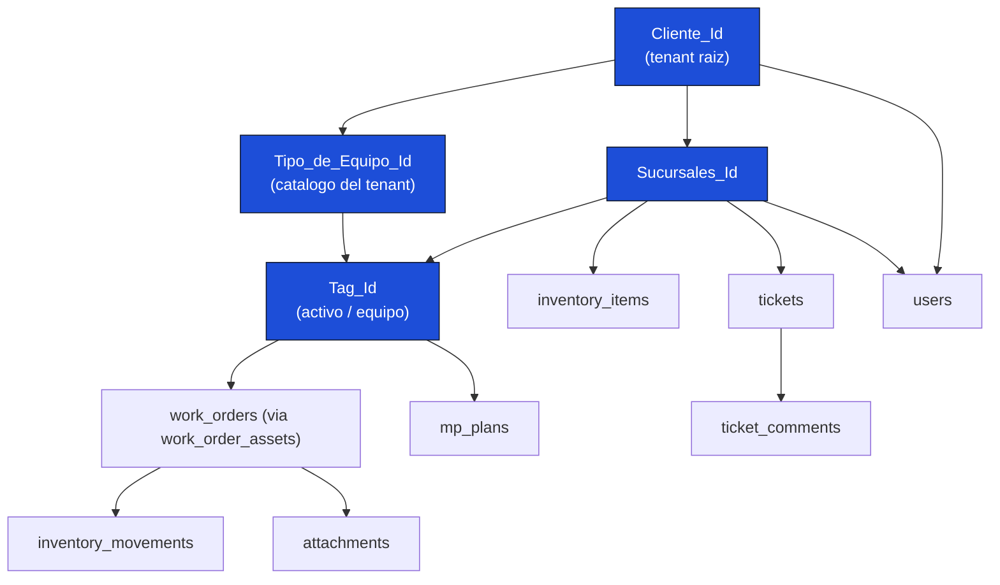
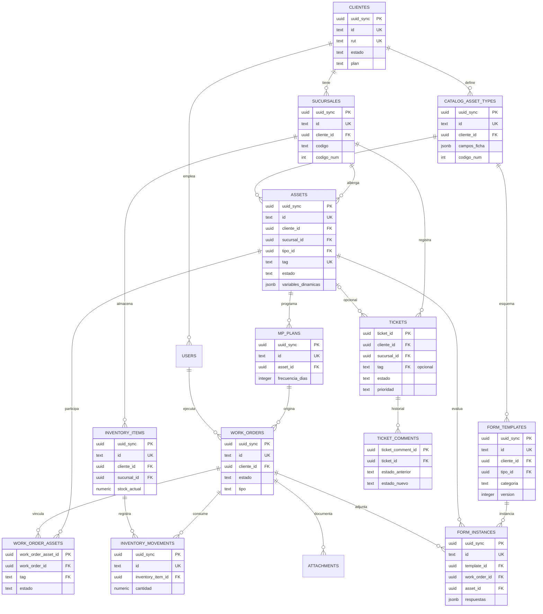
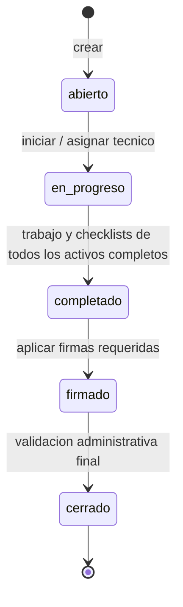
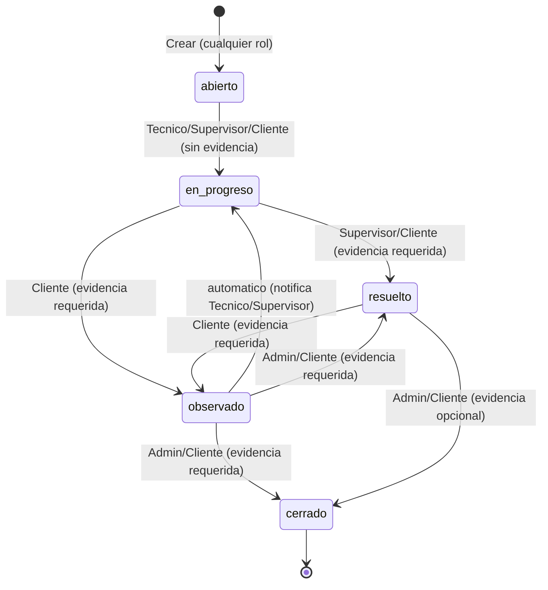
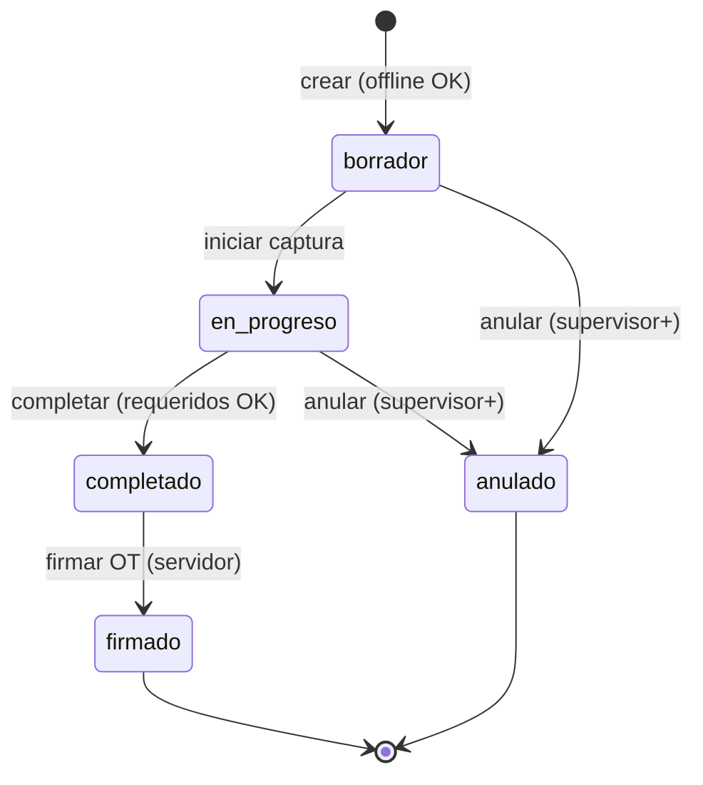
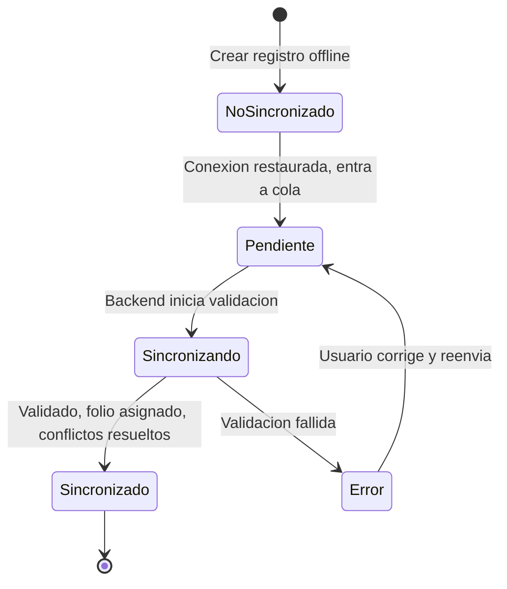

# CMMS HVAC PRO — Reglas de Negocio (Documento Normativo Único)

**Versión 1.0 — 2026-07-21**

> Documento normativo único de reglas de negocio. Ver `DOCS_INDEX.md` para la matriz de precedencia. Fusiona y reemplaza a `CMMS_HVAC_PRO_Reglas_de_Negocio_v1.md` y `FASE_1_REGLAS_DE_NEGOCIO_DETALLADO.md`.

| Control de Documento | Detalle |
|---|---|
| Tipo | Reglas de negocio normativas — vinculantes |
| Propósito | Definir la columna vertebral de datos interrelacionados multi-tenant y el detalle operativo de cada regla |
| Alcance | Plataforma universal de gestión de activos, offline-first, con sincronización eventual — ver §1 |
| Claves maestras | `Cliente_Id` · `Sucursales_Id` · `Tipo_de_Equipo_Id` · `Tag_Id` |
| Audiencia | Arquitecto · Backend · Frontend · DBA · QA · Product Owner |
| Documentos fusionados | `CMMS_HVAC_PRO_Reglas_de_Negocio_v1.md` (v1.0, jun-2026) + `FASE_1_REGLAS_DE_NEGOCIO_DETALLADO.md` (v1.0, 2026-06-13) — ambos quedan archivados; este archivo es la única fuente vigente de reglas de negocio del proyecto |

---

## Índice

- [1. Alcance e Identidad de Producto](#1-alcance)
- [2. Cómo leer este documento](#2-como-leer)
- [3. La Columna Vertebral Multi-Tenant](#3-columna)
- [4. Modelo Entidad-Relación](#4-modelo-er)
- [5. Reglas de Identidad (RN-ID)](#5-rn-id)
- [6. Reglas de Multi-Tenancy (RN-TEN)](#6-rn-ten)
- [7. Reglas de Activos (RN-ACT)](#7-rn-act)
- [8. Reglas de Órdenes de Trabajo (RN-OT)](#8-rn-ot)
- [9. Reglas de Tickets / Incidencias (RN-TKT)](#9-rn-tkt)
- [10. Reglas de Inventario (RN-INV)](#10-rn-inv)
- [11. Reglas de Mantenimiento Preventivo (RN-MP)](#11-rn-mp)
- [12. Reglas de Sincronización (RN-SYNC)](#12-rn-sync)
- [13. Reglas de Seguridad (RN-SEG)](#13-rn-seg)
- [14. Reglas de Folios (RN-FOL)](#14-rn-fol)
- [15. Matriz de Integridad Referencial](#15-integridad)
- [16. Catálogo de Estados y Transiciones](#16-estados)
- [17. Reglas de Formularios y Checklists Modulares (RN-FORM)](#17-rn-form)
- [18. Indicadores y Cálculos (KPI)](#18-kpi)
- [19. Permisos y Control de Acceso — Detalle Operativo](#19-permisos)
- [20. Comportamiento Offline/Online — Detalle Operativo](#20-offline)
- [21. Eventos y Notificaciones](#21-eventos)
- [22. Conflictos y Resolución — Escenarios](#22-conflictos)
- [23. Integridad de Datos — Cascadas, Inmutabilidad y Auditoría](#23-integridad-datos)
- [24. Casos de Uso Detallados](#24-casos-uso)
- [25. Consideraciones Técnicas](#25-tecnicas)
- [26. Edge Cases](#26-edge-cases)
- [27. Performance y Límites](#27-performance)
- [28. Datos Maestros y Catálogos](#28-datos-maestros)
- [Apéndice A — Resumen de Reglas por Dónde se Evalúan](#apendice-a)
- [§ Tablas de verdad](#tablas-de-verdad)
- [§ Workflows propiedad de este documento](#workflows-propios)
- [§ Conflictos detectados entre las fuentes y su resolución](#conflictos-fuentes)

---

<a name="1-alcance"></a>
## 1. Alcance e Identidad de Producto

> **Esta cláusula es vinculante y prevalece sobre cualquier frase de alcance o identidad que aparezca en el resto de este documento o en cualquier otro documento técnico del proyecto (SPEC-*, planes de fase, arquitectura, etc.).** Fue sellada por el dueño del producto (Nelson Bravo) como parte del plan de consolidación documental de 2026-07-21.

### 1.1 Identidad de producto

**CMMS HVAC PRO es una plataforma white-label multi-tenant genérica.** Ninguna marca real de cliente —ni "EECOL", ni "NBYB", ni "Ingeniería y Servicios Bravo Spa", ni ninguna otra razón social— es la identidad del producto. El producto no está co-marcado ni exclusivamente diseñado para ningún cliente en particular.

Cuando en casos de uso, ejemplos o capturas de pantalla de este documento (o de cualquier otro documento del proyecto) aparezcan nombres como "EECOL" o "NBYB", **deben leerse únicamente como ejemplos ilustrativos de un cliente/tenant** dentro de la plataforma multi-tenant — nunca como la marca del producto en sí. El campo `clientes.nombre` (RN-ENT-01) es precisamente el mecanismo por el cual cada tenant configura su propia identidad (nombre, RUT, logo, moneda) sin que esto afecte la identidad del producto CMMS HVAC PRO.

### 1.2 Alcance funcional

**CMMS HVAC PRO es una plataforma universal de gestión de activos ("Asset Management" / CMMS genérico), con HVAC como vertical principal y mejor soportada — no exclusivamente HVAC.**

En la práctica esto significa:
- El modelo de datos (`catalog_asset_types`, ficha técnica dinámica vía `campos_ficha`/`variables_dinamicas`, checklists modulares vía `form_templates`) está diseñado para representar **cualquier tipo de activo mantenible** (HVAC, UPS, calderas, generadores, vehículos, etc.), no solo equipos de climatización.
- El catálogo HVAC (tipos de equipo Split/Chiller/VRF/Central, refrigerantes, checklist nativo HVAC) es el **vertical de referencia, el más maduro y el mejor soportado out-of-the-box**, y sirve como caso de diseño principal para validar la extensibilidad del modelo (RN-FORM-03).
- Cualquier cláusula de alcance en otras secciones de este documento (o heredada de los documentos fusionados) que sugiera que el sistema sirve *exclusivamente* a equipos HVAC debe interpretarse a la luz de esta sección: HVAC es el vertical principal, no un límite técnico del producto.

### 1.3 Unicidad del documento

Este documento es **el único documento normativo de reglas de negocio del proyecto**. Ningún otro documento (`SPEC-*`, planes de fase, documentos de arquitectura, etc.) debe autodenominarse "fuente única" o "documento normativo" en materia de reglas de negocio — esa afirmación vive únicamente aquí. Los documentos que fusiona (`CMMS_HVAC_PRO_Reglas_de_Negocio_v1.md` y `FASE_1_REGLAS_DE_NEGOCIO_DETALLADO.md`) quedan archivados y no deben editarse como fuente de reglas nuevas; cualquier evolución de una regla de negocio se hace directamente sobre este archivo.

---

<a name="2-como-leer"></a>
## 2. Cómo leer este documento

Cada regla de negocio identificada con un código (`RN-XXX-NN`) sigue esta estructura normativa:

| Atributo | Significado |
|---|---|
| **ID** | Identificador único (p. ej. `RN-OT-03`) — se referencia desde documentos técnicos, no debe cambiarse sin coordinación |
| **Enunciado** | La regla en lenguaje claro |
| **Dónde se evalúa** | `Cliente` (Dexie/zod) · `Servidor` (Neon/API) · `Ambos` |
| **Comportamiento offline** | Qué ocurre cuando no hay conexión |
| **En conflicto** | Cómo se resuelve si hay colisión en la sincronización |

Las secciones §18 en adelante contienen contenido **operativo/de implementación** (fórmulas, pseudocódigo, catálogos de datos semilla, casos de uso paso a paso, edge cases) proveniente de la especificación detallada de Fase 1. No introducen reglas nuevas fuera de lo definido en §1–§17; las detallan.

**Principio rector:** en una app offline-first, **cada regla de negocio es también un contrato de datos**. Una regla que solo vive en la UI no existe: debe estar respaldada por una restricción en el servidor (constraint, trigger o validación de API).

**Convención de nomenclatura de códigos conservada de las fuentes:**
- `RN-CORE-*`, `RN-ID-*`, `RN-TEN-*`, `RN-ACT-*`, `RN-OT-*`, `RN-INV-*`, `RN-MP-*`, `RN-SYNC-*`, `RN-SEG-*`, `RN-FOL-*`, `RN-FORM-*` provienen de `CMMS_HVAC_PRO_Reglas_de_Negocio_v1.md`.
- `RN-ENT-*` (definición de entidades), `RN-VAL-*` (validaciones), `EC-*` (edge cases) y `UC-*` (casos de uso) provienen de `FASE_1_REGLAS_DE_NEGOCIO_DETALLADO.md`.
- `RN-TKT-*` es una sección nueva de este documento fusionado que agrupa las reglas de Tickets/Incidencias que en la fuente Fase 1 vivían sueltas bajo `RN-ENT-08/09` y `RN-VAL-TICKET-*`; no reemplaza ningún código existente, solo les da una casa temática consistente con el resto del documento.

---

<a name="3-columna"></a>
## 3. La Columna Vertebral Multi-Tenant

La aplicación entera se sostiene sobre una **cadena de contención jerárquica** de cuatro claves. Toda entidad del sistema cuelga de esta cadena, y el aislamiento de datos entre clientes (tenants) se hereda por la rama.



### 3.1 Significado de cada clave

| Clave | Entidad | Rol en la jerarquía | Cardinalidad |
|---|---|---|---|
| `Cliente_Id` | `clientes` | **Tenant raíz.** Aísla todos los datos. El `administrador` global puede operar sin cliente activo y cambiar de contexto; los demás usuarios solo ven clientes asignados. | 1 |
| `Sucursales_Id` | `sucursales` | Ubicación física del cliente. Contiene activos, inventario y tickets. | 1 Cliente → N Sucursales |
| `Tipo_de_Equipo_Id` | `catalog_asset_types` | Catálogo de tipos de equipo/activo del cliente (predefinidos o custom). Define la ficha técnica dinámica y el checklist por defecto. | 1 Cliente → N Tipos |
| `Tag_Id` | `assets` / `equipos` | Identidad del activo físico (HVAC u otro). Pertenece a una Sucursal y es de un Tipo. | 1 Sucursal → N Activos; 1 Tipo → N Activos |

**Regla crítica de anclaje (RN-ENT-00, implícita en ambas fuentes):** todo registro de negocio debe llevar `cliente_id`. Las entidades de identidad y plataforma (`users`, roles, sesiones y relaciones usuario-cliente) se vinculan mediante `user_clientes`; el `administrador` global puede no tener un cliente activo, pero nunca se crean registros de negocio sin `cliente_id`.

### 3.2 La Regla de Oro del Aislamiento

> **RN-CORE-01 — Aislamiento por rama.**
> Ninguna entidad puede referenciar una clave que pertenezca a una rama de otro `Cliente_Id`. Un `Tag_Id` debe pertenecer a una `Sucursales_Id` cuyo `Cliente_Id` coincida con el del usuario autenticado. Toda violación se rechaza de forma **permanente** con `FK_VIOLATION` o `TENANT_MISMATCH` (nunca se reasigna el tenant silenciosamente).

### 3.3 Catálogo de roles (consolidado)

Ambas fuentes coinciden en que el control de acceso opera por rol, pero ninguna de las dos enumera exhaustivamente los "6 roles" que la especificación de Fase 1 menciona como alcance (§6). Los roles que sí aparecen explícitamente nombrados en las fuentes fusionadas son:

| Rol | Alcance | Origen |
|---|---|---|
| `administrador` | Global. Único que crea/edita/activa/desactiva/elimina clientes y sucursales; único que crea/edita usuarios; puede operar sin cliente activo; valida cierre final de OT (`firmado → cerrado`). | v1 + Fase 1 |
| `supervisor` | Todas las sucursales de su tenant. Puede dar de baja/retirar activos, anular instancias de formulario, reasignar técnicos, resolver/cerrar tickets junto al cliente. | v1 + Fase 1 |
| `tecnico` | Solo sus `sucursales_asignadas`. Crea y ejecuta OT, diligencia checklists, no puede dar de baja activos ni cerrar OT administrativamente. | v1 + Fase 1 |
| `cliente` | Rol externo/portal: recibe informes, puede devolver un informe a "Observado" con evidencia, cierra tickets cuando está conforme. No crea/edita equipos. | Fase 1 |
| `proveedor` | Referenciado como `proveedor_asignado_user_id` en tickets; asignable como responsable externo de una incidencia. | Fase 1 |

> ⚠️ REVISAR: las fuentes fusionadas mencionan "6 roles" (Fase 1 §6, resumen ejecutivo) pero solo nombran 5 explícitamente (`administrador`, `supervisor`, `tecnico`, `cliente`, `proveedor`). La matriz completa de permisos se referencia como vivienda en `FASE_1_ARQUITECTURA_Y_DISEÑO.md § 1.1`, documento que no fue fusionado aquí (fuera del alcance de esta tarea). Se recomienda que el dueño del producto confirme el nombre del sexto rol y, si corresponde, se incorpore la matriz completa a este documento en una revisión posterior.

---

<a name="4-modelo-er"></a>
## 4. Modelo Entidad-Relación



> ⚠️ REVISAR — **conflicto de cardinalidad OT↔Activo resuelto en favor del modelo más detallado (Fase 1).** `CMMS_HVAC_PRO_Reglas_de_Negocio_v1.md` modelaba `work_orders.asset_id` como FK directa (una OT = un activo). `FASE_1_REGLAS_DE_NEGOCIO_DETALLADO.md` es explícito ("Nota crítica: NO hay `asset_id` directo") y documenta una tabla de unión `work_order_assets` que permite **1 OT : N activos**, con estado de progreso independiente por activo (`pendiente`/`en_progreso`/`completado`) y que la OT solo puede pasar a `completado` cuando **todos** sus `work_order_assets` están completados. Este documento adopta el modelo N:N de Fase 1 como canónico porque es el más completo y porque describe explícitamente el trigger de validación. **Se marca para revisión humana porque es un cambio estructural de esquema (afecta FKs, migraciones y cualquier código ya escrito contra `work_orders.asset_id`)** — confirmar con arquitectura antes de implementar.

---

<a name="5-rn-id"></a>
## 5. Reglas de Identidad (RN-ID)

### RN-ID-01 — Identidad universal `uuid_sync`
- **Enunciado:** Toda entidad sincronizable tiene dos identificadores obligatorios: `uuid_sync`, UUID v4 técnico e inmutable usado para sincronización y referencias estables; e `id`, identificador funcional/humano de la entidad. El `uuid_sync` puede generarse en el cliente con `crypto.randomUUID()`.
- **Dónde se evalúa:** Ambos.
- **Offline:** Se genera localmente sin necesidad de servidor; permite crear registros 100% offline.
- **Conflicto:** Imposible por diseño — la probabilidad de colisión de UUID v4 es despreciable.

### RN-ID-02 — Folio humano solo del servidor
- **Enunciado:** El identificador funcional legible (`id`, p. ej. `OT-2026-000123`) lo asigna **exclusivamente** el servidor cuando la entidad requiere correlativo oficial. Durante la captura offline puede existir un `id` temporal claramente marcado con prefijo `PEND-`, que se reemplaza mediante un mapa de identidad (`id_map`) al sincronizar.
- **Dónde se evalúa:** Servidor.
- **Offline:** El registro usa un `id` temporal con prefijo `PEND-`; la UI muestra "pendiente de folio" hasta recibir el `id` oficial.
- **Conflicto:** No aplica — el servidor es la única fuente del folio.

### RN-ID-03 — El QR codifica `uuid_sync`, no el Tag
- **Enunciado:** El código QR de un activo codifica una URL web universal con el `uuid_sync`, por ejemplo `https://app.cmmshvacpro.com/equipos/{uuid_sync}`. Nunca utiliza el `tag` como identidad del enlace, porque el tag puede corregirse y el UUID no.
- **Dónde se evalúa:** Servidor (columna generada).
- **Offline:** El QR se genera desde el `uuid_sync` ya disponible localmente.
- **Conflicto:** No aplica.

---

<a name="6-rn-ten"></a>
## 6. Reglas de Multi-Tenancy (RN-TEN)

### RN-TEN-01 — Todo registro pertenece a un `Cliente_Id`
- **Enunciado:** Toda entidad de negocio lleva `cliente_id` no nulo que la ancla a un tenant. Las entidades de identidad y plataforma (`users`, roles, sesiones y relaciones usuario-cliente) se vinculan mediante `user_clientes`; el administrador global puede no tener un cliente activo, pero nunca se crean registros de negocio sin `cliente_id`.
- **Dónde se evalúa:** Ambos (zod `uuid()` + FK `NOT NULL`).
- **Offline:** El `cliente_id` se toma de la sesión del usuario, disponible localmente.
- **Conflicto:** Si el `cliente_id` no coincide con el del JWT → `TENANT_MISMATCH` permanente.

### RN-TEN-02 — Aislamiento de lectura
- **Enunciado:** Un usuario solo recibe en el pull los registros de los clientes presentes en su relación `user_clientes`. El rol `administrador` es global, puede consultar todos los tenants, operar sin cliente preseleccionado y es el único que puede crear, editar, activar, desactivar o eliminar clientes y sus sucursales.
- **Datos mínimos del cliente (RN-ENT-01):** `nombre` (mín. 3 caracteres), `rut` único con formato válido `XX.XXX.XXX-X`, `direccion`, `region`, `email` con formato válido si está presente, y al menos una sucursal de tipo `Casa Matriz`. La Casa Matriz hereda la dirección y región principales y no puede eliminarse. El cliente también admite `razon_social`, `telefono`, `sitio_web`, `moneda` (`CLP`/`USD`, default `CLP`) y `logo_url`.
- **Estado del cliente:** `activo → suspendido → cerrado`, transición no reversible (RN-ENT-01). Un cliente "cerrado" no se elimina físicamente — se conserva por auditoría (ver también §16.3).
- **Inicio por rol:** El administrador elige vista global o contexto de cliente. Supervisor y Técnico deben elegir al iniciar uno de los clientes asignados en `user_clientes`; ese contexto permanece durante la sesión y puede cambiarse desde el encabezado. Los demás roles ingresan con su `cliente_id` predeterminado. Las sucursales se usan como filtros internos de los módulos.
- **Dónde se evalúa:** Servidor (filtro en `/api/sync/pull` o equivalente `/api/sync/download`).
- **Offline:** El cliente solo tiene en Dexie los datos de su tenant; no hay fuga posible.
- **Conflicto:** No aplica.

### RN-TEN-03 — Alcance por sucursal del técnico
- **Enunciado:** Un `tecnico` solo accede a activos y OT de sus `sucursales_asignadas`. Un `supervisor` accede a todas las sucursales de su tenant.
- **Dónde se evalúa:** Servidor (RBAC + filtro de pull).
- **Offline:** Dexie solo contiene los registros dentro del alcance ya descargado.
- **Conflicto:** No aplica.

### RN-TEN-04 — Límites por plan
- **Enunciado:** El `plan` del cliente (`starter`/`pro`/`enterprise`) define límites (p. ej. máximo de activos). Superarlo bloquea altas con `PLAN_LIMIT`.
- **Dónde se evalúa:** Servidor.
- **Offline:** El cliente puede crear localmente; el servidor rechaza al sincronizar si excede.
- **Conflicto:** El registro excedente queda `failed` con `PLAN_LIMIT` en el panel de errores.

### RN-ENT-02 — Sucursal
- **Enunciado:** Una sucursal pertenece a un único `cliente_id` y es única por `(cliente_id, nombre)`, `(cliente_id, codigo)` y `(cliente_id, codigo_num)`. El campo `codigo` (p. ej. `21-STK`) y `codigo_num` (correlativo) alimentan la composición del `Tag_Id` (RN-ACT-06/RN-VAL-EQUIPO-01 — ver nota de conflicto en §7). Incluye georreferenciación opcional (`latitud`/`longitud`), datos de contacto y `estado` (`activo`/`cerrado`).
- **Dónde se evalúa:** Ambos.
- **Offline:** El catálogo de sucursales del tenant se descarga en el pull.
- **Conflicto:** Duplicado de nombre/código dentro del mismo cliente → `DUPLICATE_KEY`.
- **Editable por:** Administrador global.

---

<a name="7-rn-act"></a>
## 7. Reglas de Activos (RN-ACT)

### RN-ACT-01 — Tag único por cliente
- **Enunciado:** El `tag` de un activo es único dentro de un mismo `cliente_id` (no globalmente). El formato canónico auto-generado se define en **RN-ACT-06**; se acepta además `^[A-Z0-9]+(\.[A-Z0-9]+)*$` para tags manuales/legados (p. ej. `STGO.AZ.001`).
- **Dónde se evalúa:** Ambos (zod regex + `UNIQUE (cliente_id, tag)`).
- **Offline:** El cliente valida el formato; la unicidad real se confirma en el servidor.
- **Conflicto:** Tag duplicado en el mismo tenant → `DUPLICATE_KEY` permanente.

### RN-ACT-02 — Coherencia de rama Sucursal-Tipo
- **Enunciado:** Un activo referencia una `sucursal_id` y un `tipo_id` que deben pertenecer al mismo `cliente_id` del activo.
- **Dónde se evalúa:** Servidor (FK + verificación de tenant).
- **Offline:** El cliente solo ofrece sucursales/tipos de su tenant en los selects.
- **Conflicto:** Referencia cruzada de tenant → `FK_VIOLATION` permanente.

### RN-ACT-03 — Ficha técnica validada contra el Tipo
- **Enunciado:** Los campos de `ficha_tecnica`/`variables_dinamicas` de un activo deben cumplir el esquema `campos_ficha`/`campos_dinamicos` definido en su `Tipo_de_Equipo_Id`. Los campos `requerido: true` son obligatorios.
- **Dónde se evalúa:** Ambos (zod dinámico + trigger `validate_ficha_tecnica`).
- **Offline:** El formulario se construye dinámicamente desde el catálogo descargado.
- **Conflicto:** Campo requerido ausente → `FICHA_FIELD_REQUIRED`.
- **Detalle de validación por tipo (RN-VAL-EQUIPO-03):** además del esquema genérico, existen reglas específicas por tipo de equipo — p. ej. un `Split` requiere `capacidad_btu > 0`; un `VRF` requiere al menos 1 Unidad Evaporadora (`ue_list.length >= 1`). Estas reglas específicas se declaran junto con el catálogo del tipo y se validan tanto en cliente como en servidor.
- **Ejemplos de esquema dinámico por tipo (`campos_dinamicos`/`variables_dinamicas`):**

  | Tipo | Campos típicos |
  |---|---|
  | Split | `tipo_split` (mural/cassette/piso-techo), `capacidad_btu`, `unidad_interior`, `ciclo_frio_calor`, `compresor.tipo`/`on_off`/`inverter` |
  | Chiller | `capacidad_tr`, `bombas[]` (nombre, tipo, caudal_gpm), `circuitos[]` (número, compresores, refrigerante) |
  | VRF | `capacidad_total_kw`, `ue_list[]` (id, ubicación, capacidad_kw) |
  | Central/Ducted | `capacidad_kw`, `voltaje`, `sucursales` |
  | Equipo de Precisión | `capacidad_kw`, `humidificador`, `rango_humedad`, `precision_temperatura` |

  Estos tipos son el **catálogo predefinido de referencia del vertical HVAC** (§1.2); un tenant puede definir tipos de equipo adicionales para otras clases de activos usando el mismo mecanismo de `campos_dinamicos` (RN-FORM-03).

### RN-ACT-04 — Baja de activo restringida
- **Enunciado:** Cambiar `estado_operativo` a `baja`/`retirado` requiere rol `supervisor` o superior. La transición es **irreversible**: un activo retirado no vuelve a ningún otro estado (ver matriz de transición en §16.2).
- **Dónde se evalúa:** Ambos (UI oculta acción + RBAC servidor).
- **Offline:** La UI restringe según el rol en sesión.
- **Conflicto:** Técnico intenta dar de baja → `FORBIDDEN`.

### RN-ACT-05 — No se borra, se da de baja
- **Enunciado:** Los activos no se eliminan físicamente; se marcan con `estado_operativo='baja'` (equivalente a `retirado`) y/o `deleted_at` (soft-delete), conservando el historial de OT. Al retirar un equipo, las OT abiertas asociadas se anotan automáticamente (p. ej. se anexa "[Equipo retirado]" a la descripción) para no perder trazabilidad.
- **Dónde se evalúa:** Ambos.
- **Offline:** El soft-delete se propaga como tombstone en el pull.
- **Conflicto:** LWW por `updated_at` del servidor.

### RN-ACT-06 — Composición del Tag_Id
- **Enunciado:** El `Tag_Id` canónico se compone como `id_sucursal.tipo_de_equipo.nro_serie` con máscara `0000000.0000.000` (7 + 4 + 3 dígitos): sucursal (`codigo_num`), tipo de equipo (`codigo_num`) y correlativo de serie por `(cliente, sucursal, tipo)`. Ej.: `0000012.0003.007`.
- **Dónde se evalúa:** Ambos (CHECK `^\d{7}\.\d{4}\.\d{3}$` + composición en servidor).
- **Offline:** El activo se crea con `uuid_sync` y un tag provisional con formato `PEND.<short>` (p. ej. `PEND.A1B2C3`), válido frente al CHECK y de uso solo para mostrar hasta el sellado.
- **Conflicto:** No aplica — el correlativo lo sella el servidor (RN-ACT-07).

> ⚠️ REVISAR — **conflicto real de formato de TAG entre las dos fuentes, no resuelto automáticamente.** `FASE_1_REGLAS_DE_NEGOCIO_DETALLADO.md` (RN-VAL-EQUIPO-01) especifica un formato distinto: `{sucursal_codigo}.{tipo_codigo}.{seq}` con ejemplo `21-STK.AC.001` y regex de validación `^\d{2,}-[A-Z]+\.[A-Z]+\.\d{3}$` — es decir, códigos **alfanuméricos** de sucursal/tipo, no el patrón puramente numérico de 7-4-3 dígitos de RN-ACT-06. Ambas fuentes describen la misma regla de negocio (composición del Tag) con formatos incompatibles entre sí; ninguna es estrictamente "más detallada" que la otra, son literalmente distintas. Este documento conserva **RN-ACT-06/07 (formato numérico 7-4-3) como el vigente**, por ser el que además especifica el mecanismo de sellado por servidor y el manejo de overflow (RN-ACT-07), pero dado que el ejemplo alfanumérico de Fase 1 (`21-STK.AC.001`) aparece repetido de forma consistente en varios pseudocódigos de esa fuente (generación, validación, casos de uso, edge cases), **se requiere que el dueño del producto confirme cuál formato es el vigente antes de generar el DDL definitivo**, ya que además afecta el formato de folio (ver conflicto relacionado en §14).

### RN-ACT-07 — Generación del correlativo sellada por servidor
- **Enunciado:** El segmento `nro_serie` lo asigna **exclusivamente** el servidor desde `asset_tag_sequences` (mismo patrón que los folios, RN-FOL). El cliente nunca inventa el correlativo. En la variante offline documentada por Fase 1, el cliente puede proponer un TAG temporal con un sufijo UUID corto (p. ej. `21-STK.AC.a1b2c3d4`) precisamente para evitar colisiones entre dos técnicos offline creando equipos simultáneamente en la misma rama; el servidor lo reemplaza por el correlativo oficial al sincronizar.
- **Dónde se evalúa:** Servidor (trigger `assign_asset_tag`).
- **Offline:** El tag definitivo se sella al sincronizar; hasta entonces la UI muestra "pendiente".
- **Conflicto:** Correlativo > 999 por rama+tipo → amplía a 4 dígitos y emite alerta `TAG_SERIAL_OVERFLOW` (no bloquea el alta).

### RN-VAL-EQUIPO-02 — Imagen de placa requerida (condicional)
- **Enunciado:** Si el activo se marca `tiene_placa = true`, la `imagen_placa_url` es obligatoria (no puede quedar vacía). Si `tiene_placa = false`, la imagen es opcional y cualquier valor presente se ignora con una advertencia. Cuando hay imagen, la URL debe apuntar a un archivo `jpg`/`jpeg`/`png`.
- **Dónde se evalúa:** Ambos.
- **Offline:** La foto se captura y guarda como Blob local; la validación de presencia ocurre en el formulario.
- **Conflicto:** `VALIDATION_ERROR` si falta la imagen requerida.

### RN-VAL-EQUIPO-04 — Estados operativos y transiciones válidas
- **Enunciado:** Un activo transita entre estados operativos según una matriz de transiciones válidas (ver Catálogo de Estados, §16.2). El estado terminal (`baja`/`retirado`) no admite ninguna transición de salida.
- **Dónde se evalúa:** Ambos.
- **Offline:** La UI valida la transición contra la tabla local antes de permitir el cambio.
- **Conflicto:** Transición no permitida → `INVALID_TRANSITION`.

### Campos no editables tras la creación de un activo
`tag`, `tipo_de_equipo_id`/`tipo_id`, `cliente_id`, `sucursal_id`. Editable por: Crear (Admin, Supervisor, Técnico de su sucursal — Cliente no puede crear); Editar (Admin, Supervisor, Técnico — Cliente no); Retirar (solo Admin/Supervisor, ver RN-ACT-04).

### Catálogo de refrigerantes
El activo puede referenciar `refrigerante_id` contra un catálogo `refrigerantes_catalogo` con 15 refrigerantes de uso común (ver §28.1 para el detalle sembrado — incluye `peligro_nivel` para refrigerantes inflamables como R-290/R-600a o tóxicos como R-717).

---

<a name="8-rn-ot"></a>
## 8. Reglas de Órdenes de Trabajo (RN-OT)

### RN-OT-01 — Máquina de estados estricta
- **Enunciado:** Una OT solo transita por estados válidos (ver §16). Transiciones no permitidas se rechazan con `INVALID_TRANSITION`.
- **Dónde se evalúa:** Ambos (validación en UI + servidor).
- **Offline:** El cliente conoce la tabla de transiciones y bloquea las inválidas.
- **Conflicto:** Si dos dispositivos avanzan la misma OT, gana el servidor (LWW); si está en `firmado` o `cerrado`, ver RN-OT-04.
- **Estados intermedios permitidos en `abierto` (RN-VAL-OT-02):** mientras la OT está en `abierto`, se puede editar libremente (descripción, técnico asignado). En estados posteriores a `abierto`, solo se permite reasignar `tecnico_asignado_user_id`/`supervisor_user_id`; cualquier otro cambio de contenido se rechaza con `OT_NOT_EDITABLE` salvo lo previsto en RN-OT-04 para OT firmadas.

### RN-OT-02 — OT siempre sobre activo activo
- **Enunciado:** No se puede crear una OT sobre un activo en estado `baja`/`retirado`.
- **Dónde se evalúa:** Ambos.
- **Offline:** La UI advierte; el servidor rechaza con `ASSET_INACTIVE`.
- **Conflicto:** El registro queda `failed` si el activo fue dado de baja antes de sincronizar (ver también EC-001, §26).
- **Regla derivada (RN-VAL-OT-01):** una OT requiere al menos 1 equipo asociado (vía `work_order_assets`, §4). Cada `tag` referenciado debe existir y pertenecer al mismo `cliente_id` de la OT; de lo contrario se rechaza antes de crear la OT.

### RN-OT-03 — Cierre exige checklist completo
- **Enunciado:** Para pasar a `completado`, todos los ítems `requerido` del checklist deben estar completados. Cuando la OT tiene múltiples activos vinculados (`work_order_assets`, §4), la OT solo pasa a `completado` cuando **todos** los `work_order_assets.estado = 'completado'` — es decir, cada activo debe tener su checklist/informe propio completado.
- **Dónde se evalúa:** Ambos.
- **Offline:** La UI no permite cerrar con checklist incompleto ni con activos pendientes.
- **Conflicto:** Servidor rechaza con `CHECKLIST_INCOMPLETE` si el payload llega incompleto (código de error específico: `OT-VAL-001` cuando la causa es activos sin completar).
- **Ver también:** tabla de verdad normativa en §Tablas de verdad, que consolida esta regla junto con RN-OT-04.

### RN-OT-04 — OT firmada es inmutable
- **Enunciado:** Una vez en estado `firmado`, la OT no admite modificaciones de contenido técnico, evidencias o firmas. Se sella `firma_hash` (SHA-256). Solo puede transitar a `cerrado` mediante validación administrativa, sin alterar el contenido sellado. La transición `completado → firmado` valida que estén aplicadas todas las firmas configuradas antes de sellar.
- **Dónde se evalúa:** Servidor (trigger `protect_signed_work_order`).
- **Offline:** La UI bloquea edición de OT en estado `firmado` o `cerrado`.
- **Conflicto:** Cualquier actualización de contenido sobre una OT firmada o cerrada → `IMMUTABLE_SIGNED_OT`; el cambio local se marca `conflicted`.
- **Ver también:** tabla de verdad normativa en §Tablas de verdad.

### RN-OT-05 — Consumo de materiales genera movimiento
- **Enunciado:** Al registrar `materiales_usados` en una OT, se genera un `inventory_movement` tipo `salida` por cada material consumido.
- **Dónde se evalúa:** Servidor.
- **Offline:** El consumo se captura localmente; el movimiento se materializa al sincronizar.
- **Conflicto:** Si el stock resultante baja del mínimo, se genera notificación `stock_bajo` (no bloquea) — ver también §21 (Eventos).

### RN-OT-06 — Autoría y tiempos sellados
- **Enunciado:** `created_by`/`updated_by` registran el usuario; `fecha_inicio` se sella al pasar a `en_progreso`, `fecha_completado` al pasar a `completado`, `fecha_firma` al pasar a `firmado` y `fecha_cierre`/`closed_at` al pasar a `cerrado` (por el servidor).
- **Dónde se evalúa:** Ambos (`captured_at` cliente, fechas oficiales servidor).
- **Offline:** Se guarda `captured_at` local para orden y auditoría.
- **Conflicto:** Las fechas oficiales las sella el servidor.
- **Campo adicional:** `version` (entero, incrementa cada edición de contenido) se usa como marca de control de cambios sobre la OT mientras está editable.

### RN-OT-07 — Estructura de la OT genérica firmable
- **Enunciado:** La OT genérica incluye cuatro cuadros de texto narrativos — `hallazgo`, `diagnostico`, `recomendaciones`, `conclusiones` — además del encabezado estándar (cliente, sucursal, activo(s), intervención). Se llenan manualmente o por *binding* desde checklists (RN-FORM-05). Cada OT tiene además un `tipo` que clasifica la intervención: `preventivo`, `correctivo`, `atencion_falla`, `puesta_en_marcha`, `inspeccion_tecnica`, `instalacion_montaje`, `predictivo`.
- **Dónde se evalúa:** Ambos.
- **Offline:** Se capturan localmente; el *binding* compone valores al completar checklists.
- **Conflicto:** LWW por `updated_at` del servidor (salvo OT firmada, RN-OT-04).

### RN-OT-08 — La OT llama y adjunta checklists
- **Enunciado:** Una OT puede adjuntar 1..N Instancias de checklist (`form_instances.work_order_id`), y —cuando aplica el modelo multi-activo de §4— 1..N activos vía `work_order_assets`, cada uno con su propio avance y su propia instancia de formulario/informe. El checklist HVAC nativo es el estándar; otras categorías (UPS, caldera, generador, vehículo) se adjuntan del mismo modo.
- **Reconciliación con el legado:** El `work_orders.checklist jsonb` embebido (RN-OT-03) se conserva como atajo del checklist por defecto del plan MP; el motor `form_instances` es la vía canónica para checklists extensibles y la OT genérica. Las categorías nuevas usan **siempre** `form_instances`. El cierre exige ambos completos (RN-OT-03 + RN-FORM-07).
- **Dónde se evalúa:** Ambos (FK + RN-FORM-07 para el cierre).
- **Offline:** Los checklists se diligencian offline y viajan en el mismo lote de sync.
- **Conflicto:** Cierre con checklist incompleto → `CHECKLIST_INCOMPLETE`.

### RN-ENT-06/07 — Detalle de esquema de la OT y su vínculo con activos
- **Folio y folio temporal:** `folio` oficial vs `folio_temporal` (offline, prefijo `OT-{uuid-corto}`) — ver conflicto de formato de folio en §14.
- **Vínculo con activos:** tabla `work_order_assets` (`work_order_asset_id`, `work_order_id`, `cliente_id`, `tag`, `estado` `pendiente/en_progreso/completado`, `form_instance_id` opcional, `orden`), única por `(work_order_id, tag)`.
- **Consumo energético asociado a la OT:** campo `consumo_kwh` (nullable = usar fórmula automática, ver §18.5) y `consumo_editado_manually` (booleano) para permitir sobreescritura manual del valor calculado.

---

<a name="9-rn-tkt"></a>
## 9. Reglas de Tickets / Incidencias (RN-TKT)

> Esta sección proviene íntegramente de `FASE_1_REGLAS_DE_NEGOCIO_DETALLADO.md` (RN-ENT-08, RN-ENT-09, RN-VAL-TICKET-01/02); `CMMS_HVAC_PRO_Reglas_de_Negocio_v1.md` no modelaba Tickets como entidad propia. Se agrupa aquí bajo el prefijo `RN-TKT` únicamente como organización temática de este documento fusionado — los códigos de origen (`RN-ENT-08/09`, `RN-VAL-TICKET-01/02`) se conservan entre paréntesis por trazabilidad.

### RN-TKT-01 (RN-ENT-08) — Ticket como entidad de incidencia
- **Enunciado:** Un `ticket` es la unidad de registro de una incidencia/consulta, con `numero_correlativo` secuencial por cliente, `titulo` (≥5 caracteres), `descripcion` (≥10 caracteres), `tipo` (`correctivo`/`preventivo`/`consulta`), `prioridad` (`baja`/`media`/`alta`/`critica`), un `tag` de activo opcional (no todo ticket se asocia a un equipo), y asignación a `responsable_tecnico_user_id` y/o `proveedor_asignado_user_id`.
- **Dónde se evalúa:** Ambos.
- **Offline:** Se crea localmente y sincroniza como el resto de entidades de negocio.
- **Conflicto:** `numero_correlativo` es único por cliente — el servidor lo sella igual que un folio (RN-FOL).

### RN-TKT-02 (RN-ENT-09) — Evidencia obligatoria en cambios de estado
- **Enunciado:** Todo cambio de estado de un ticket debe ir acompañado de un `ticket_comment` con **texto de al menos 20 caracteres O una foto** (al menos uno de los dos es obligatorio; ambos son aceptados si están presentes).
- **Dónde se evalúa:** Ambos (validación de formulario + `CHECK` en `ticket_comments`).
- **Offline:** La evidencia (foto) se guarda como Blob local y viaja en el mismo lote.
- **Conflicto:** `VALIDATION_ERROR` si no hay texto suficiente ni foto.
- **Detalle por transición (RN-VAL-TICKET-01):** no todas las transiciones exigen evidencia. `abierto → en_progreso` no la requiere; `en_progreso → resuelto`, `en_progreso → observado`, `resuelto → observado`, `observado → resuelto`, `observado → cerrado` sí la requieren; `resuelto → cerrado` es opcional.

### RN-TKT-03 (RN-VAL-TICKET-02) — Límite de ciclos de devolución
- **Enunciado:** Un ticket no puede devolverse a `observado` más de 5 veces en una ventana de 7 días. Al alcanzar el límite, el sistema exige escalar a Supervisor en lugar de permitir otra devolución.
- **Dónde se evalúa:** Servidor.
- **Offline:** No aplica al crear la devolución localmente; el servidor rechaza al sincronizar si el conteo ya se superó.
- **Conflicto:** `VALIDATION_ERROR` (`Máximo 5 devueltas por semana. Escalar a Supervisor.`).

### RN-TKT-04 — Máquina de estados del ticket
- **Enunciado:** `abierto → en_progreso → resuelto ⇄ observado → cerrado`, con las siguientes transiciones y roles permitidos (ver diagrama y tabla completos en §16.4):
  - `abierto → en_progreso`: Técnico/Supervisor/Cliente, sin evidencia.
  - `en_progreso → resuelto`: Supervisor/Cliente, con evidencia.
  - `en_progreso → observado`: Cliente, con evidencia.
  - `resuelto → observado`: Cliente, con evidencia (devuelve a técnico).
  - `observado → en_progreso`: automático (notifica a Técnico/Supervisor).
  - `observado → resuelto` / `observado → cerrado`: Admin/Cliente, con evidencia.
  - `resuelto → cerrado`: Admin/Cliente, evidencia opcional.
- **Dónde se evalúa:** Ambos.
- **Offline:** El cliente valida la transición contra la tabla local.
- **Conflicto:** Transición no permitida → `INVALID_TRANSITION`.

### RN-TKT-05 — Inmutabilidad tras cierre
- **Enunciado:** Un ticket en estado `cerrado` no se puede reabrir. Su historial completo (`ticket_comments`) se conserva íntegro para auditoría: quién cerró, cuándo y por qué.
- **Dónde se evalúa:** Servidor.
- **Offline:** La UI oculta acciones sobre tickets cerrados.
- **Conflicto:** Intento de modificar ticket cerrado → `IMMUTABLE_CLOSED_TICKET`.

---

<a name="10-rn-inv"></a>
## 10. Reglas de Inventario (RN-INV)

> **Nota de alcance (Fase 1):** el inventario está completamente modelado a nivel de datos, pero **no tuvo UI en el alcance de Fase 1** ("solo DDL documentado"); su interfaz de usuario se planificó para fases posteriores. Esto no cambia la vigencia de las reglas siguientes, que sí gobiernan el modelo de datos desde el primer momento en que exista escritura de inventario (p. ej. vía consumo de materiales en una OT, RN-OT-05).

### RN-INV-01 — El stock solo cambia por movimientos
- **Enunciado:** `inventory_items.stock_actual` es una **columna derivada**: nunca se actualiza directamente. Solo cambia al insertar un `inventory_movement` (libro append-only).
- **Dónde se evalúa:** Servidor (trigger `apply_inventory_movement`).
- **Offline:** El cliente captura movimientos; el stock local se recalcula tras el pull.
- **Conflicto:** Movimientos concurrentes se serializan con `FOR UPDATE`; el stock nunca se corrompe.

### RN-INV-02 — Movimientos son inmutables (append-only)
- **Enunciado:** Un `inventory_movement` nunca se edita ni borra. Una corrección es un nuevo movimiento de tipo `ajuste` o `devolucion`.
- **Dónde se evalúa:** Servidor (sin endpoint de update/delete).
- **Offline:** Los movimientos se encolan y suben; jamás se modifican.
- **Conflicto:** No aplica — son hechos históricos.

### RN-INV-03 — Stock por sucursal
- **Enunciado:** El inventario pertenece a una `Sucursales_Id`. El mismo repuesto en dos sucursales son dos registros con stock independiente.
- **Dónde se evalúa:** Ambos (`UNIQUE (cliente_id, codigo)` por código de catálogo; stock por sucursal).
- **Offline:** El técnico ve el stock de sus sucursales.
- **Conflicto:** No aplica.

### RN-INV-04 — Alerta de stock bajo automática
- **Enunciado:** Cuando un movimiento deja `stock_actual < stock_minimo`, se genera una notificación `stock_bajo` a administradores y supervisores del tenant.
- **Dónde se evalúa:** Servidor (trigger).
- **Offline:** La alerta llega en el siguiente pull.
- **Conflicto:** No aplica.

### RN-INV-05 — Cantidad nunca cero
- **Enunciado:** Un movimiento debe tener `cantidad != 0` (positivo = entrada, negativo = salida).
- **Dónde se evalúa:** Ambos (zod + `CHECK (cantidad != 0)`).
- **Offline:** Validado en el formulario.
- **Conflicto:** `VALIDATION_ERROR`.

---

<a name="11-rn-mp"></a>
## 11. Reglas de Mantenimiento Preventivo (RN-MP)

### RN-MP-01 — Generación automática por frecuencia
- **Enunciado:** Un scheduler diario en el servidor genera OT preventivas cuando `proxima_ejecucion <= now() + alertar_dias_antes`.
- **Dónde se evalúa:** Servidor (Vercel Cron).
- **Offline:** No aplica (proceso de servidor); la OT generada llega por pull.
- **Conflicto:** No aplica.

### RN-MP-02 — No duplicar OT preventiva del mismo plan
- **Enunciado:** El scheduler no genera una nueva OT si ya existe una OT `abierta` o `en_progreso` de ese plan en el período.
- **Dónde se evalúa:** Servidor.
- **Offline:** No aplica.
- **Conflicto:** No aplica.

### RN-MP-03 — Recálculo de próxima ejecución
- **Enunciado:** Al completar una OT preventiva, `ultima_ejecucion` se actualiza y `proxima_ejecucion` se recalcula como `ultima_ejecucion + frecuencia_dias`.
- **Dónde se evalúa:** Servidor.
- **Offline:** La OT se cierra localmente; el recálculo ocurre al sincronizar.
- **Conflicto:** Servidor es la fuente de verdad de las fechas del plan.

### RN-MP-04 — Frecuencia positiva
- **Enunciado:** `frecuencia_dias` debe ser mayor que cero.
- **Dónde se evalúa:** Ambos (zod + `CHECK (> 0)`).
- **Offline:** Validado en formulario.
- **Conflicto:** `VALIDATION_ERROR`.

> ⚠️ REVISAR — **posible duplicación de mecanismos de frecuencia entre las fuentes.** `mp_plans.frecuencia_dias` (v1, RN-MP-04) modela la frecuencia como un entero de días arbitrario ligado a un plan de MP independiente. `FASE_1_REGLAS_DE_NEGOCIO_DETALLADO.md` §5.7 modela en cambio `equipos.frecuencia_mantenimiento` como un **enum categórico** (`unico`/`mensual`/`bimestral`/`trimestral`/`semestral`/`anual`) directamente en el activo, y recalcula "próximo mantenimiento" a partir de ese enum, sin pasar por `mp_plans`. Ninguna de las dos fuentes reconcilia explícitamente ambos mecanismos. Este documento conserva `mp_plans`/`frecuencia_dias` (RN-MP-01..04) como el mecanismo normativo por ser el de v1 (columna vertebral), y trata el enum `frecuencia_mantenimiento` de Fase 1 como un campo descriptivo del activo (útil como default al crear su primer `mp_plan`) — pero se recomienda que el dueño del producto confirme si ambos mecanismos deben coexistir o si uno reemplaza al otro antes de construir el motor de scheduling definitivo.

---

<a name="12-rn-sync"></a>
## 12. Reglas de Sincronización (RN-SYNC)

### RN-SYNC-01 — Sincronización idempotente
- **Enunciado:** Cada batch de push lleva un `batch_uuid`. Si el servidor recibe el mismo `batch_uuid` dos veces, devuelve el resultado original sin duplicar datos.
- **Dónde se evalúa:** Servidor (tabla `sync_log`).
- **Offline:** El cliente reintenta con el mismo `batch_uuid` tras un fallo de red.
- **Conflicto:** Imposible duplicar por diseño.

### RN-SYNC-02 — El servidor es dueño del tiempo
- **Enunciado:** `updated_at` lo sella exclusivamente el servidor. El `captured_at` del cliente solo sirve para auditoría y orden local.
- **Dónde se evalúa:** Servidor (trigger `seal_updated_at`).
- **Offline:** Se guarda `captured_at` local.
- **Conflicto:** El LWW se basa siempre en el tiempo del servidor.

### RN-SYNC-03 — Resolución LWW (Last Write Wins)
- **Enunciado:** Ante un conflicto, gana el registro con `updated_at` del servidor más reciente. Las entidades firmables (OT) usan resolución manual vía `ConflictModal`.
- **Dónde se evalúa:** Cliente (resolver) + Servidor (tiempo).
- **Offline:** El resolver se aplica al recibir el pull.
- **Conflicto:** Ver tabla de verdad en la especificación técnica §9.2, y los escenarios detallados en §22 de este documento.

### RN-SYNC-04 — Cola de fallidos con reintentos limitados
- **Enunciado:** Un ítem que falla por error temporal se reintenta con backoff exponencial + jitter, **hasta 3 veces**. Tras ello queda `failed` y aparece en el panel de errores de sincronización.
- **Dónde se evalúa:** Cliente (`syncEngine`).
- **Offline:** Los ítems permanecen en la cola hasta recuperar conexión.
- **Conflicto:** Errores permanentes (FK, validación) no se reintentan.
- **Curva de backoff (detalle de Fase 1):** la progresión documentada es `1s, 2s, 4s, 8s, 16s`, con techo (`max`) de `60s` entre reintentos.

> ⚠️ REVISAR — **posible inconsistencia numérica entre el tope de reintentos y la curva de backoff.** RN-SYNC-04 (v1) fija el tope en **3** reintentos antes de marcar `failed`. La curva de backoff documentada en Fase 1 (`1s, 2s, 4s, 8s, 16s, max 60s`) tiene 5 pasos antes de tocar el techo, y el mecanismo de cola descrito en Fase 1 §7.3 (cron cada 30s que reintenta todo ítem `pending`/`error` cuyo `next_retry` ya venció) no expone explícitamente un contador de intentos máximo — sugiere reintento indefinido hasta éxito. Este documento mantiene el tope de **3 intentos** de RN-SYNC-04 como la regla vigente (es la que define el estado terminal `failed`, necesario para no dejar ítems reintentando para siempre), y trata la curva de backoff de Fase 1 como la forma ilustrativa del espaciado entre esos 3 intentos. Se recomienda confirmar con arquitectura si el cron de 30s de Fase 1 debe respetar el mismo tope de 3 o si describe un mecanismo distinto (reintento de fondo indefinido) que deba documentarse como tal.

### RN-SYNC-05 — Binarios fuera del payload de sync
- **Enunciado:** Ningún binario (foto, firma) viaja por `/api/sync`. El límite por ítem es 100 KB. Los binarios se suben a Object Storage por un pipeline separado (sign → PUT → confirm).
- **Dónde se evalúa:** Ambos (cliente valida antes de encolar, API revalida).
- **Offline:** Los binarios se guardan en `blobs_outbox` y se suben al recuperar conexión.
- **Conflicto:** Ítem > 100 KB → `ITEM_TOO_LARGE` permanente.
- **Límites operativos complementarios (Fase 1, §27):** hasta 10 fotos por informe × 5 MB c/u (máx. 50 MB total); firma digital como PNG comprimido, objetivo ≤500 KB.

### RN-SYNC-06 — Pull incremental por cursor
- **Enunciado:** El cliente solicita solo los cambios posteriores a su `last_server_seq`. El servidor responde por `server_seq` ascendente y pagina con `has_more`.
- **Dónde se evalúa:** Servidor.
- **Offline:** El cursor se guarda en `settings` (equivalente: `last_sync_timestamp` en el flujo de Fase 1).
- **Conflicto:** No aplica.

---

<a name="13-rn-seg"></a>
## 13. Reglas de Seguridad (RN-SEG)

### RN-SEG-01 — El PIN nunca sale del servidor
- **Enunciado:** El hash del PIN (`pin_hash`, Argon2id) reside solo en el servidor. El cliente jamás almacena el PIN ni su hash en IndexedDB, localStorage o archivos. El inicio de sesión requiere conexión y una respuesta válida del servidor.
- **Dónde se evalúa:** Servidor.
- **Offline:** No se permite iniciar una nueva sesión offline. Una sesión online ya emitida puede seguir operando mientras su token siga vigente.
- **Conflicto:** No aplica.
- **Confirmado sin contradicción por Fase 1:** el documento detallado declara explícitamente que "implementa" v1 y preserva "login online con Argon2id en servidor" — no hay conflicto de fuente en esta regla.

### RN-SEG-02 — RBAC en el servidor por operación
- **Enunciado:** El control de acceso se evalúa en el servidor para cada operación (no solo se oculta en la UI). La UI restringe por experiencia; el servidor por seguridad.
- **Dónde se evalúa:** Servidor (middleware) + Cliente (UX).
- **Offline:** La UI aplica restricciones según el rol en sesión.
- **Conflicto:** Operación no permitida → `FORBIDDEN`.
- **Detalle operativo:** ver §19 (matriz y pseudocódigo de middleware de permisos).

### RN-SEG-03 — Bloqueo tras intentos fallidos
- **Enunciado:** Tras 5 intentos fallidos de PIN, la cuenta se bloquea 30 minutos. Los intentos se registran en `cmms_auth_failures`.
- **Dónde se evalúa:** Servidor.
- **Offline:** No aplica, porque el inicio de sesión es online-only.
- **Conflicto:** No aplica.

### RN-SEG-04 — Operaciones de usuarios son online-only
- **Enunciado:** Crear/editar usuarios no se difiere offline; requiere conexión y rol `administrador`. El formulario exige identidad, correo, rol, estado y PIN inicial; para roles operativos también exige un cliente predeterminado. Las operaciones de seguridad no entran en la cola de sync.
- **Dónde se evalúa:** Servidor (`POST /api/users`).
- **Offline:** La acción se deshabilita sin conexión.
- **Conflicto:** No aplica.

### RN-SEG-05 — Tokens con expiración y rotación
- **Enunciado:** El access token dura 12 h; el refresh token 30 días con rotación. Un usuario desactivado (`activo=false`) produce `AUTH_STALE` en la siguiente sincronización.
- **Dónde se evalúa:** Servidor.
- **Offline:** El access token vigente permite operar; al expirar exige reconexión.
- **Conflicto:** No aplica.

---

<a name="14-rn-fol"></a>
## 14. Reglas de Folios (RN-FOL)

### RN-FOL-01 — Folio secuencial por cliente, tipo y año
- **Enunciado:** Los folios se generan por combinación `(cliente_id, entity_type, year)` con formato `PREFIJO-AÑO-NNNNNN` (p. ej. `OT-2026-000123`).
- **Dónde se evalúa:** Servidor (tabla `folio_sequences` + trigger `assign_folio`).
- **Offline:** El registro vive sin folio hasta sincronizar.
- **Conflicto:** No aplica — secuencia atómica con `ON CONFLICT DO UPDATE`.

### RN-FOL-02 — Prefijos por entidad
- **Enunciado:** `OT` (work_orders), `ACT` (assets), `REP` (inventory_items), `MP` (mp_plans). Los tickets usan `numero_correlativo` secuencial por cliente en lugar de un folio con prefijo textual (RN-TKT-01).
- **Dónde se evalúa:** Servidor.
- **Offline:** No aplica.
- **Conflicto:** No aplica.

> ⚠️ REVISAR — **conflicto de formato de folio para OT/Informe, relacionado con el conflicto de TAG de §7.** `FASE_1_REGLAS_DE_NEGOCIO_DETALLADO.md` documenta un formato de folio distinto y más específico para los informes técnicos de OT: `INF-{cod_sucursal}.{cod_tipo}-{tag_corr}-{seq}` (ejemplo: `INF-21-STK.AC-001-000042`), generado por una función `asignar_folio()` con su propia tabla `informe_sequences` — en vez del formato genérico `OT-{AÑO}-{NNNNNN}` de RN-FOL-01. Este documento conserva **RN-FOL-01/02 (formato genérico por cliente+tipo+año) como el vigente** por pertenecer a la sección normativa de v1 que aplica uniformemente a todas las entidades foliadas (OT, activos, inventario, MP). El formato `INF-*` de Fase 1 se documenta aquí como variante/alternativa específica de informes técnicos que **requiere confirmación del dueño del producto**: ¿es un formato legado a descartar, o un requisito real de negocio (folio legible que incorpora sucursal+tipo+equipo) que debe reemplazar o convivir con RN-FOL-01 para la entidad OT?

---

<a name="15-integridad"></a>
## 15. Matriz de Integridad Referencial

| Entidad | Referencia a | Clave foránea | ON DELETE | Regla de tenant |
|---|---|---|---|---|
| `sucursales` | `clientes` | `cliente_id` | RESTRICT | mismo `cliente_id` |
| `catalog_asset_types` | `clientes` | `cliente_id` | RESTRICT | mismo `cliente_id` |
| `user_clientes` | `users` / `clientes` | `(user_id, cliente_id)` | CASCADE / RESTRICT | asignación explícita de alcance; administrador global exceptuado |
| `assets` | `clientes` | `cliente_id` | RESTRICT | raíz del tenant |
| `assets` | `sucursales` | `sucursal_id` | RESTRICT | sucursal del mismo cliente |
| `assets` | `catalog_asset_types` | `tipo_id` | RESTRICT | tipo del mismo cliente |
| `assets` | `refrigerantes_catalogo` | `refrigerante_id` | SET NULL | catálogo global, sin restricción de tenant |
| `work_order_assets` | `work_orders` | `work_order_id` | CASCADE | OT del mismo cliente |
| `work_order_assets` | `assets` | `tag` | RESTRICT | activo del mismo cliente — ver nota de conflicto en §4 sobre el modelo N:N OT↔Activo |
| `work_orders` | `users` | `tecnico_asignado_user_id` / `supervisor_user_id` | SET NULL | usuario del mismo cliente |
| `work_orders` | `mp_plans` | `mp_plan_id` | SET NULL | plan del mismo cliente |
| `tickets` | `clientes` | `cliente_id` | RESTRICT | raíz del tenant |
| `tickets` | `sucursales` | `sucursal_id` | RESTRICT | sucursal del mismo cliente |
| `tickets` | `assets` | `tag` | SET NULL | opcional; activo del mismo cliente si presente |
| `ticket_comments` | `tickets` | `ticket_id` | CASCADE | ticket del mismo cliente |
| `inventory_items` | `sucursales` | `sucursal_id` | RESTRICT | sucursal del mismo cliente |
| `inventory_movements` | `inventory_items` | `inventory_item_id` | RESTRICT | ítem del mismo cliente |
| `inventory_movements` | `work_orders` | `referencia_ot` | SET NULL | OT del mismo cliente |
| `mp_plans` | `assets` | `asset_id` | RESTRICT | activo del mismo cliente |
| `form_templates` | `clientes` | `cliente_id` | RESTRICT | raíz del tenant |
| `form_templates` | `catalog_asset_types` | `tipo_id` | RESTRICT | tipo del mismo cliente (NULL = genérica) |
| `form_instances` | `form_templates` | `template_id` | RESTRICT | plantilla del mismo cliente |
| `form_instances` | `work_orders` | `work_order_id` | CASCADE | OT del mismo cliente |
| `form_instances` | `assets` | `asset_id` | RESTRICT | activo del mismo cliente |
| `asset_tag_sequences` | `clientes`/`sucursales`/`catalog_asset_types` | `(cliente,sucursal,tipo)` | RESTRICT | secuencia por rama |
| `attachments` | (entity_uuid dinámico) | `entity_uuid` | — | validado por trigger |
| `audit_log` | `users` | `usuario_id` | RESTRICT | acción siempre atribuida a un usuario |

**Regla transversal:** toda FK se valida adicionalmente contra el `cliente_id` del JWT. Una FK válida en SQL pero de otro tenant se rechaza con `TENANT_MISMATCH`.

**Cascadas no destructivas (RN-INT-01, de Fase 1 §10.1):** el borrado de `clientes` no existe (solo `estado='cerrado'`, RN-ENT-01). El borrado de una `sucursal` no es físico: en su lugar, se retiran (soft) los activos que dependían de ella. El retiro de un activo no borra sus OT: las anota como referidas a un "equipo retirado" (RN-ACT-05).

**Campos inmutables tras creación (RN-INT-02):** además de los ya listados por entidad (`tag`, `tipo_id`, `cliente_id`, `sucursal_id` en activos — §7), se aplica de forma transversal que `created_at` y `created_by_user_id` nunca se modifican en ninguna entidad tras el `INSERT` inicial.

---

<a name="16-estados"></a>
## 16. Catálogo de Estados y Transiciones

### 16.1 Estados de Orden de Trabajo



**Secuencia normativa:** `abierto → en_progreso → completado → firmado → cerrado`. No se omiten estados. `firmado` sella contenido y evidencias; `cerrado` representa la validación administrativa final. Ambas fuentes coinciden exactamente en esta secuencia (Fase 1 la declara explícitamente preservada de v1).

### 16.2 Estados de Activo

La tabla siguiente refleja el modelo detallado de Fase 1 (más granular), con mapeo a la terminología de 4 estados de v1 entre paréntesis:

| Estado | Significado | Permite nueva OT | Quién puede asignar | Transiciones válidas de salida |
|---|---|:---:|---|---|
| `operativo` | Funcionando normal | ✓ | técnico+ | → `en_observacion`, `en_falla`, `mantenimiento`, `baja`/`retirado` |
| `en_observacion` (≈ `observado` en v1) | Funciona con anomalía | ✓ | técnico+ | → `operativo`, `en_falla`, `mantenimiento`, `baja`/`retirado` |
| `en_falla` (≈ `detenido` en v1) | Fuera de servicio por falla | ✓ | técnico+ | → `operativo`, `mantenimiento`, `baja`/`retirado` |
| `mantenimiento` (≈ `detenido` en v1) | Fuera de servicio, en intervención programada | ✓ | técnico+ | → `operativo`, `en_observacion`, `en_falla`, `baja`/`retirado` |
| `baja` / `retirado` | Retirado definitivamente | ✗ | supervisor+ | — (terminal, irreversible) |

> ⚠️ REVISAR — **el enum de 4 estados de v1 (`operativo`/`observado`/`detenido`/`baja`) y el enum de 5 estados de Fase 1 (`operativo`/`en_observacion`/`en_falla`/`mantenimiento`/`retirado`) no son literalmente el mismo catálogo.** Se adoptó el catálogo de 5 estados de Fase 1 como el vigente en esta tabla por ser el más detallado (incluye matriz de transiciones explícita), y se mapeó `observado→en_observacion` y `baja→retirado` de forma directa; pero `detenido` (v1) no tiene un equivalente 1:1 limpio — se solapa parcialmente con `en_falla` y `mantenimiento` de Fase 1. El resto del documento usa `baja` como término normativo (por ser el usado en RN-ACT-04/05 y RN-OT-02) tratándolo como sinónimo de `retirado`. **Se requiere que el dueño del producto confirme el enum definitivo de estados de activo** (nombres exactos en inglés/español para el DDL) antes de la implementación.

### 16.3 Estados de Cliente (tenant)

| Estado | Significado | Efecto |
|---|---|---|
| `activo` | Tenant operativo | Todo habilitado |
| `suspendido` | Tenant suspendido | Solo lectura; sync de escritura rechazada |
| `cerrado` | Tenant dado de baja (Fase 1, RN-ENT-01) | Sin acceso; registro conservado por auditoría, no se elimina |

**Transición normativa:** `activo → suspendido → cerrado`, no reversible (Fase 1, RN-ENT-01). v1 no documentaba el estado `cerrado` explícitamente; se incorpora aquí como ampliación sin conflicto, ya que es compatible con el ciclo de vida descrito en RN-TEN-02.

### 16.4 Estados de Ticket / Incidencia



Ver reglas normativas completas en §9 (RN-TKT-01..05).

### 16.5 Tipos de Movimiento de Inventario

| Tipo | Signo cantidad | Uso |
|---|:---:|---|
| `entrada` | + | Compra, recepción |
| `salida` | − | Consumo en OT |
| `ajuste` | ± | Corrección de inventario físico |
| `devolucion` | + | Material no usado devuelto |
| `baja` | − | Merma, obsolescencia |

### 16.6 Estados de Instancia de Formulario / Checklist



| Estado | Significado | Editable | Quién |
|---|---|:---:|---|
| `borrador` | Creado, sin capturar | ✓ | técnico+ |
| `en_progreso` | Captura en curso | ✓ | técnico+ |
| `completado` | Requeridos OK; listo para firmar | ✓ | técnico+ |
| `firmado` | Sellado con la OT (Informe Cerrado) | ✗ | servidor |
| `anulado` | Descartado | ✗ | supervisor+ |

### 16.7 Estado interno de sincronización (cliente)



Complementa RN-SYNC-04: un ítem puede oscilar entre `Pendiente`/`Error` hasta agotar el tope de reintentos, momento en el cual queda `failed` (equivalente al estado terminal que el panel de errores de sincronización muestra al usuario).

---

<a name="17-rn-form"></a>
## 17. Reglas de Formularios y Checklists Modulares (RN-FORM)

> Estas reglas gobiernan el motor modular descrito en la Especificación Técnica §13 (Plantillas, Instancias, *binding*, OT genérica). Permiten crear infinidad de checklists por categoría de equipo o de activo **sin cambiar código** — este es el mecanismo central que sostiene el alcance "universal de gestión de activos" descrito en §1.2.

### RN-FORM-01 — Toda captura estructurada nace de una Plantilla versionada
- **Enunciado:** Ningún checklist/inspección se captura "suelto": siempre es una **Instancia** de una **Plantilla** (`form_templates`) identificada por `(codigo, version)`. La Instancia congela `template_version`.
- **Dónde se evalúa:** Ambos.
- **Offline:** Las Plantillas publicadas se descargan en el pull y permiten instanciar 100% offline.
- **Conflicto:** Si la Plantilla cambia, las Instancias previas conservan su `template_version` (no se rompen).

### RN-FORM-02 — La Plantilla pertenece a un Tipo de Equipo o es genérica
- **Enunciado:** Una Plantilla se enlaza a un `Tipo_de_Equipo_Id` (checklist nativo HVAC, UPS, caldera, generador, vehículo) o es **genérica** (`tipo_id = NULL`, p. ej. la OT genérica).
- **Dónde se evalúa:** Ambos (FK + tenant).
- **Offline:** El select ofrece solo Plantillas del tenant del usuario.
- **Conflicto:** Tipo de otro tenant → `TENANT_MISMATCH`.

### RN-FORM-03 — Extensibilidad sin migración (nuevas categorías por configuración)
- **Enunciado:** Agregar una categoría de infraestructura o un nuevo vertical de activo se hace **creando y publicando una Plantilla**, nunca con DDL nuevo en el flujo de aplicación. La reportería tabular usa proyecciones (`vw_checklist_<categoria>`).
- **Dónde se evalúa:** Servidor (alta de Plantilla) + cliente (render dinámico).
- **Offline:** Tras el pull, la nueva categoría queda lista para instanciar.
- **Conflicto:** No aplica — es configuración de datos.

### RN-FORM-04 — Respuestas validadas contra la definición de campo
- **Enunciado:** Cada respuesta de `form_instances.respuestas` se valida contra el campo de la Plantilla: `tipo`, `requerido`, `opciones`, `rango_min/max`.
- **Dónde se evalúa:** Ambos (zod dinámico cliente + verificación servidor).
- **Offline:** El cliente valida en captura; el servidor revalida al sincronizar.
- **Conflicto:** Requerido ausente → `FORM_REQUIRED_MISSING`; fuera de rango → `FORM_OUT_OF_RANGE`.
- **Ejemplo de validación específica por categoría (Fase 1, EC-004):** un checklist de tipo Split/Central exige mediciones eléctricas (`voltaje > 0`, `corriente > 0`); un checklist de tipo Chiller exige al menos 1 circuito con `presion_baja` y `presion_alta` presentes.

### RN-FORM-05 — Binding: las respuestas se devuelven a los cuadros de texto de la OT
- **Enunciado:** Un campo con `binding` proyecta su valor a un cuadro narrativo de la OT (`hallazgo`, `diagnostico`, `recomendaciones`, `conclusiones`) o al Informe, según `modo` (`set`/`append`/`lista`).
- **Dónde se evalúa:** Cliente (composición al completar) + servidor (persistencia).
- **Offline:** La composición ocurre localmente al completar el checklist.
- **Conflicto:** LWW sobre los campos de la OT por `updated_at` del servidor.

### RN-FORM-06 — Detección determinista de hallazgos
- **Enunciado:** Un campo marca **hallazgo** cuando su valor cumple `es_hallazgo_si` o queda fuera de `rango_min/max`. `hallazgos_n` y `score` se calculan de forma determinista.
- **Dónde se evalúa:** Ambos (cálculo cliente, recalculado y sellado por servidor).
- **Offline:** Se calcula localmente para feedback inmediato.
- **Conflicto:** El servidor recalcula y sella el valor canónico.

### RN-FORM-07 — Cierre de OT exige checklists adjuntos completos
- **Enunciado:** Una OT genérica no pasa a `completado` si tiene Instancias adjuntas en estado distinto de `completado`, ni pasa a `firmado` si faltan las firmas configuradas. Extiende RN-OT-03 y RN-OT-08.
- **Dónde se evalúa:** Ambos.
- **Offline:** La UI bloquea el cierre con checklist incompleto.
- **Conflicto:** Payload con checklist incompleto → `CHECKLIST_INCOMPLETE`.

### RN-FORM-08 — Instancia firmada es inmutable (Informe Cerrado)
- **Enunciado:** Al firmar la OT, sus Instancias pasan a `firmado`; se sella `firmado_at` y `firma_hash` (SHA-256). Ninguna edición posterior es admitida.
- **Dónde se evalúa:** Servidor (trigger análogo a `protect_signed_work_order`).
- **Offline:** La UI bloquea edición de Instancias firmadas.
- **Conflicto:** Update sobre Instancia firmada → `IMMUTABLE_SIGNED_FORM`; el cambio local se marca `conflicted`.

---

<a name="18-kpi"></a>
## 18. Indicadores y Cálculos (KPI)

> Contenido íntegro de `FASE_1_REGLAS_DE_NEGOCIO_DETALLADO.md` §5, sin equivalente en v1 (que solo mencionaba KPI tangencialmente en su ER). No hay conflicto: es contenido puramente aditivo.

Los indicadores **no son tablas separadas**: se calculan a partir de `work_orders`, `tickets` y `equipos`/`assets`, normalmente materializados en una vista actualizada nightly (`kpi_cliente_mes`) e invalidados en caché al cerrar una OT.

### 18.1 MTBF (Mean Time Between Failures)
Tiempo promedio entre fallas — indica confiabilidad del equipo.

```
MTBF = Horas totales de operación / Número de fallas correctivas (OT tipo 'correctivo' o 'atencion_falla')
```

**Edge cases:** si hay 0 fallas, MTBF es infinito (mostrar "N/A" o "Excelente"); si `horas_totales = 0`, MTBF = 0 (el equipo nunca operó). Cálculo sobre ventana de 12 meses, actualizado nightly (job a las 2 AM).

### 18.2 MTBM (Mean Time Between Maintenance)
Tiempo promedio entre mantenimientos preventivos.

```
MTBM = Horas totales de operación / Número de OT tipo 'preventivo'
```

### 18.3 MTBR (Mean Time to Repair)
Tiempo promedio de reparación (tiempo inactivo por corrección).

```
MTBR = promedio de (fecha_cierre - fecha_creacion) sobre OT tipo 'correctivo'/'atencion_falla'
```
Se calcula también el máximo tiempo de reparación como indicador secundario.

### 18.4 Disponibilidad (%)
Porcentaje de tiempo que el equipo estuvo operativo en el período.

```
Disponibilidad (%) = (Horas del período − Horas inactivas) / Horas del período × 100
```
**Edge case:** los equipos en estado `baja`/`retirado` se excluyen del cálculo.

### 18.5 Consumo Energético (kWh)
Origen del dato: manual (usuario edita `consumo_kwh` y marca `consumo_editado_manually = true`) o calculado automáticamente.

```
kWh (monofásico) = (Voltaje × Corriente / 1000) × Horas de operación
kWh (trifásico)   = (√3 × Voltaje × Corriente / 1000) × Horas de operación   [√3 ≈ 1.732]
```

Ejemplo monofásico: 220 V, 10 A, 8 h → `(220×10/1000)×8 = 17.6 kWh`.
Ejemplo trifásico: 380 V, 15 A, 8 h → `(1.732×380×15/1000)×8 ≈ 64.6 kWh`.

Si `voltaje = 0` o `corriente = 0`, el cálculo automático retorna `null` (no se puede calcular; requiere carga manual). El resultado se redondea a 2 decimales. Se detecta trifásico por la presencia de `"3x"` o `"380"` en el campo `voltaje` (texto libre, p. ej. `"380/400V 3x"`).

### 18.6 OTPF (OT Primera Vez — resueltos sin devolución)
Porcentaje de tickets que se resolvieron sin pasar nunca por el estado `observado`.

```
OTPF (%) = (Tickets cerrados sin paso por 'observado') / (Total tickets cerrados) × 100
```
Ventana de cálculo: últimos 30 días.

### 18.7 Próximo Mantenimiento (auto-calculado)
Se recalcula cada vez que una OT tipo `preventivo` vinculada al activo se cierra:

```
ultimo_mantenimiento = fecha_cierre de la OT preventiva mas reciente del activo
proximo_mantenimiento = ultimo_mantenimiento + intervalo(frecuencia_mantenimiento)
```
donde el intervalo se deriva del enum `frecuencia_mantenimiento` del activo (`mensual`=+1 mes, `bimestral`=+2 meses, `trimestral`=+3 meses, `semestral`=+6 meses, `anual`=+1 año, `unico`=sin próxima fecha). Ver nota de conflicto con `mp_plans.frecuencia_dias` en §11.

---

<a name="19-permisos"></a>
## 19. Permisos y Control de Acceso — Detalle Operativo

> Complementa RN-SEG-02 (v1) y RN-TEN-02/03 con el detalle operativo de Fase 1 §6. La matriz granular completa de permisos por rol y acción vive en `FASE_1_ARQUITECTURA_Y_DISEÑO.md § 1.1` (fuera del alcance de esta fusión); aquí se documenta el principio de validación, no la matriz exhaustiva.

**Principio de validación en dos pasos (servidor):**
1. **Pertenencia al tenant:** el `administrador` global pasa siempre; cualquier otro rol debe tener el `cliente_id` solicitado dentro de su lista de clientes asignados (`user_clientes`) — de lo contrario, `403 FORBIDDEN` ("No tienes acceso a este cliente").
2. **Permiso granular por acción y recurso:** se evalúa contra una matriz `rol → {recurso:accion}`. Si la combinación no está habilitada, `403 FORBIDDEN` con el detalle de la acción y el rol del solicitante.

**Validaciones adicionales por contexto:** algunas acciones requieren una tercera verificación específica — p. ej. un `tecnico` que edita un equipo solo puede hacerlo si el equipo pertenece a una de sus sucursales asignadas (coherente con RN-TEN-03).

**Frontend:** la UI usa el mismo mapa de permisos para mostrar/ocultar u deshabilitar acciones (botones "Editar"/"Eliminar" condicionados por `puedeHacer(recurso, accion)`), pero esto es exclusivamente UX — la fuente de verdad de seguridad es siempre el servidor (RN-SEG-02).

---

<a name="20-offline"></a>
## 20. Comportamiento Offline/Online — Detalle Operativo

> Complementa RN-SYNC-01..06 con el flujo operativo paso a paso documentado en Fase 1 §7.

### 20.1 Flujo offline (creación de OT en terreno, sin conexión)
1. La PWA opera con Service Worker activo y el schema Dexie local ya cargado.
2. Al crear una OT, se inserta localmente y se asigna folio temporal (`OT-{uuid-corto}`); el registro entra a `sync_queue` con `status='pending'`.
3. Los checklists (`form_instance`) se diligencian localmente; las fotos se guardan como Blob.
4. La firma digital se captura en canvas, se convierte a PNG y se guarda en almacenamiento de blobs local.
5. Al marcar "Completado", `work_order.estado` y `work_order_asset.estado` pasan a `completado` y el registro entra a la cola de sync.
6. Sin conexión, todo permanece pendiente localmente con feedback explícito al usuario ("Guardado localmente, pendiente de sincronizar").

### 20.2 Flujo de sincronización (conexión restaurada)
1. **Upload (local → servidor):** cada ítem de `sync_queue` se sube. Si el servidor responde `409` (conflicto), se compara `updated_at` local vs. servidor: si el local es más nuevo, se reintenta el upload; si el servidor es más nuevo, el ítem local se marca `conflicted` (ver RN-SYNC-03/§22).
2. **Download (servidor → local):** se solicitan los cambios posteriores al último `last_sync_timestamp`/cursor (RN-SYNC-06); el merge aplica LWW registro a registro.
3. **Persistencia del cursor** y notificación de éxito al usuario.

### 20.3 Cola de reintento (`sync_queue`)
Tabla local con `status` en `pending/syncing/synced/error/conflicted`, `retry_count`, `next_retry` y `last_error`. Un job (cron cada 30s en el ejemplo de Fase 1) reintenta los ítems `pending`/`error` cuyo `next_retry` ya venció — sujeto al tope de 3 intentos de RN-SYNC-04 (ver nota de conflicto en §12).

---

<a name="21-eventos"></a>
## 21. Eventos y Notificaciones

> Contenido íntegro de Fase 1 §8, sin equivalente formal en v1 más allá de menciones puntuales (p. ej. la notificación `stock_bajo` de RN-INV-04). Sin conflicto: es contenido aditivo que además le da contexto operativo a reglas ya normadas.

| Evento | Disparador | Canal | Destinatario | Condición |
|---|---|---|---|---|
| OT Asignada | Crear OT + asignar técnico | Push + Email | Técnico | Siempre |
| OT Criticidad | Activo crítico + OT vencida SLA | Push + Email + SMS | Supervisor, Admin | SLA vencido (ejemplo: 4 horas para activos críticos) |
| MP Próxima | Próximo mantenimiento < 7 días | Push | Supervisor | Configuración habilitada |
| Ticket Devuelto | Ticket → `observado` | Push + Email | Técnico, Supervisor | Siempre |
| Stock Bajo | Inventario bajo `stock_minimo` | Email | Admin | Coincide con RN-INV-04; sin UI en Fase 1 |
| Consumo Anómalo | kWh fuera de ±20% del promedio | Email | Admin | Revisión semanal |
| Sync Error | Fallo repetido de upload | Push | Usuario | Tras agotar los reintentos de RN-SYNC-04 |

**Mecanismo:** notificaciones push vía suscripciones VAPID por usuario (`users.push_subscription`); una suscripción expirada (HTTP 410 del proveedor push) se limpia automáticamente. El Service Worker escucha el evento `push`, muestra la notificación y enfoca/abre la ventana de la app al hacer clic.

---

<a name="22-conflictos"></a>
## 22. Conflictos y Resolución — Escenarios

> Detalla con ejemplos concretos la aplicación de RN-SYNC-03 (LWW) y RN-ACT-06/07 en escenarios reales, tal como los documenta Fase 1 §9.

### 22.1 Edición concurrente de un mismo registro (LWW)
Dos usuarios offline editan el mismo campo de un mismo registro en momentos distintos y sincronizan en orden distinto al de su edición real. El servidor resuelve por `updated_at` más reciente (servidor, RN-SYNC-02): si el cambio entrante es más nuevo que el existente, se acepta; si no, se rechaza y se devuelve al cliente el estado servidor vigente (`409`), presentando al usuario la opción de "usar versión servidor" o "reintentar con mis cambios".

### 22.2 TAG duplicado generado offline
Dos técnicos, offline, crean equipos en la misma rama (sucursal+tipo) y ambos generan localmente el mismo correlativo aparente. La mitigación es la ya normada en RN-ACT-07: el correlativo real nunca lo decide el cliente — el cliente propone un TAG provisional (con sufijo temporal no colisionable) y el servidor asigna el correlativo definitivo único al sincronizar.

### 22.3 Folio duplicado generado offline
Análogo al anterior pero para folios de OT: el cliente nunca debe confiar en el folio temporal que generó offline; el servidor **siempre** asigna el folio oficial desde su secuencia atómica al recibir el registro (RN-FOL-01), y el cliente actualiza su copia local con el folio oficial recibido en la respuesta de sincronización.

---

<a name="23-integridad-datos"></a>
## 23. Integridad de Datos — Cascadas, Inmutabilidad y Auditoría

> Formaliza en prosa el contenido de Fase 1 §10, ya referenciado desde la Matriz de Integridad Referencial (§15).

- **Cascadas no destructivas:** ninguna entidad "raíz" de negocio (cliente, sucursal, activo) se borra físicamente por cascada; se propagan como cambios de estado (`cerrado`, retiro de activos dependientes, anotación de OT afectadas).
- **Campos inmutables:** `cliente_id`, `tag`, `created_at`, `created_by_user_id` no pueden modificarse tras el `INSERT` inicial en ninguna entidad — un intento de hacerlo se rechaza a nivel de trigger/constraint de servidor.
- **Auditoría universal:** todo `INSERT`/`UPDATE`/`DELETE` sobre entidades de negocio se registra en `audit_log` con `valores_anteriores`/`valores_nuevos` (JSON), `usuario_id`, `ip_address`, `user_agent` y `created_at`. Este mecanismo es transversal y no reemplaza los sellos de auditoría específicos ya normados (p. ej. `firma_hash` en RN-OT-04/RN-FORM-08).

---

<a name="24-casos-uso"></a>
## 24. Casos de Uso Detallados

> Provenientes de Fase 1 §11 (UC-001, UC-002). Se conservan como ejemplos ilustrativos de cómo las reglas normativas de §5–§17 se combinan en un flujo real; los nombres de cliente/técnico que aparecen son ejemplos, no la identidad del producto (§1.1).

### UC-001 — Técnico realiza mantenimiento preventivo offline
Actor: técnico en terreno, sin conexión. Flujo resumido: (1) abre la PWA offline; (2) ubica el equipo por QR o búsqueda local; (3) revisa la ficha técnica descargada; (4) crea la OT con folio temporal; (5) diligencia el checklist dinámico según tipo de equipo (ejemplo Split: inspección de unidad interior, limpieza de filtros, mediciones eléctricas; ejemplo Chiller: revisión de bombas, presión por circuito); (6) registra mediciones, con cálculo automático de consumo kWh (§18.5); (7) adjunta evidencia fotográfica; (8) firma el informe en canvas; (9) marca la OT como completada, entrando a la cola de sync; (10) al recuperar conexión, sincroniza: el servidor asigna folio oficial, convierte el TAG temporal a oficial si corresponde, y descarga cambios recientes; (11) el cliente (tenant) recibe notificación del nuevo informe disponible.

### UC-002 — Cliente devuelve informe por defecto
Actor: usuario con rol `cliente`. Flujo resumido: (1) recibe notificación de informe disponible; (2) revisa el PDF, mediciones, firma y evidencia; detecta un defecto (p. ej. capacidad insuficiente); (3) marca "Requiere ajustes": el ticket pasa a `observado` con comentario obligatorio (texto y/o foto, RN-TKT-02); (4) el sistema notifica a técnico y supervisor, y el `work_order_asset` asociado vuelve a `en_progreso`; (5) el técnico revisa la observación, coordina el ajuste con supervisor y edita el informe (nueva medición, nueva evidencia, nueva firma), marcando "Completado" nuevamente; (6) al sincronizar, el ticket pasa a `resuelto` y el cliente es notificado; (7) el cliente revisa el informe actualizado y, conforme, cierra el ticket (`cerrado`), quedando el historial completo disponible para auditoría.

---

<a name="25-tecnicas"></a>
## 25. Consideraciones Técnicas

> Resumen de Fase 1 §12, como referencia operativa — el detalle exhaustivo de esquema Dexie y endpoints vive en la Especificación Técnica hermana de este documento, no se duplica aquí en extenso.

- **Schema Dexie local (offline):** incluye tablas de catálogo (`clientes`, `sucursales`, `catalog_asset_types`, `refrigerantes_catalogo`), tablas operativas (`equipos`/`assets`, `work_orders`, `work_order_assets`, `form_instances`, `tickets`, `ticket_comments`) y tablas de mecánica de sincronización (`sync_queue`, `attachment_metadata`, `sync_history`).
- **Endpoints principales:** autenticación online-only (`POST /api/auth/login`, coherente con RN-SEG-01); CRUD de equipos y OT; `POST /api/sync/upload/:tabla` y `GET /api/sync/download` (equivalentes funcionales del `/api/sync/pull`/push de v1, RN-SYNC-06); registro de suscripción push; consulta de KPI; exportación de reportes (PDF/Excel/JSON).

---

<a name="26-edge-cases"></a>
## 26. Edge Cases

> Provenientes de Fase 1 §13 (EC-001..EC-004). Cada uno documenta el comportamiento esperado cuando una regla normativa colisiona con una condición de carrera offline/online.

### EC-001 — Usuario offline genera OT sobre un activo que el servidor retiró mientras tanto
Un técnico offline crea una OT para un activo; mientras tanto, un administrador (online) retira ese mismo activo. Al sincronizar, el servidor valida que el activo referenciado siga activo (coherente con RN-OT-02) y rechaza el `work_order_asset` si el activo ya no existe o está retirado, devolviendo un error accionable para que el usuario elimine la OT local o elija otro activo.

### EC-002 — Folio temporal colisiona conceptualmente con la secuencia del servidor
Un folio temporal generado offline (`OT-abc123`) nunca se usa como folio real: el servidor genera siempre uno nuevo desde su secuencia atómica (RN-FOL-01) y lo retorna en la respuesta de sincronización; el cliente actualiza su copia local reemplazando el folio temporal por el oficial.

### EC-003 — Un usuario intenta editar un activo de otro cliente (tenant)
El servidor valida que `cliente_id` esté entre los clientes permitidos del usuario autenticado (RN-TEN-01/02) antes de procesar cualquier edición; de lo contrario, `403 FORBIDDEN` con el detalle del cliente solicitado vs. los clientes permitidos.

### EC-004 — Instancia de formulario sin mediciones numéricas requeridas
Un checklist de tipo Split/Central sin `voltaje`/`corriente` válidos (>0), o un checklist de Chiller sin presión de al menos 1 circuito, se rechaza con `FORM_REQUIRED_MISSING`/`FORM_OUT_OF_RANGE` (RN-FORM-04) antes de permitir que el `form_instance` pase a `completado`.

---

<a name="27-performance"></a>
## 27. Performance y Límites

> Provenientes de Fase 1 §14. Estos son parámetros operativos, no reglas de negocio en sentido estricto, pero se conservan porque acotan el comportamiento esperado de reglas como RN-SYNC-05 y RN-TEN-04.

| Ítem | Límite | Razonamiento |
|---|---|---|
| Activos por cliente | 100.000 | Dexie/IndexedDB sin degradación perceptible |
| Usuarios por cliente | 10.000 | Base de datos + caché |
| OT activas simultáneas | 1.000 | Memoria de backend |
| Batch de sincronización | 1.000 registros | Payload HTTP de 10 MB |
| Fotos por informe | 10 archivos × 5 MB (máx. 50 MB total) | Almacenamiento de blobs |
| Firma digital | PNG ≤ 500 KB | Compresión de canvas a PNG |
| Rate limit API | 100 req/min por usuario | Protección de backend |
| Timeout API | 30 segundos | — |
| Payload máximo API | 10 MB | — |

Estos límites son parámetros de referencia de Fase 1 y deben validarse/ajustarse contra la infraestructura real (Neon/Vercel) al momento de implementar; no son, en sí mismos, reglas normativas del negocio sino guardrails técnicos razonables.

---

<a name="28-datos-maestros"></a>
## 28. Datos Maestros y Catálogos

> Provenientes de Fase 1 §15. Datos semilla ("seed data") de referencia para el vertical HVAC (§1.2).

### 28.1 Catálogo de refrigerantes (15 de uso común en Chile)

| Refrigerante | Nivel de peligro | Nota |
|---|:---:|---|
| R-22 | medio | — |
| R-410A | bajo | — |
| R-407C | bajo | — |
| R-407F | bajo | — |
| R-290 (Propano) | alto | Inflamable |
| R-600a (Isobutano) | alto | Inflamable |
| R-32 | bajo | — |
| R-454B | bajo | — |
| R-513A | bajo | — |
| R-1234yf | bajo | — |
| R-1234ze | bajo | — |
| R-744 (CO2) | bajo | Presión de trabajo muy alta |
| R-717 (Amoníaco) | alto | Tóxico |
| R-421A | medio | — |
| R-422D | medio | — |

### 28.2 Tipos de equipo predefinidos (vertical HVAC)

| Tipo | Campos requeridos | Campos opcionales |
|---|---|---|
| Split | `capacidad_btu`, `voltaje` | `tipo_split`, `ciclo_frio_calor` |
| Central/Ducted | `capacidad_kw`, `voltaje`, `sucursales` | — |
| Chiller | `capacidad_tr`, `bombas`, `circuitos` | `eficiencia_iplv` |
| VRF | `capacidad_total_kw`, `ue_count` | `tipo_compresor` |
| Equipo de Precisión | `capacidad_kw`, `humidificador` | `rango_humedad`, `precision_temperatura` |

Este catálogo es semilla inicial del tenant, no un límite: cualquier cliente puede extenderlo con tipos de activo propios (RN-FORM-03), incluyendo verticales fuera de HVAC, en línea con el alcance definido en §1.2.

---

<a name="apendice-a"></a>
## Apéndice A — Resumen de Reglas por Dónde se Evalúan

| Solo Cliente | Ambos (Cliente + Servidor) | Solo Servidor |
|---|---|---|
| Contador de reintentos offline (RN-SYNC-04) | Identidad `uuid_sync` (RN-ID-01) | Folios (RN-FOL-01, RN-FOL-02) |
| UX de RBAC (RN-SEG-02) | Tenant `cliente_id` (RN-TEN-01) | Aislamiento de pull (RN-TEN-02) |
| Cola de binarios (RN-SYNC-05) | Tag único (RN-ACT-01) | Stock por movimientos (RN-INV-01) |
| | Ficha técnica (RN-ACT-03) | OT inmutable firmada (RN-OT-04) |
| | Máquina de estados OT (RN-OT-01) | PIN hash (RN-SEG-01) |
| | Cantidad ≠ 0 (RN-INV-05) | Generación MP (RN-MP-01) |
| | Evidencia en cambio de estado de ticket (RN-TKT-02) | Sellado de tiempo (RN-SYNC-02) |
| | | Idempotencia (RN-SYNC-01) |
| | | Límite de devoluciones de ticket (RN-TKT-03) |

---

<a name="tablas-de-verdad"></a>
## § Tablas de verdad

Esta tabla de verdad aplica a las reglas de cierre de OT **RN-OT-03** (cierre exige checklist completo) y **RN-OT-04** (OT firmada es inmutable), consolidando en una sola matriz las condiciones que deben cumplirse simultáneamente para que una Orden de Trabajo pueda cerrarse.

| Checklist completo | Firma de cliente | Movimiento de inventario registrado* | Activo en estado activo | ¿Permite cerrar? |
|:---:|:---:|:---:|:---:|:---:|
| 1 | 1 | 1 | 1 | ✅ Sí |
| 1 | 1 | 1 | 0 | ❌ No (activo dado de baja) |
| 1 | 1 | 0 | 1 | ❌ No (consumo sin ledger) |
| 1 | 0 | 1 | 1 | ❌ No (falta firma) |
| 0 | 1 | 1 | 1 | ❌ No (checklist incompleto) |
| 0 | 0 | 0 | 1 | ❌ No |

\* Solo exigible si la OT registró consumo de materiales; sin consumo la columna se considera satisfecha.

---

<a name="workflows-propios"></a>
## § Workflows propiedad de este documento

| Código | Workflow | Estado |
|--------|----------|--------|
| W-01 | Alta y baja de activo | ✅ Normado |
| W-03 | Creación de OT offline | ✅ Normado |
| W-06 | Firma y cierre de OT | ✅ Normado |
| W-07 | Movimiento de inventario (append-only) | ✅ Normado |
| W-08 | Mantenimiento preventivo programado | ✅ Normado |

Si alguno de estos workflows aparece descrito también en otro documento, este documento tiene precedencia; el otro debe enlazar aquí, no redefinirlo.

---

<a name="conflictos-fuentes"></a>
## § Conflictos detectados entre las fuentes y su resolución

Resumen de los conflictos de contenido real (no de marca/alcance, que ya estaban resueltos por decisión del dueño del producto antes de esta fusión) encontrados entre `CMMS_HVAC_PRO_Reglas_de_Negocio_v1.md` y `FASE_1_REGLAS_DE_NEGOCIO_DETALLADO.md`, y cómo se resolvieron en este documento. Los ítems marcados `⚠️ REVISAR` en el cuerpo del documento son los que requieren una decisión humana adicional; el resto se resolvió aplicando la regla "se conserva la versión más detallada, manteniendo la estructura de v1".

1. **Cardinalidad OT↔Activo** (§4): v1 modela `work_orders.asset_id` 1:N; Fase 1 modela N:N vía `work_order_assets`. Resuelto adoptando el modelo N:N de Fase 1 por ser más detallado y explícito ("Nota crítica"). Marcado `⚠️ REVISAR` por ser un cambio estructural de esquema.
2. **Formato del `Tag_Id`** (§7, RN-ACT-06): v1 usa máscara numérica `0000000.0000.000`; Fase 1 usa ejemplos alfanuméricos `21-STK.AC.001` con su propio regex. Resuelto conservando RN-ACT-06/07 (v1) como vigente por incluir el mecanismo de sellado y overflow. Marcado `⚠️ REVISAR` porque el formato de Fase 1 aparece de forma consistente y repetida en sus pseudocódigos — sugiere que pudo ser una decisión de diseño posterior no reconciliada con v1.
3. **Formato de folio de OT/Informe** (§14, RN-FOL-01/02): v1 usa `PREFIJO-AÑO-NNNNNN`; Fase 1 usa `INF-{sucursal}.{tipo}-{tag_corr}-{seq}` con su propia tabla `informe_sequences`. Resuelto conservando RN-FOL-01/02 (v1) como vigente por ser la regla genérica aplicable a todas las entidades foliadas. Marcado `⚠️ REVISAR`.
4. **Catálogo de estados de Activo** (§16.2): v1 usa 4 estados (`operativo`/`observado`/`detenido`/`baja`); Fase 1 usa 5 (`operativo`/`en_observacion`/`en_falla`/`mantenimiento`/`retirado`) con matriz de transición explícita. Resuelto adoptando el catálogo de Fase 1 (más detallado) con mapeo aproximado a los términos de v1. Marcado `⚠️ REVISAR` porque el mapeo no es 1:1 limpio.
5. **Mecanismo de frecuencia de Mantenimiento Preventivo** (§11, RN-MP-04): v1 usa `mp_plans.frecuencia_dias` (entero); Fase 1 usa `equipos.frecuencia_mantenimiento` (enum categórico) calculado directamente sobre el activo, sin pasar por `mp_plans`. Resuelto conservando `mp_plans`/RN-MP-01..04 (v1) como el mecanismo normativo y tratando el enum de Fase 1 como campo descriptivo/default. Marcado `⚠️ REVISAR`.
6. **Tope de reintentos de sincronización vs. curva de backoff** (§12, RN-SYNC-04): v1 fija tope de 3 reintentos; Fase 1 documenta una curva de backoff de 5 pasos (`1s,2s,4s,8s,16s,max60s`) y un cron de reintento cada 30s sin tope explícito. Resuelto conservando el tope de 3 (v1) como regla vigente y tratando la curva de Fase 1 como forma ilustrativa del espaciado. Marcado `⚠️ REVISAR`.
7. **Enumeración de roles** (§3.3): Fase 1 anuncia "6 roles" en su alcance pero solo nombra 5 (`administrador`, `supervisor`, `tecnico`, `cliente`, `proveedor`) a lo largo del documento; la matriz completa vive en un documento no fusionado aquí. Marcado `⚠️ REVISAR`.

Ningún otro conflicto de contenido sustantivo fue detectado entre ambas fuentes; el resto de las reglas de Fase 1 (RN-ENT-*, RN-VAL-*, EC-*, UC-*, indicadores, eventos, edge cases, catálogos) es **aditivo** respecto de v1 — profundiza o ilustra reglas ya normadas sin contradecirlas, y se incorporó en su totalidad en las secciones correspondientes (§9, §18–§28).

---

*Reglas de Negocio v1.0 — CMMS HVAC PRO · 2026-07-21*
*Documento normativo único — fusiona `CMMS_HVAC_PRO_Reglas_de_Negocio_v1.md` y `FASE_1_REGLAS_DE_NEGOCIO_DETALLADO.md`*
*Documento hermano: `CMMS_HVAC_PRO_Especificacion_Tecnica.md`*
