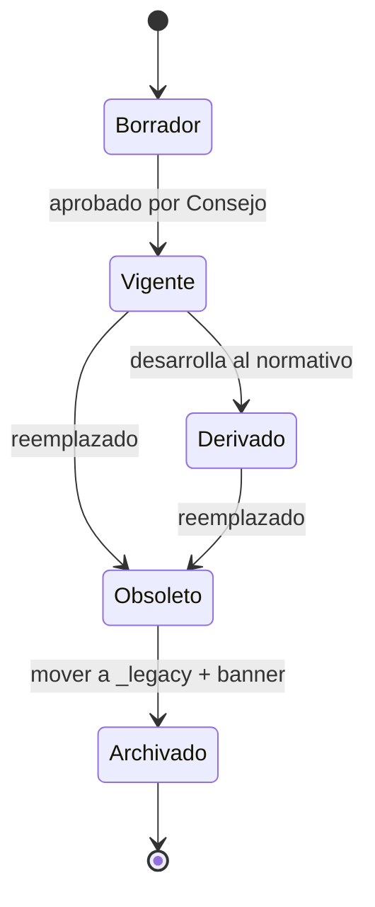
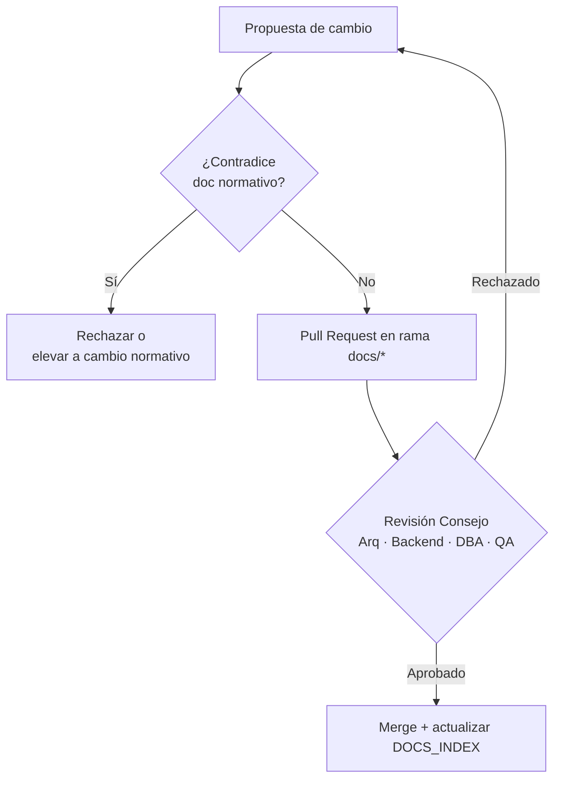

# DOCS_INDEX — Índice y Gobernanza Documental

## CMMS HVAC PRO

**Versión:** 1.0
**Fecha:** 2026-07-21
**Rol:** Punto de entrada obligatorio a la documentación del proyecto. No es normativo de negocio ni técnico — gobierna la **precedencia** entre los documentos que sí lo son.

> Este índice es el resultado de la Fase F0–F5 del [`docs/PLAN-CORRECTIVO-DOCUMENTAL.md`](docs/PLAN-CORRECTIVO-DOCUMENTAL.md) (consolidación documental, 2026-07-21), que corrigió la doble fuente de verdad, los conflictos de stack (React 18/19), de persistencia (Drizzle/Dexie) y de modelo de datos (`cmms_*` vs `activos`/`OT`) detectados en la auditoría [`docs/audits/SPEC-KIT_AUDIT.md`](docs/audits/SPEC-KIT_AUDIT.md).

---

## 1. Principio de gobernanza

**Un solo documento manda por dominio; el resto desarrolla, nunca contradice; lo antiguo se archiva con trazabilidad, no se borra.**

Cualquier agente humano o de IA que lea este repositorio debe empezar por este archivo antes de asumir que un `.md` cualquiera es la verdad vigente.

---

## 2. Documentos vigentes

| Documento | Rol | Estado |
|---|---|---|
| [`CMMS_HVAC_PRO_Reglas_de_Negocio.md`](CMMS_HVAC_PRO_Reglas_de_Negocio.md) | **Normativo #1 — Negocio.** Única fuente de reglas de negocio. | ✅ Vigente |
| [`CMMS_HVAC_PRO_Especificacion_Tecnica.md`](CMMS_HVAC_PRO_Especificacion_Tecnica.md) | **Normativo #1 — Técnico.** Única fuente de arquitectura, stack y modelo de datos. | ✅ Vigente |
| [`SPEC-ASSET-UNIVERSAL.md`](SPEC-ASSET-UNIVERSAL.md) | Temático propio — modelo universal de activos. | ✅ Vigente |
| [`SPEC-CONFIG-FLOWS.md`](SPEC-CONFIG-FLOWS.md) | Temático propio — dueño de **W-09**. | ✅ Vigente |
| [`SPEC-QR-FLOW.md`](SPEC-QR-FLOW.md) | Temático propio — dueño de **W-02**. | ✅ Vigente |
| [`FASE_2_PLAN_IMPLEMENTACION_FRONTEND.md`](FASE_2_PLAN_IMPLEMENTACION_FRONTEND.md) | Plan vivo — sprints, estimaciones, checklist de desarrollo (no normativo). | ✅ Vigente |
| [`README.md`](README.md) | Portada del repositorio. | ✅ Vigente |
| `DOCS_INDEX.md` (este archivo) | Índice + gobernanza + precedencia. | ✅ Vigente |

## 3. Documentos archivados (`docs/_legacy/`)

Se conservan solo por trazabilidad histórica. Ninguno debe usarse para desarrollo ni ser leído por agentes de IA como fuente vigente — todos llevan banner `⚠️ OBSOLETO` en la primera línea.

| Documento archivado | Motivo | Reemplazado por |
|---|---|---|
| `docs/_legacy/REGLAS_DE_NEGOCIO.md` | Tercera fuente de reglas de negocio en conflicto (marca EECOL, stack desalineado) | `CMMS_HVAC_PRO_Reglas_de_Negocio.md` |
| `docs/_legacy/TECHNICAL_DOCUMENTATION.md` | Documento técnico con identidad de marca NBYB embebida | `CMMS_HVAC_PRO_Especificacion_Tecnica.md` |
| `docs/_legacy/replit.md` | Fragmento huérfano de notas de despliegue | `CMMS_HVAC_PRO_Especificacion_Tecnica.md` |
| `docs/_legacy/CMMS_HVAC_PRO_Reglas_de_Negocio_v1.md` | Absorbido en la fusión — mantenerlo aparte reintroduciría doble fuente | `CMMS_HVAC_PRO_Reglas_de_Negocio.md` |
| `docs/_legacy/FASE_1_REGLAS_DE_NEGOCIO_DETALLADO.md` | Absorbido en la fusión | `CMMS_HVAC_PRO_Reglas_de_Negocio.md` |
| `docs/_legacy/ARCHITECTURE.md` | Absorbido en la fusión — tenía "React 18" desactualizado | `CMMS_HVAC_PRO_Especificacion_Tecnica.md` |
| `docs/_legacy/FE-INFRA-01_DEXIE_V16_SCHEMA.md` | Absorbido en la fusión | `CMMS_HVAC_PRO_Especificacion_Tecnica.md` |
| `docs/_legacy/FASE_1_ARQUITECTURA_Y_DISEÑO.md` | Absorbido en la fusión | `CMMS_HVAC_PRO_Especificacion_Tecnica.md` |

## 4. Documentos históricos (`docs/audits/`)

| Documento | Rol |
|---|---|
| [`docs/audits/SPEC-KIT_AUDIT.md`](docs/audits/SPEC-KIT_AUDIT.md) | Reporte de auditoría que originó [`docs/PLAN-CORRECTIVO-DOCUMENTAL.md`](docs/PLAN-CORRECTIVO-DOCUMENTAL.md) y esta consolidación. Histórico, no normativo. |
| [`docs/PLAN-CORRECTIVO-DOCUMENTAL.md`](docs/PLAN-CORRECTIVO-DOCUMENTAL.md) | Plan de consolidación ejecutado para producir este índice y los 2 documentos normativos. Histórico, no normativo. |

---

## 5. TV-2 · Tabla de decisión — precedencia documental

| Conflicto entre… | Prevalece |
|---|---|
| Reglas de Negocio vs Especificación Técnica | **Reglas de Negocio** |
| Especificación Técnica vs SPEC-* temático | **Especificación Técnica** |
| SPEC-* temático vs FASE_2 (plan de fase) | **SPEC-* temático** |
| Documento vigente vs documento archivado | **El vigente (siempre)** |
| Documento normativo vs código | **El documento** (la divergencia es bug, salvo brecha documentada explícitamente como deuda técnica) |

## 6. Decisiones selladas (Fase F1)

Estas decisiones resuelven los conflictos C-1…C-7 de la auditoría y son vinculantes en toda la documentación vigente:

| Dominio | Decisión sellada | Verificado por |
|---|---|---|
| Stack frontend | **React 19** (no React 18) + Vite + Tailwind + Wouter + Zustand | `package.json` |
| Persistencia cliente | **Dexie 4.x** sobre IndexedDB, offline-first | `src/db/database.ts` y uso extensivo en `src/` |
| Persistencia servidor | **SQL crudo sobre Neon Postgres serverless** vía `@neondatabase/serverless`. **No existe Drizzle ORM** en el proyecto | `server.ts`, `package.json` |
| Modelo de datos | Nomenclatura canónica objetivo: `activos` / `uuid_sync` / `OT`. El modelo legacy `cmms_*` **sigue vivo en producción hoy** (tablas y rutas de API activas) y coexiste con el canónico — documentado como deuda técnica en `CMMS_HVAC_PRO_Especificacion_Tecnica.md`, sin fecha de eliminación forzada | `server.ts` (tablas `CREATE TABLE` y `allowedResources`) |
| Identidad de producto | Plataforma **white-label multi-tenant genérica**. Ninguna marca real (EECOL, NBYB/Ingeniería y Servicios Bravo Spa) es la identidad del producto — son ejemplos ilustrativos de tenant/cliente. **Gap conocido:** el código de UI aún tiene strings "NBYB SPA" hardcodeados (`src/pages/ScannerQR.tsx`, `src/components/modals/CreateAssetModal.tsx`) pendientes de generalizar — ver `§ Riesgos y deuda técnica` en la Especificación Técnica | Lectura directa de código fuente |
| Alcance | Plataforma **universal de gestión de activos**, con **HVAC como vertical principal** (no exclusivamente HVAC) | Decisión de producto (Nelson Bravo, 2026-07-21) |

## 7. TV-1 · Tabla de verdad — triage aplicado a los 14 documentos originales

| A: ¿Contradice normativo? | B: ¿Stack desalineado? | C: ¿Referenciado por algo vigente? | Acción |
|:---:|:---:|:---:|---|
| 0 | 0 | 0 | Mantener |
| 0 | 0 | 1 | Mantener |
| 0 | 1 | 0 | Actualizar stack |
| 0 | 1 | 1 | Actualizar stack (prioritario) |
| 1 | 0 | 0 | Archivar |
| 1 | 0 | 1 | Reescribir y alinear |
| 1 | 1 | 0 | Archivar |
| 1 | 1 | 1 | Reescribir y alinear (crítico) |

## 8. Inventario de workflows (W-01…W-09)

| Código | Workflow | Documento dueño |
|---|---|---|
| W-01 | Alta y baja de activo | Reglas de Negocio |
| W-02 | Escaneo de QR y deep-link | SPEC-QR-FLOW |
| W-03 | Creación de OT offline | Reglas de Negocio |
| W-04 | Sincronización offline → online | Especificación Técnica |
| W-05 | Resolución de conflictos (409) | Especificación Técnica |
| W-06 | Firma y cierre de OT | Reglas de Negocio |
| W-07 | Movimiento de inventario (append-only) | Reglas de Negocio |
| W-08 | Mantenimiento preventivo programado | Reglas de Negocio |
| W-09 | Configuración por cliente (toggles) | SPEC-CONFIG-FLOWS |

**Regla de unicidad:** si un workflow aparece descrito en más de un documento, el documento dueño manda; los demás enlazan a él, no lo reescriben.

## 9. Máquina de estados de un documento

## 10. Gobernanza de cambios documentales

Cualquier cambio a un documento normativo (Reglas de Negocio o Especificación Técnica) debe pasar por este flujo antes de mezclarse a `main`.

## 11. Conflictos abiertos pendientes de decisión humana

La fusión de los documentos normativos detectó contradicciones de contenido real (no de marca/alcance/stack, esas ya están selladas en §6) entre las fuentes originales. Se resolvieron con el criterio "conservar la versión más detallada" pero quedan marcadas `⚠️ REVISAR` dentro de los documentos normativos para decisión del Product Owner:

**En `CMMS_HVAC_PRO_Reglas_de_Negocio.md` (§ Conflictos detectados):**
1. Cardinalidad OT↔Activo: 1:N (v1) vs N:N vía tabla puente `work_order_assets` (Fase 1) — se adoptó N:N.
2. Formato de `Tag_Id`: máscara numérica (v1) vs alfanumérico `{sucursal}.{tipo}.{seq}` (Fase 1) — se adoptó el de v1.
3. Formato de folio de OT: `PREFIJO-AÑO-NNNNNN` (v1) vs `INF-{sucursal}.{tipo}-{tag_corr}-{seq}` (Fase 1) — se adoptó el de v1.
4. Catálogo de estados de activo: 4 estados (v1) vs 5 estados con matriz de transición (Fase 1) — se adoptó el de Fase 1, mapeo no es 1:1 limpio.
5. Mecanismo de frecuencia de mantenimiento preventivo: `mp_plans.frecuencia_dias` (v1) vs `equipos.frecuencia_mantenimiento` enum (Fase 1) — se adoptó el de v1.
6. Tope de reintentos de sync: 3 (v1) vs curva de backoff de 5 pasos sin tope explícito (Fase 1) — se adoptó el de v1.
7. Enumeración de roles: Fase 1 declara "6 roles" pero solo nombra 5 en las fuentes fusionadas — matriz completa vive en el ahora archivado `docs/_legacy/FASE_1_ARQUITECTURA_Y_DISEÑO.md`.

**En `CMMS_HVAC_PRO_Especificacion_Tecnica.md` (§9.1 y §10):**
8. Existen dos mecanismos de resolución de conflictos de sync distintos y coexistentes en `server.ts` (`POST /api/sync` con LWW silencioso vs `POST /api/cmms/:resource` con bloqueo optimista y HTTP 409) — no está claro cuál usa hoy el frontend en producción.
9. `server.ts` hace `DROP` de las tablas `cmms_*` en el arranque ("migración QA senior") pero rutas activas del mismo archivo dependen de que esas tablas existan — contradicción interna sin resolver.
10. Posible traslape entre el recurso `tickets`→`work_orders` del modelo canónico y un módulo de "Ticket/Incidencia" independiente descrito en Fase 1 y en el schema Dexie — no confirmado en Postgres.
11. Placeholder de versión de schema Dexie (`NEXT_SCHEMA_VERSION`) sin fijar contra `src/db/database.ts`.

**Estas 11 decisiones no se resolvieron por criterio propio del asistente de IA — requieren que Nelson Bravo (Product Owner) las zanje explícitamente.** Hasta entonces, ambas alternativas quedan documentadas en el cuerpo de cada documento normativo con la nota `⚠️ REVISAR`.

---

*Índice de gobernanza documental. Actualizar esta tabla en cada cambio de estado de un documento (nuevo, archivado, renombrado).*
