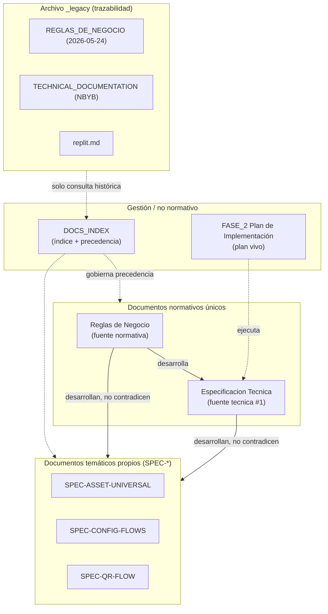
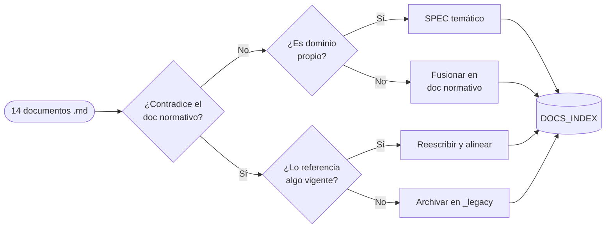
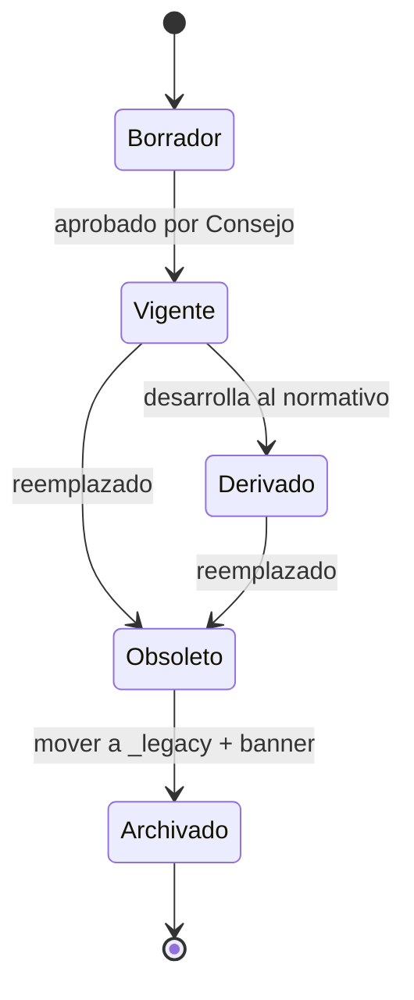
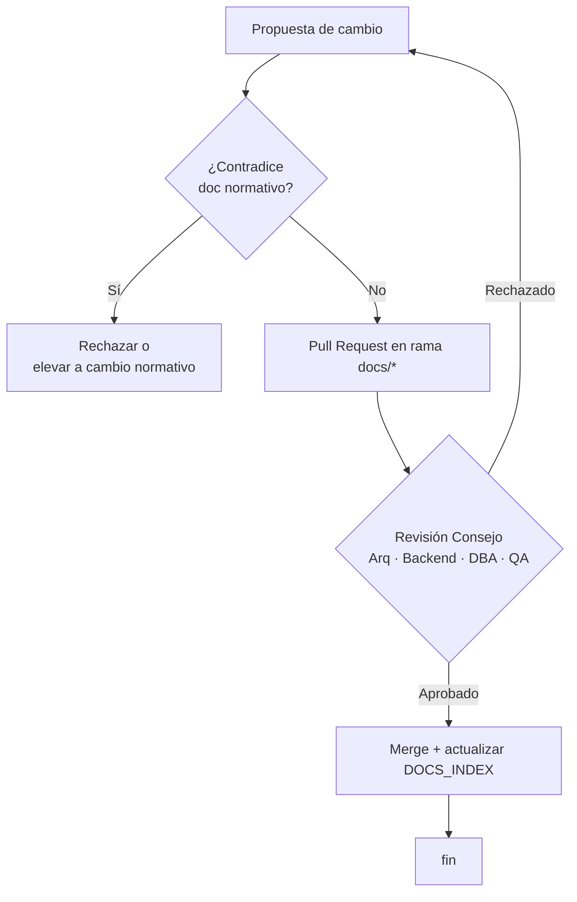
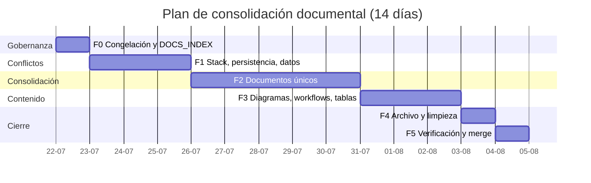

# PLAN DE TRABAJO — MEDIDAS CORRECTIVAS Y CONSOLIDACIÓN DOCUMENTAL
## CMMS HVAC PRO · Reestructuración a Documentación Normativa Única

**Versión:** 1.0
**Fecha:** 2026-07-21
**Base:** Auditoría de los 14 documentos `.md` del repositorio `nelsonbravosalas-creator/CMMS-HVAC-PRO--IA-STUDIO` (rama `main`, commit `14ee0ab`)
**Estado:** Ejecutado (rama `docs/consolidacion`, 2026-07-21) — ver [`DOCS_INDEX.md`](../DOCS_INDEX.md) para el resultado
**Duración estimada original:** 14 días hábiles (6 fases)

> **Objetivo rector:** dejar el proyecto con **dos documentos normativos únicos** — Reglas de Negocio y Especificación Técnica — más un conjunto acotado de **documentos temáticos propios** (`SPEC-*`), eliminando la doble fuente de verdad y los conflictos de stack, modelo de datos y marca detectados en la auditoría.

---

## 0. Tabla de contenidos

1. Resumen ejecutivo
2. Arquitectura documental objetivo
3. Medidas correctivas (mapa a hallazgos C-1…C-7)
4. Fases del plan de trabajo
5. Diagramas de proceso
6. Tablas de workflow (W-01…W-09)
7. Tablas de verdad / decisión
8. Documentación objetivo (documentos únicos + temáticos)
9. Criterios de aceptación (Definition of Done)
10. Riesgos y mitigaciones

---

## 1. Resumen ejecutivo

La auditoría detectó que el repositorio tiene **tres documentos de reglas de negocio** y **dos que reclaman ser "fuente única de verdad"**, con conflictos de stack (React 18 vs 19; Drizzle vs Dexie), de modelo de datos (`cmms_tickets` vs `activos`/`OT`), de marca (EECOL vs NBYB vs genérico) y una referencia rota a un documento hermano inexistente.

Este plan corrige esos conflictos en **6 fases** y consolida todo en **dos documentos normativos únicos** más los documentos temáticos vigentes. El resultado es una base documental sin contradicciones, con precedencia explícita, diagramas de proceso, tablas de workflow y tablas de decisión, apta para desarrollo humano y para agentes de IA que generen o validen código.

**Principio de gobernanza:** un solo documento manda por dominio; el resto desarrolla, nunca contradice; lo antiguo se archiva con trazabilidad, no se borra.

---

## 2. Arquitectura documental objetivo

**Antes (14 documentos, 3 esquemas en conflicto):**

- 3 reglas de negocio compitiendo
- Stack duplicado (React 18/19, Drizzle/Dexie)
- 3 documentos legacy sueltos + 1 README plantilla

**Después (documentación única y jerárquica):**

---

## 3. Medidas correctivas

Cada medida corrige un hallazgo de la auditoría (C-1…C-7) y se asigna a una fase, un rol responsable y un criterio de aceptación verificable.

| ID | Hallazgo | Medida correctiva | Prioridad | Fase | Responsable | Dependencia | Criterio de aceptación |
|----|----------|-------------------|-----------|------|-------------|-------------|------------------------|
| M-01 | C-1 Doble fuente de verdad | Declarar `Reglas de Negocio` como única fuente normativa; degradar `REGLAS_DE_NEGOCIO.md` a legacy | 🔴 Crítica | F0 | Arquitecto | — | `DOCS_INDEX.md` fija 1 sola fuente por dominio; ningún doc vigente dice "fuente única" salvo el normativo |
| M-02 | C-2 React 18 vs 19 | Unificar todos los documentos al stack real del repo (React 19, Vite, Neon) | 🔴 Alta | F1 | Frontend | M-01 | `grep "React 18"` = 0 en documentos vigentes |
| M-03 | C-3 Drizzle vs Dexie | Sellar persistencia: Dexie (cliente) + Neon/SQL (servidor); Drizzle y `cmms_sync_v2` pasan a legacy | 🔴 Alta | F1 | DBA + Backend | M-01 | Especificación Técnica declara una sola capa de persistencia por lado |
| M-04 | C-4 Modelo de datos | Fijar nomenclatura canónica (`activos`, `uuid_sync`, `OT`); mapear `cmms_*` como equivalencia histórica | 🔴 Alta | F1 | DBA | M-01 | Diccionario de datos único en Especificación Técnica; tabla de equivalencias legacy |
| M-05 | C-5 Marca / cliente | Definir identidad de producto (multi-tenant genérico); EECOL y NBYB como tenants de ejemplo | 🟡 Media | F1 | Arquitecto | M-01 | Ninguna marca cliente aparece como identidad del producto en docs vigentes |
| M-06 | C-6 Alcance HVAC vs universal | Sellar alcance: "plataforma universal de activos, HVAC como vertical principal" | 🟡 Media | F2 | Arquitecto | M-01 | Reglas de Negocio contiene una cláusula de alcance única |
| M-07 | C-7 Referencia rota | Crear `Especificacion Tecnica` (llena el hueco del documento hermano citado) | 🟡 Media | F2 | Arquitecto | M-02…M-04 | 0 referencias a documentos inexistentes (`grep` cruzado) |
| M-08 | Plantilla / marca | Reescribir `README.md` (quitar boilerplate Google AI Studio y banner CDN externo) | 🟡 Media | F4 | Frontend | M-05 | README describe el producto real y enlaza al índice; sin imágenes de CDN externo |
| M-09 | Nombre engañoso | Renombrar `FE-INFRA-01_DEXIE_V16_SCHEMA.md` → `FE-INFRA-01_DEXIE_SCHEMA.md` | 🟢 Baja | F4 | Frontend | M-03 | Sin "V16" en el nombre; referencias internas actualizadas |
| M-10 | Fragmento huérfano | Absorber `replit.md` en notas de despliegue o archivar | 🟢 Baja | F4 | Backend | M-01 | `replit.md` archivado o integrado; no queda huérfano en raíz |

---

## 4. Fases del plan de trabajo

### F0 — Congelación y gobernanza (Día 1)
- Crear rama `docs/consolidacion`.
- Crear `DOCS_INDEX.md` con la **matriz de precedencia** (ver §7, TV-2).
- Congelar edición de documentos legacy (banner `⚠️ OBSOLETO`).
- **Entregable:** `DOCS_INDEX.md` + rama de trabajo. Cierra **M-01**.

### F1 — Resolución de conflictos críticos (Días 2–4)
- Unificar stack (M-02), persistencia (M-03) y modelo de datos (M-04).
- Definir identidad de producto (M-05).
- **Entregable:** matriz de decisiones selladas (stack, persistencia, nomenclatura, marca).

### F2 — Consolidación documental (Días 5–9)
- Fusionar reglas vigentes → **`CMMS_HVAC_PRO_Reglas_de_Negocio.md`** (único).
- Fusionar arquitectura + schema + partes técnicas → **`CMMS_HVAC_PRO_Especificacion_Tecnica.md`** (único, cierra M-07).
- Sellar alcance universal/HVAC (M-06).
- Normalizar cabeceras y precedencia de los `SPEC-*` temáticos.
- **Entregable:** 2 documentos normativos únicos + `SPEC-*` alineados.

### F3 — Diagramas, workflows y tablas de decisión (Días 10–12)
- Incorporar los **diagramas de proceso** (§5) a la Especificación Técnica.
- Incorporar las **tablas de workflow** W-01…W-09 (§6).
- Incorporar las **tablas de verdad / decisión** (§7) a las Reglas de Negocio.
- **Entregable:** documentación con diagramas y tablas normativas embebidas.

### F4 — Archivo y limpieza (Día 13)
- Mover legacy a `docs/_legacy/` con banner (M-01, M-10).
- Reescribir `README.md` (M-08).
- Renombrar `FE-INFRA-01` (M-09).
- **Entregable:** raíz limpia; histórico preservado y marcado.

### F5 — Verificación y cierre (Día 14)
- Ejecutar checklist DoD (§9) y revisión "Consejo" (multi-rol).
- `grep` de regresión: sin "React 18", sin "fuente única" duplicada, sin referencias rotas.
- Merge de `docs/consolidacion` a `main`.
- **Entregable:** documentación consolidada en `main`.

---

## 5. Diagramas de proceso

### D-1 · Flujo de triage y consolidación documental

### D-2 · Máquina de estados de un documento

### D-3 · Gobernanza de cambios documentales

### D-4 · Cronograma (Gantt)

---

## 6. Tablas de workflow (W-01…W-09)

Inventario de flujos operativos del sistema. Cada workflow tiene **un documento dueño** y un diagrama de proceso; ninguno se define en dos lugares.

| Código | Workflow | Documento dueño | Diagrama | Estado |
|--------|----------|-----------------|----------|--------|
| W-01 | Alta y baja de activo | Reglas de Negocio | D-flow activo | ✅ Normado |
| W-02 | Escaneo de QR y deep-link | SPEC-QR-FLOW | Sec. QR | ✅ Normado |
| W-03 | Creación de OT offline | Reglas de Negocio | Sec. OT | ✅ Normado |
| W-04 | Sincronización offline → online | Especificación Técnica | D-sync | ✅ Normado |
| W-05 | Resolución de conflictos (409) | Especificación Técnica | D-conflicto | 🟡 A consolidar |
| W-06 | Firma y cierre de OT | Reglas de Negocio | TV-3 (§7) | ✅ Normado |
| W-07 | Movimiento de inventario (append-only) | Reglas de Negocio | Sec. INV | ✅ Normado |
| W-08 | Mantenimiento preventivo programado | Reglas de Negocio | Sec. MP | ✅ Normado |
| W-09 | Configuración por cliente (toggles) | SPEC-CONFIG-FLOWS | Sec. Config | ✅ Normado |

**Regla de unicidad:** si un workflow aparece descrito en más de un documento, el documento dueño manda y los demás enlazan a él (no lo reescriben).

---

## 7. Tablas de verdad / decisión

### TV-1 · Tabla de verdad — triage documental

Entradas booleanas por documento; salida = acción. Es el algoritmo de decisión de la Fase F0–F4.

| A: ¿Contradice normativo? | B: ¿Stack desalineado? | C: ¿Referenciado por algo vigente? | Acción |
|:---:|:---:|:---:|--------|
| 0 | 0 | 0 | **Mantener** |
| 0 | 0 | 1 | **Mantener** |
| 0 | 1 | 0 | **Actualizar stack** |
| 0 | 1 | 1 | **Actualizar stack (prioritario)** |
| 1 | 0 | 0 | **Archivar** |
| 1 | 0 | 1 | **Reescribir y alinear** |
| 1 | 1 | 0 | **Archivar** |
| 1 | 1 | 1 | **Reescribir y alinear (crítico)** |

**Aplicación a los documentos actuales:**

| Documento | A | B | C | Acción resultante |
|-----------|:-:|:-:|:-:|-------------------|
| `CMMS_HVAC_PRO_Reglas_de_Negocio_v1` | 0 | 0 | 1 | Mantener (base normativa) |
| `FASE_1_REGLAS_DE_NEGOCIO_DETALLADO` | 0 | 0 | 1 | Mantener → fusionar |
| `FASE_1_ARQUITECTURA_Y_DISEÑO` | 0 | 0 | 1 | Mantener → fusionar |
| `SPEC-ASSET/CONFIG/QR-*` | 0 | 0 | 1 | Mantener |
| `ARCHITECTURE` | 0 | 1 | 1 | Actualizar stack → fusionar |
| `FE-INFRA-01_DEXIE_V16` | 0 | 1 | 1 | Actualizar + renombrar |
| `REGLAS_DE_NEGOCIO` (2026-05-24) | 1 | 1 | 0 | **Archivar** |
| `TECHNICAL_DOCUMENTATION` (NBYB) | 1 | 1 | 0 | **Archivar** |
| `replit.md` | 1 | 1 | 0 | **Archivar** |
| `README` (plantilla) | 1 | 0 | 1 | **Reescribir** |

### TV-2 · Tabla de decisión — precedencia documental

| Conflicto entre… | Prevalece |
|------------------|-----------|
| Reglas de Negocio vs Especificación Técnica | **Reglas de Negocio** |
| Especificación Técnica vs SPEC-* temático | **Especificación Técnica** |
| SPEC-* temático vs Plan de fase | **SPEC-* temático** |
| Documento vigente vs documento archivado | **El vigente (siempre)** |
| Documento normativo vs código | **El documento** (la divergencia es bug, salvo brecha documentada) |

### TV-3 · Tabla de verdad — cierre de una OT (regla RN-OT-03 / RN-OT-04)

Ejemplo de tabla de verdad de negocio que vivirá en las Reglas de Negocio. Salida = ¿se permite pasar la OT a estado `cerrado`?

| Checklist completo | Firma de cliente | Movimiento de inventario registrado* | Activo en estado activo | ¿Permite cerrar? |
|:---:|:---:|:---:|:---:|:---:|
| 1 | 1 | 1 | 1 | ✅ Sí |
| 1 | 1 | 1 | 0 | ❌ No (activo dado de baja) |
| 1 | 1 | 0 | 1 | ❌ No (consumo sin ledger) |
| 1 | 0 | 1 | 1 | ❌ No (falta firma) |
| 0 | 1 | 1 | 1 | ❌ No (checklist incompleto) |
| 0 | 0 | 0 | 1 | ❌ No |

\* Solo exigible si la OT registró consumo de materiales; sin consumo la columna se considera satisfecha.

---

## 8. Documentación objetivo (entregable final)

| Documento | Rol | Se consolida desde | Estado objetivo |
|-----------|-----|--------------------|-----------------|
| **`CMMS_HVAC_PRO_Reglas_de_Negocio.md`** | Normativo #1 (negocio) | `..._Reglas_de_Negocio_v1` + `FASE_1_REGLAS_DE_NEGOCIO_DETALLADO` | Único |
| **`CMMS_HVAC_PRO_Especificacion_Tecnica.md`** | Normativo #1 (técnico) | `ARCHITECTURE` + `FE-INFRA-01` + `FASE_1_ARQUITECTURA_Y_DISEÑO` + partes técnicas de `FASE_2` | Único |
| `SPEC-ASSET-UNIVERSAL.md` | Temático propio | igual | Vigente |
| `SPEC-CONFIG-FLOWS.md` | Temático propio | igual | Vigente |
| `SPEC-QR-FLOW.md` | Temático propio | igual | Vigente |
| `DOCS_INDEX.md` | Índice + precedencia | nuevo | Vigente |
| `FASE_2_PLAN_IMPLEMENTACION_FRONTEND.md` | Plan vivo | igual (recorte técnico movido a Espec. Técnica) | Vigente |
| `README.md` | Portada del repo | reescribir | Vigente |
| `docs/_legacy/REGLAS_DE_NEGOCIO.md` | Archivo | mover + banner | Archivado |
| `docs/_legacy/TECHNICAL_DOCUMENTATION.md` | Archivo | mover + banner | Archivado |
| `docs/_legacy/replit.md` | Archivo | mover + banner | Archivado |
| `SPEC-KIT_AUDIT.md` | Reporte de auditoría | mover a `docs/audits/` | Histórico |

**Resultado:** de 14 documentos con 3 esquemas en conflicto → **2 normativos únicos + 3 temáticos + índice + plan + README**, con 4 documentos archivados con trazabilidad.

> **Nota de ejecución (2026-07-21):** durante la ejecución se detectó que dejar `CMMS_HVAC_PRO_Reglas_de_Negocio_v1.md`, `FASE_1_REGLAS_DE_NEGOCIO_DETALLADO.md`, `ARCHITECTURE.md` y `FASE_1_ARQUITECTURA_Y_DISEÑO.md` en la raíz tras la fusión recreaba la doble fuente de verdad. Por decisión del Product Owner, estos 4 documentos (más `FE-INFRA-01_DEXIE_V16_SCHEMA.md`, cuya renombración M-09 quedó reemplazada por archivado completo) también se movieron a `docs/_legacy/` con banner `⚠️ OBSOLETO`. Ver [`DOCS_INDEX.md`](../DOCS_INDEX.md) §3 para el detalle final.

---

## 9. Criterios de aceptación (Definition of Done)

- [x] Existe exactamente **un** documento de Reglas de Negocio y **uno** de Especificación Técnica vigentes.
- [x] `DOCS_INDEX.md` lista los documentos con estado (Vigente / Temático / Plan / Archivado) y la matriz de precedencia (TV-2).
- [x] `grep -ri "React 18"` = 0 como afirmación vigente en documentos vigentes (solo aparece en menciones correctivas "no React 18").
- [x] Ningún documento vigente, salvo el normativo, se declara "fuente única/normativa".
- [x] 0 referencias a documentos inexistentes (verificación cruzada de enlaces).
- [x] `README.md` describe el producto real, sin boilerplate ni imágenes de CDN externo.
- [x] Legacy movido a `docs/_legacy/` con banner de obsolescencia en la primera línea.
- [x] Los 9 workflows (W-01…W-09) tienen un único documento dueño.
- [x] Las tablas de verdad TV-1…TV-3 están embebidas en el documento normativo correspondiente.
- [ ] Revisión "Consejo" (Arquitecto · Backend · DBA · QA) aprobada — **pendiente: revisión humana de Nelson Bravo antes de mezclar `docs/consolidacion` a `main`.**

---

## 10. Riesgos y mitigaciones

| Riesgo | Impacto | Mitigación |
|--------|---------|------------|
| Pérdida de conocimiento histórico al archivar | Medio | No se borra: se archiva con banner y se conserva en `docs/_legacy/` |
| El código actual sigue el modelo `cmms_*` (legacy) | Alto | Tabla de equivalencias en Espec. Técnica; brechas documentadas, no ignoradas |
| Consolidación introduce contradicciones nuevas | Alto | `grep` de regresión + revisión Consejo antes del merge (F5); 11 conflictos de contenido real detectados durante la fusión quedaron marcados `⚠️ REVISAR` en los documentos normativos, ver `DOCS_INDEX.md` §11 |
| Agentes de IA leen documentos legacy como vigentes | Alto | Banner `⚠️ OBSOLETO` en primera línea + `DOCS_INDEX` como punto de entrada |
| Alcance universal vs HVAC sin resolver | Medio | Cláusula de alcance única sellada en F2 (M-06) |

---

*Documento de planificación. No es normativo por sí mismo: su salida (los 2 documentos únicos + índice) sí lo será.*
